# Gemelo digital de ingeniería SorTV1 v1.0

Documento técnico y guía de construcción. Configuración de referencia del 16 de septiembre de 2026.

## 01 Resumen técnico del producto

GEMELO DIGITAL SorTV1 v1.0 — CONFIGURACIÓN BASE

SorTV1 retiene una pieza seca, inspecciona su apariencia y solicita un destino a un controlador independiente. La autoridad física del Pico W comprueba resguardos, posición y descarga; la Raspberry Pi 5 de 2 GB ejecuta percepción y registro. La aplicación entregada representa este contrato mediante una planta cinemática de referencia. No equivale a un prototipo medido ni a una validación de manufactura.

**Estado de ingeniería:** precursor digital ejecutable con bloqueos eléctricos y cotas por resolver. No se libera la fabricación con esta documentación. El registro de auditoría distingue las funciones digitales ejecutadas de los puntos INCOMPLETE. No se declara DIGITAL BASELINE COMPLETE mientras falte una condición exigida.

**Aislamiento:** repositorio, BOM, presupuesto, piezas, cronograma, versiones, documentación, pruebas, hitos y deuda técnica pertenecen solo a SorTV1. La transferencia a VizionarIA se limita al conocimiento. SorTV1 no condiciona el avance de VizionarIA ni utiliza sus piezas reservadas.

Fuentes normativas: plan de seis semanas aportado [S0], BOM actual de 82 renglones y especificaciones de este encargo. La BOM actual concreta ACT-09 como 17HS8401 de 1.8 A/fase frente a la referencia de 1–1.5 A/fase del plan; se conserva el motor comprado y se limita inicialmente la corriente según ensayo. No se adoptan las alternativas de laptop/webcam ni se elimina ToF por presupuesto. El gate integrado original de S0 de 170/200 continúa separado del ensayo mecánico de 196/200 y de los gates de IA.

**Contrato de ingreso:** interior estable, operación supervisada y una sola pieza por ciclo; envolvente inicial 100 × 100 × 150 mm y 200 g. Se excluyen líquidos, vidrio, pilas, sanitarios, punzocortantes, comida húmeda, objetos largos y flexibles enredables. La cámara no determina composición química ni garantiza detectar materiales prohibidos. Dos piezas superpuestas pueden parecer una: la supervisión sigue siendo necesaria.

BIN0 recibe PET/plástico admitido; BIN1 papel/cartón; BIN2 metal/latas; BIN3 otro seco conocido. REJECT es una decisión lógica independiente de OTRO_SECO_CONOCIDO. En la entrega digital, la incertidumbre conduce a REVIEW sin descarga automática: es la política conservadora inicial. Dirigir REJECT a BIN3 exige un cambio de política versionado que compruebe dominio físico y disponibilidad del depósito.

**Estados de evidencia:** SIMULATED describe resultados del modelo; PHYSICAL exige medición del equipo identificado. REFERENCE es una cifra para visualizar; TBC-MEDIR significa que falta comprobar la pieza real; MEASURED registra una medición ingresada; FROZEN exige una decisión adicional de liberación dimensional. Un número visible en 3D no implica que se pueda perforar con él.

## 02 Vista exterior final

La envolvente MECH-65 es vertical, de referencia 500 × 500 × 850 mm. El acabado plateado se realiza sobre paneles funcionales desmontables; no se presupone que todo el gabinete sea acero. La rigidez la proporciona el bastidor, no el recubrimiento. Bordes y entradas de cable quedan protegidos; ningún acabado tapa tornillos de mantenimiento.

MECH-TOP es la tapa de ingreso con dos bisagras MECH-73. MECH-DOOR es una puerta independiente de servicio, con MECH-74 y MECH-75. El frente superior contiene SAFE-33 accesible, SENS-26 separado y los tres AD16-22D. No se incorpora pantalla física. El panel operador se observa desde la laptop conectada al software local.

La fotografía aportada es referencia estética de acabado y nombre SorTV1. El modelo técnico incorpora deliberadamente los elementos funcionales pedidos —paro, rearme y señalización— que no aparecen detallados en esa imagen. Las caras V01–V07 mantienen la misma geometría interna; no son productos diferentes. El acceso de servicio no obliga a retirar el revestimiento superior.

Verde significa READY; amarillo, procesamiento o REVIEW; rojo, FAULT, paro o resguardo de servicio abierto. La apertura normal de tapa en READY retira potencia y muestra carga en curso; no se confunde con un fallo durante maniobra. Los indicadores están representados, pero su accionamiento eléctrico requiere resolver HARDWARE-RISK-05. La señalización no es una protección de movimiento.
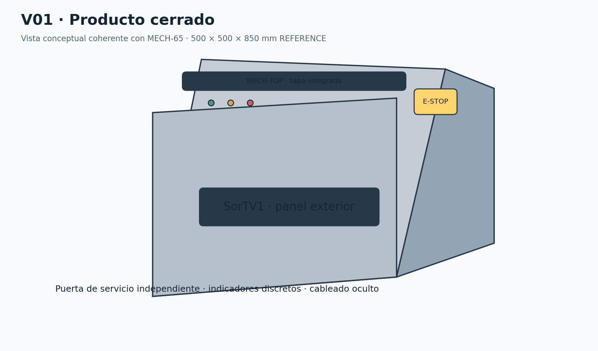

V01 Producto cerrado y controles de acceso. Geometría REFERENCE.

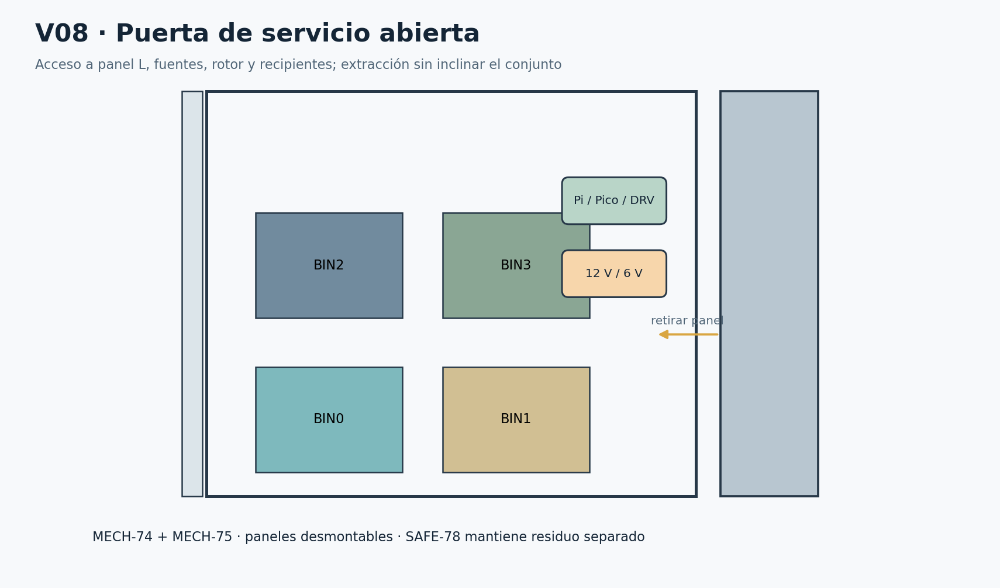

V08 Puerta de servicio abierta. Verificar extracción real de recipientes.

| Vista | Orientación y función | Acceso e interferencia |
| --- | --- | --- |
| V01 Perspectiva frontal cerrada | Frente +Z, derecha +X, arriba +Y; paro al frente superior | Acceso tapa y puerta independientes; acabado no estructural / Tapa, puerta y estabilidad |
| V02 Frontal | Eje óptico desde +Z hacia origen | Puerta abatible permite bins delanteros, luego traseros / Extracción de asas y panel de control |
| V03 Lateral derecha | Desde +X | Panel atornillado; acceso varillaje por derecha / Servo/varilla y pared |
| V04 Lateral izquierda | Desde −X | Panel removible para celda/soportes / Celda no toca carcasa |
| V05 Posterior | Desde −Z; lógica alta potencia baja | Panel ventilado desmontable; fuentes externas / CSI, radios y aire cooler |
| V06 Superior | Desde +Y | Quitar tapa solo aislado; cámara fija al marco / Volumen de visión y depósito manual |
| V07 Inferior funcional | Desde −Y | Motor central sobre base y apoyos estables / Altura motor/acople y tornillos |
| V08 Servicio abierto | Puerta hacia frente | Sacar delante antes de atrás si comparten corredor / No inclinar bin lleno sobre electrónica |

## 03 Layout interno general

El sistema de coordenadas común usa X hacia la derecha del operador, Y vertical y Z hacia el frente. El origen está en el centro de la base. Los valores numéricos de ModelBuilder son coordenadas de referencia en milímetros, vinculadas a dimensions.json cuando existe un parámetro. Las piezas pequeñas usan envolventes simplificadas: no representan roscas ni conectores a escala de fabricación.

Nivel A: recinto superior fijo para cámara/luz y conjunto pesado independiente para bandeja, hoja, servo y enlaces. Nivel B: volumen libre de apertura, debajo de la bandeja. Nivel C: guía rotatoria y hub, con eje apoyado estructuralmente. Nivel D: cuatro recipientes extraíbles. La bahía posterior separa residuos y electrónica mediante SAFE-78.

El plano de pesaje de referencia está a 555 mm; la lente a 280 mm sobre ese plano, todavía TBC para cobertura de objetos altos. La guía empieza debajo y desemboca sobre las bocas. La bajada no puede depender de que una caja atraviese un eje, un travesaño o una PCB. El hub del rotor se sitúa bajo el suelo del conducto; el eje no atraviesa la abertura de entrada.

La Pi está alta en la bahía posterior para respetar el CSI de 16–30 cm. El HX711 queda próximo a la celda, en el lado seco del separador. El resto de lógica y potencia se distribuye verticalmente. Las fuentes permanecen externas y cerradas, sin red eléctrica expuesta dentro del gabinete.

La transparencia reduce opacidad de carcasa; no mueve piezas ni cambia la BOM. Los conjuntos seleccionados conservan su component_id y muestran alimentación, controlador, fijación, calibración y prueba. Las vistas de mantenimiento permiten identificar el panel que debe retirarse primero.
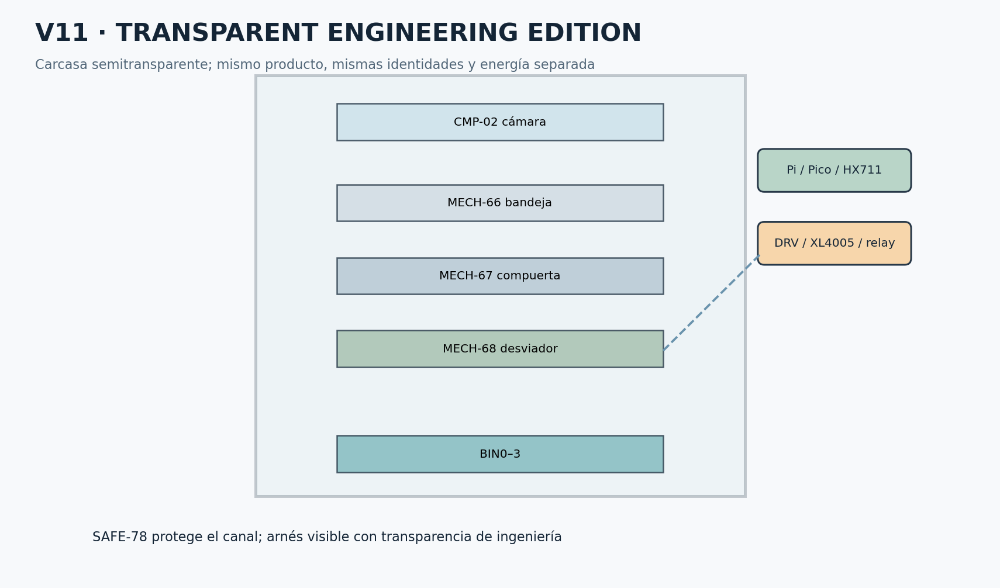

V11 SorTV1 TRANSPARENT ENGINEERING EDITION. Mismo producto, carcasa semitransparente.

## 04 Corte longitudinal

V09 corta virtualmente por X = 0. Deben seguirse la línea óptica, el plano pesado, el barrido de hoja, el canal inclinado, el hub inferior y la boca del depósito. No se permite interpretar la ausencia de una pared por el corte como un permiso para quitarla del producto.

El conflicto más importante es el volumen de barrido de MECH-67. Una hoja de 160 mm que gira aproximadamente 90° puede bajar hasta 160 mm desde su bisagra. La guía ocupa parte de esa franja vertical; la no interferencia depende también de X/Z y del ángulo del rotor. El indicador de margen vertical negativo de la aplicación es una alerta conservadora, no una demostración suficiente de colisión. Se requiere barrer hoja, varilla y horn contra la guía en las cuatro posiciones y en las tolerancias extremas.

La cámara permanece fija durante carga y operación. MECH-TOP debe abrir sin tocar lente, iluminación ni CSI. El conjunto pesado no debe tocar el bastidor al recibir un objeto excéntrico. Una holgura que existe en vacío puede desaparecer con 200 g, flexión de soporte y cables mal tendidos.

**Liberación del corte:** demostrar paso de la muestra más alta, bajar la compuerta a OPEN real, conservar resguardos y documentar holgura mínima medida. Si el mecanismo no cabe, modificar cotas paramétricas dentro de un cambio documentado; no recortar el objeto admitido ni el paso útil en silencio.
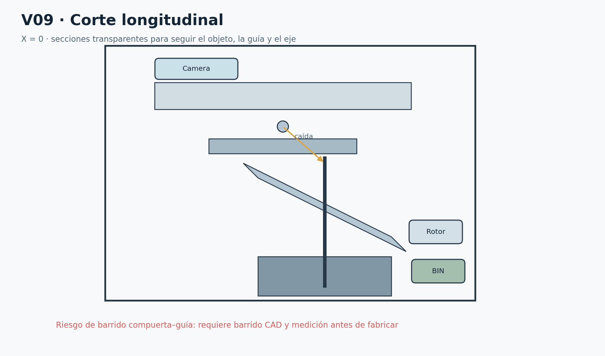

V09 Corte longitudinal de referencia. Riesgo de barrido compuerta–guía pendiente.

## 05 Corte transversal

V10 elimina virtualmente la zona superior para mostrar la salida radial y los cuatro bins. BIN0 ocupa el cuadrante posterior izquierdo, BIN1 el posterior derecho, BIN2 el anterior derecho y BIN3 el anterior izquierdo. ROT0–ROT3 avanzan 90° en ese orden nominal; la orientación física real se congela con las ventanas reed.

La envolvente circular de un canal radial con ancho no nulo es mayor que el radio hasta el centro de salida. Una comprobación inicial usa R_envolvente = sqrt(R_salida² + semiancho²), a la que se añaden paredes, imán, tornillos, flexión y margen. Con 163 mm y 72 mm de referencia resulta aproximadamente 178 mm antes de esos márgenes. No basta comparar 163 mm contra medio gabinete.

La tolerancia de índice se deriva de la boca más pequeña. Si el margen lateral libre es m y el radio de salida R, el error angular admisible aproximado es asin(m/R). Debe descontarse la dispersión del residuo y la posición de los recipientes. El valor de 2° de dimensions.json es una referencia editable, no una tolerancia ya validada.

Barreras y ToF quedan fijos fuera del barrido. El cable de cada sensor se fija al bastidor y rodea el volumen móvil. Un tornillo o un asa que sobresale invalida un análisis hecho solo con cajas nominales.
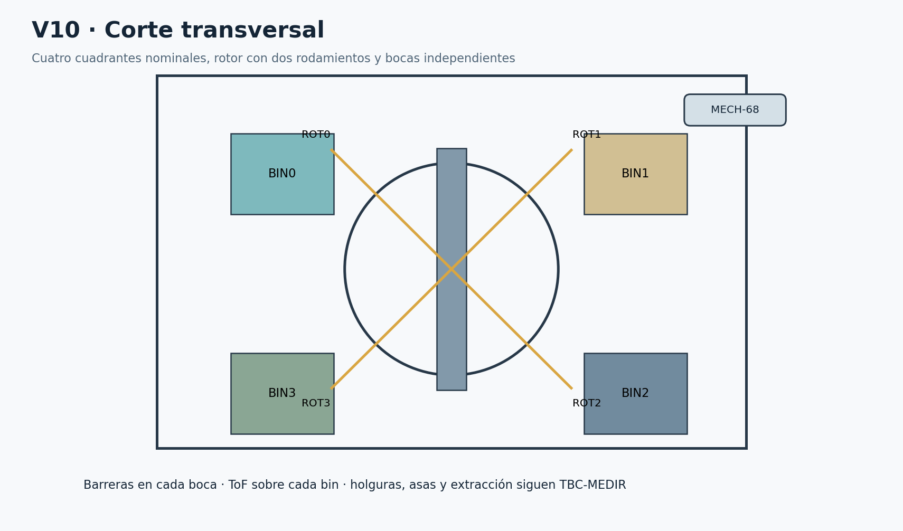

V10 Corte transversal y cuadrantes de destino.

## 06 Exploded view

El exploded view separa grupos A–O mediante transformaciones visuales reversibles. A 0 % todos vuelven a su posición. Los cables siguen siendo relaciones del mismo arnés y no se interpretan como nuevas longitudes de compra. Seleccionar una pieza muestra la entrada de BOM y el procedimiento relacionado.

La secuencia de ensamblaje gobierna el orden real; la posición artística en una vista explosionada no autoriza un montaje que cierre el acceso a un tornillo. Ningún par de apriete se inventa para M3/M4/M5 sin conocer rosca, material, inserto y fabricante. Para plástico impreso se valida primero una probeta y se evita aplastar capas o precargar rodamientos.
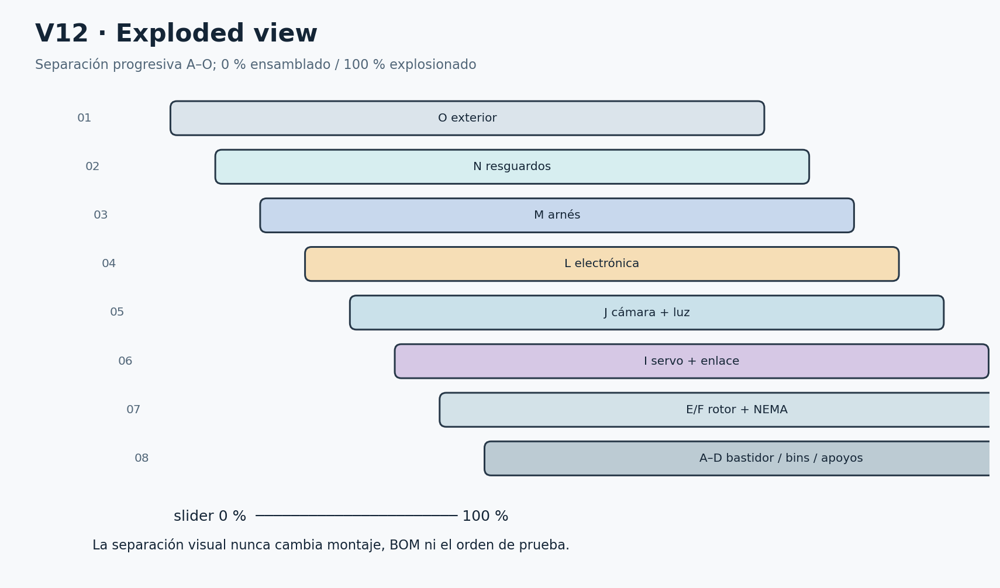

V12 Despiece por grupos de ensamblaje, posición intermedia.

| Grupo | Conjunto y BOM | Etapa y control antes de seguir |
| --- | --- | --- |
| A | Bastidor · 65 | 6 · Estructura estable, cantos protegidos |
| B | Paneles · 65 | 6 · Estructura estable, cantos protegidos |
| C | Depósitos · 64 | 1 · Los cuatro caben y salen sin deformarse |
| D | Eje y apoyos · 69,70,71 | 7 · Gira suave sin motor |
| E | Desviador · 68 | 8 · Sin colisión ni invasión del eje al flujo |
| F | NEMA y acople · 9,10,11 | 9 · Motor transmite par, apoyos toman carga radial |
| G | Bandeja y celda · 19,66 | 10 · Tara+objeto dentro capacidad validada; no apoyo paralelo |
| H | Compuerta y bisagra · 67,72 | 11 · OPEN/CLOSED con margen; sin zumbido en tope |
| I | Servo y varillaje · 15,16,17 | 11 · OPEN/CLOSED con margen; sin zumbido en tope |
| J | Cámara y luz · 2,45,46 | 12 · Objeto íntegro a 150 mm de altura en ROI final |
| K | Sensores · 18,20,21,22,23,24,25,26,27,28,29,30 | 13 · Todos con soporte, ruta y prueba individual |
| L | Electrónica · 1,3,4,5,6,12,13,14,31,32,33,34,35,36,37,38,39,40,41,42,43,44 | 14 · Separado del residuo y accesible |
| M | Arnés · 7,8,47,48,49,50,51,52,53,54,55,56,57,58,59,60,61,62,63 | 15 · Sin positivos unidos ni retorno de motor por Pico |
| N | Resguardos · 78 | 16 · Interrupción física verificable |
| O | Exterior · 65,73,74,75,76,77,79 | 16 · Interrupción física verificable |

## 07 Planta superior

La planta V06 relaciona acceso superior, cámara y bandeja. V17 muestra los cuatro depósitos por debajo. El eje central se reserva como volumen estructural, no como un quinto destino. Los bins se identifican físicamente y en datos con BIN-00 a BIN-03.

El canal debe apuntar al centro útil de la boca, no al centro exterior de un recipiente con reborde irregular. Las asas se incluyen en la envolvente de extracción. Si la puerta solo permite retirar dos recipientes por delante, la guía de servicio exige sacar esos primero para alcanzar los posteriores. No se presupone un cajón telescópico ni rieles no comprados.

El contenedor se apoya sobre una superficie horizontal; se comprueba estabilidad con distintos patrones de llenado. El peso de un bin lleno cambia el centro de gravedad. Un dibujo de cuatro recipientes simétricos no prueba estabilidad frente a una fuerza aplicada en la tapa.
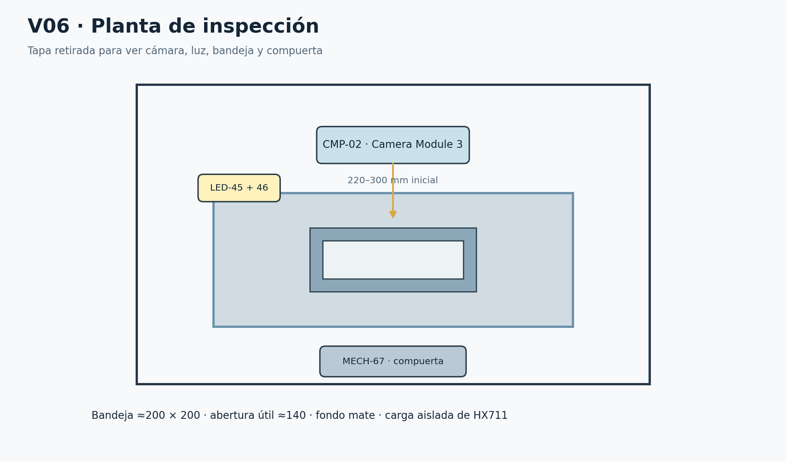

V06 Planta de inspección y volumen superior.

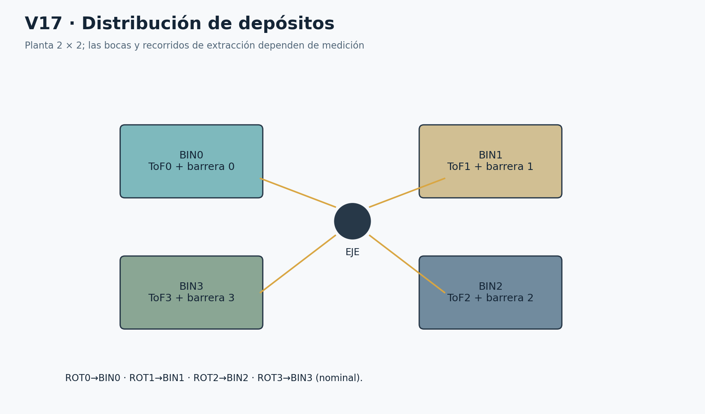

V17 Planta de depósitos: 0–1 al fondo y 3–2 al frente.

## 08 Arquitectura mecánica

**Camino de carga:** MECH-65 bastidor → extremo fijo SENS-19 → zona elástica de la celda → extremo de carga → soporte pesado → MECH-66 + MECH-67 + MECH-72 + ACT-15 + MECH-16/17. El servo, la bisagra y los dos límites de compuerta pertenecen al mismo subconjunto pesado. Así sus reacciones internas no crean un puente directo al bastidor. La tara incluye todas esas masas.

Una celda de 1 kg limita la suma de tara, objeto y efectos dinámicos; no significa que siempre pueda pesarse un objeto de 1 kg sobre una bandeja adicional. Se pesa el conjunto terminado, se revisa la ficha de montaje y se instalan topes anti-sobrecarga. Los topes permanecen separados durante la ventana útil; si tocan durante pesaje, la lectura queda falseada. La holgura se fija con deflexión medida, no por el valor gráfico.

No colocar un apoyo lateral rígido contra la bandeja, un cable tenso, la bisagra anclada al marco fijo ni un servo fijo que sostenga permanentemente la hoja. La cámara y la luz sí se fijan al bastidor porque no deben agregar fuerzas variables ni vibración al plano pesado. Los cables que cruzan entre ambos mundos llevan un bucle blando, sujeto a cada lado y probado con cargas patrón.

Los topes y soportes son piezas de fabricación de BOM-65/79; no son sensores nuevos. La mecánica de apoyo se resuelve antes de aumentar corriente o torque. El desmontaje debe permitir retirar el conjunto pesado como módulo, sin abrir rodamientos del rotor.

**Cadena de movimiento del rotor:** estructura → alojamientos MECH-70 superior/inferior → eje MECH-69 → hub bajo el suelo de MECH-68 → acople MECH-11 → ACT-09. La palabra superior describe el apoyo más alto del eje, no exige atravesar con un soporte la trayectoria del objeto. Los dos rodamientos llevan la carga radial; collarines limitan deriva axial según su tipo. El motor entrega principalmente par. Un acople flexible no compensa grandes desalineaciones.

**Criterios mecánicos previos:** giro manual suave, no contacto hoja–guía, no cable en el barrido, muestras admitidas sin puentes, masa dentro de capacidad y acceso a tornillos. La guía 3D es una sección abierta de referencia con paredes; el taller debe cerrar la solución manufacturable y verificable con sus radios, pendiente y espesor.

## 09 Cámara y bandeja

CMP-02 es Camera Module 3 visible estándar, no NoIR. HAR-07 conecta el extremo de 15 pines a cámara y el de 22 a la Pi 5; insertar sin alimentación y revisar orientación. El fabricante advierte evitar pliegues agudos. El radio y la longitud efectiva dependen del cable adquirido; no se dobla para hacer caber una Pi demasiado alejada. [S1]

La bandeja de referencia es de 200 × 200 mm, fondo mate uniforme, iluminación blanca difusa y geometría repetible. La lente mira hacia el plano de inspección con soporte ranurado. Bloquear foco/exposición/WB solo después de comprobar estabilidad y conservar sus metadatos. Las sombras o reflejos que ocultan contorno causan REVIEW, no una clasificación obligada.

**Campo de visión tridimensional:** una distancia medida solo hasta la bandeja no garantiza que se vea un objeto de 150 mm de alto. Para distancia de lente a bandeja H y altura de objeto h, el ancho vertical visible ideal es 2(H−h)tan(FOV_vertical/2). Como ejemplo de cálculo de referencia —ángulo a verificar en el modo real— con 41° y H = 280 mm, h = 150 mm, el campo vertical es aproximadamente 97 mm: no alcanza 100 mm. Con H = 300 mm sería aproximadamente 112 mm, antes de márgenes, desplazamiento y recorte del modo 640×480.

Por ello la referencia gráfica de 280 mm queda como RISK óptico. Antes de fabricar, colocar una carta de 100 × 100 mm a la altura máxima, en las posiciones extremas permitidas, y comprobar píxeles del modo seleccionado. La geometría puede necesitar la parte alta del rango 220–300 mm o revisar la posición del plano de bandeja; no se sustituye por cámara wide. El gabinete de 850 mm también debe revisarse si subir la cámara invade la tapa.

La Pi adquiere vista general 640×480 a 10–15 FPS; solo activa IA para un ciclo. Debe vaciar o identificar buffers previos, capturar tres imágenes nuevas tras cierre y estabilidad, separadas inicialmente 100 ms. Verifica la edad individual al empezar cada inferencia; no sirve comprobar solo el último frame. Captura, calidad e inferencia pueden intercalarse para no envejecer el primer frame mientras se acumulan los tres.

El recorrido causal es cierre y presencia estable → INSPECT → frames nuevos con controles → quality → decisión. Ni un timestamp reciente ni una CNN sustituyen la comprobación de que el objeto cabe y está completo en la ROI.
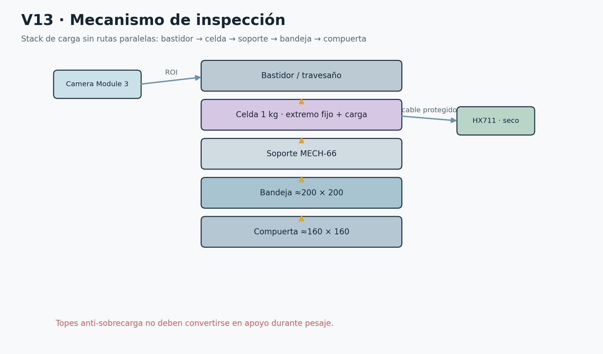

V13 Inspección: cámara fija y conjunto de pesaje independiente.

## 10 Celda de carga y HX711

SENS-19 se monta con su extremo fijo al soporte rígido y su extremo de carga al módulo pesado; orientación y caras de fijación se identifican en la pieza real. Se usan separadores para que la zona flexible no toque tornillos, carcasa ni bandeja. ELEC-HX711 se fija cerca de la celda en la bahía seca, con el cable de puente corto, protegido del paso y alejado de bobinas.

Identificar E+, E−, A+, A− por ficha y medición, no por colores universales. El módulo debe entregar DOUT compatible con 3.3 V y recibir SCK de 3.3 V; si separa alimentación analógica y digital, seguir su esquema real. No alimentar una placa desconocida a 5 V y asumir que DOUT es seguro. SCK no debe quedar alto durante tiempos indebidos que cambien su estado de alimentación.

**Calibración:** registrar lectura cruda con bandeja limpia y hoja cerrada; tarar solo bajo permiso vacío; aplicar dos o más masas patrón dentro de la carga útil, incluyendo cerca de 200 g; ajustar pendiente y verificar un punto independiente. Repetir en centro y esquinas. Documentar ruido, deriva, histéresis, tiempo de establecimiento y efecto del cable. Recalibrar al cambiar montaje, cable, hoja o servo.

**Política inicial:** presencia por masa por encima de un umbral medido; estabilidad por dispersión y pendiente dentro de una ventana calibrada; sobrepeso >200 g → REVIEW; señal oscilante → espera acotada y REVIEW. Los umbrales de gramos de presencia/vacío no se congelan antes de conocer ruido. El modelo usa masa exacta sintética y una ventana de estabilidad de referencia: no simula la electrónica analógica del HX711.

Papel muy liviano puede quedar por debajo de resolución útil. La visión puede complementar presencia si quality acredita un objeto completo. No convertir una lectura no resoluble en «vacío seguro». Para terminar una descarga se requieren el haz correcto y ausencia de objeto según política validada; si el peso es ambiguo, solicitar revisión. El gemelo no agrega un sensor de vacío en el conducto: routeClear es una inferencia/permiso, con inspección manual después de un fallo.

**Prueba de ruta paralela:** colocar masa patrón, mover suavemente cada cable y tocar solo el soporte fijo. Un cambio superior a la incertidumbre presupuestada invalida el montaje. No compensarlo con una tara distinta para cada posición de servo.

## 11 Compuerta y servo

ACT-15 recibe aproximadamente 6.0 V desde ELEC-32. El PWM GPIO3 transmite una intención de posición; SENS-22 y SENS-23 son la confirmación real de cierre y apertura. Los switches disparan antes del tope mecánico y no absorben su esfuerzo. CLOSED y OPEN simultáneos son una contradicción y llevan a FAULT.

La transmisión sigue servo → horn MECH-16 → varilla MECH-17 → brazo solidario a la hoja MECH-67 → bisagra MECH-72. Los pasadores son cautivos. La visualización representa una referencia de cuatro barras con brazos iguales de 18 mm y enlace de 45 mm; el desfase inicial de −30° mantiene el barrido ideal entre −30° y −120°. Son TBC, no un diseño de taller aprobado. Las articulaciones deben permitir ese giro sin cargar lateralmente el eje del servo ni desprender el horn.

**Par en bisagra:** T_g = g(m_objeto r_objeto + m_hoja r_hoja). Con los valores de ejemplo del plan, 0.20 kg a 0.08 m y 0.15 kg a 0.07 m, T_g ≈ 0.260 N·m. Con factor inicial 2, demanda ≈0.520 N·m antes de fricción, aceleración y geometría del enlace. Estos números son CALCULADOS con masas de referencia, no medidos.

Para un enlace general: fuerza F ≈ T_bisagra/(r_brazo·sin β) y T_servo ≈ F·r_horn·sin α/η, con η <1. Cerca de β =0 o 180° la fuerza crece mucho: aparece punto muerto o mala ventaja mecánica. Recorrer todo el rango, no solo comparar posiciones finales. Con radios iguales y barras paralelas ideales la razón de par es aproximadamente 1, pero la fricción y las tolerancias siguen exigiendo ensayo.

TowerPro publica para su MG996R 11 kgf·cm de bloqueo a 6 V, equivalente a aproximadamente 1.08 N·m; eso no define un régimen continuo utilizable. La pieza real y su procedencia se verifican. No usar una cifra de bloqueo para concluir que 0.52 N·m funciona continuamente sin calor. [S4]

**Apertura:** destino confirmado → PWM acotado → OPEN dentro de 1 s → caída observada. **Cierre:** haz completo y bandeja vacía → PWM cierre → CLOSED dentro de 1 s → DONE. OPEN/CLOSED ausentes, zumbido, atasco, caída de tensión o calentamiento nunca se convierten en éxito. El modelo detecta brownout/stall mediante el movimiento no confirmado y timeout; no inventa un sensor de corriente o voltaje que la BOM no contiene.

Al cortar energía el servo puede ceder y una pieza en vuelo sigue cayendo. Resguardar el volumen completo y verificar retención de la hoja sin energía. No se afirma que E-STOP detenga instantáneamente el residuo por gravedad.

## 12 Desviador y eje

MECH-68 es un canal de paredes lisas con entrada bajo compuerta y salida radial. Solo rota vacío. Durante POSITIONING, la hoja permanece cerrada; durante DISPENSING la guía ya está indexada y el motor puede mantener posición sin generar pasos. El rotor no se usa para transportar una pieza alojada en él.

MECH-69 termina por debajo del suelo del canal y transmite torque a un hub inferior. En el modelo no emerge un eje sólido por el centro de la lata. La fabricación debe comprobar la relación suelo–hub–eje en sección y bajo flexión. Los rodamientos MECH-70 se alojan en soportes independientes; el superior se coloca más cerca del hub y el inferior cerca del acople, sin que un travesaño corte la trayectoria hacia bins.

Identificar diámetros reales de eje, interiores de rodamientos, collarines y acople 5→8. El diámetro de 8 mm es la interfaz sugerida por el acople, no prueba de que los rodamientos comprados correspondan. No elegir tolerancia H7 u otra sin conocer materiales, cargas, fijación y recomendación de la pieza. Registrar juego axial necesario sin precargar un rodamiento que no lo admite.

Homing: inspección manual del recorrido vacío → resguardos → rearme → movimiento lento acotado → ROT0 exclusivo estable 100 ms → detener. Si arranca entre índices, buscar en dirección definida hasta un límite temporal y angular. Si arranca sobre ROT0, validar exclusividad y estabilidad antes de aceptar. La referencia angular del simulador no es un encoder físico.

La calibración gira vacío hacia cada índice, registra borde de detección de reed y sitúa el objetivo dentro de su ventana con margen. Ajustar físicamente el reed y el imán; no compensar una salida mal centrada solo cambiando un contador de pasos. Un índice ausente, ambiguo o perdido durante apertura lleva a FAULT.
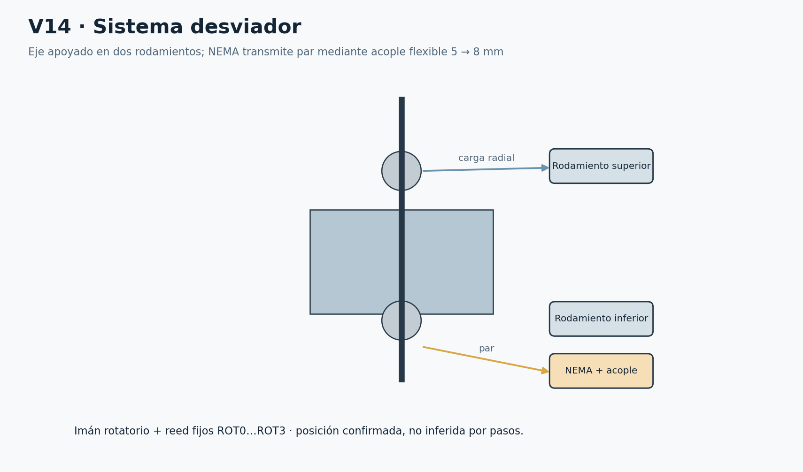

V14 Rotor, apoyos y motor. El canal y el eje mantienen identidades separadas.

## 13 NEMA y DRV8825

ACT-09 conserva la referencia 17HS8401, 1.8° y 1.8 A/fase. El valor nominal no obliga a arrancar a máxima corriente. ELEC-12 recibe 12 V en VMOT, retorno a estrella de potencia, A1/A2 y B1/B2 a pares de bobinas identificados por continuidad. Los colores del cable del motor dependen del lote. Desconectar fuente, comprobar descarga y después manipular bobinas: nunca hot-plug.

ELEC-14-0, 100 µF/35 V, se coloca junto a VMOT con conductores cortos y polaridad correcta. ELEC-13 ventila; no debe puentear pines. La capacidad máxima de corriente del chip no equivale a la del módulo pequeño sin una prueba térmica.

La ecuación de referencia del DRV8825 es I_FS = VREF/(5·Rsense). Debe identificarse Rsense real y el circuito del carrier antes de aplicarla. Un grabado R100 indicaría 0.10 Ω solo si corresponde a las resistencias de sensado correctas; no usar la fórmula abreviada de otra placa ni asumir el valor por color del PCB. [S2]

Procedimiento: (1) fotografiar/revisar módulo y Rsense; (2) cotejar ficha del chip y carrier; (3) elegir corriente conservadora dentro de capacidades del motor, driver y cable; (4) ajustar y medir con método correcto; (5) rotor desacoplado o vacío; (6) comprobar pasos perdidos contra reed; (7) medir temperatura en una sesión representativa; (8) aumentar gradualmente velocidad/aceleración solo si se mantienen márgenes. No aumentar corriente para vencer un atasco.

nEN es activo LOW. Debe iniciar HIGH mediante hardware antes de que el firmware configure GPIO2. La resistencia externa necesaria no aparece especificada en la BOM; si la placa no la incorpora de forma demostrada, HARDWARE-RISK-03 bloquea el montaje. nRESET/nSLEEP y MODE0–MODE2 también deben fijarse según el carrier, no dejarse a una suposición del simulador. No consumen nuevos GPIO si se cablean a niveles fijos, pero sus componentes y conexiones deben documentarse.

Microstepping es TBC por ensayo. Se comienza con un modo simple, bajo STEP rate y rampa limitada; se registran frecuencia, anchura de pulso y tiempos DIR conforme a ficha. El modelo cinemático usa velocidad de referencia y sensor de índice, sin simular chopper ni par electromagnético. El 12 V de entrada y la corriente de fase no son magnitudes intercambiables para dimensionar el fusible.

## 14 Depósitos

BIN-00…03 corresponden a las cuatro unidades de BOM-64, aproximadamente 5–8 L. Cada unidad se mide, etiqueta y prueba con su boca, reborde, asas y trayectoria de retirada. El dibujo rectangular no acredita volumen útil, ángulo de pared ni interferencias de asas.

Cada boca tiene una barrera fija. Su posición debe quedar bajo la salida orientada, de manera que el objeto atraviese el haz antes de entrar al volumen de almacenamiento. El ToF se monta fuera del impacto, apuntando hacia la superficie de residuos. Ningún sensor nuevo confirma presencia de recipiente: se inspecciona manualmente al iniciar y después de abrir servicio.

La app anima caída continua desde bandeja a guía y bin mediante un recorrido por tramos. La gravedad y el contacto son conceptuales: no se ejecuta un modelo de partículas, rebotes, deformación de papel ni fricción medida. El objeto no cambia de destino por selección manual del usuario; las probabilidades sintéticas y la política producen requested_bin.

Una barrera en la boca acredita un paso por esa zona, no necesariamente reposo definitivo en el fondo. La contención por paredes y el montaje de boca deben impedir que el objeto rebote fuera. La prueba física de ruta incluye observación independiente del bin real y registra cualquier salida o atasco.

## 15 Sensores ToF

SENS-TOF0…3 se alimentan y comunican con niveles compatibles con 3.3 V, según el breakout real. SDA GPIO4 y SCL GPIO5 son comunes; XSHUT GPIO6…9 es individual. XSHUT puede pertenecer al dominio de 2.8 V del sensor: en ese caso usar LOW o alta impedancia y su pull-up local, nunca forzar 3.3 V sin comprobar el módulo.

En cada arranque: todos XSHUT LOW; liberar ToF0 y asignar 0x30; liberar ToF1 a 0x31; ToF2 a 0x32; ToF3 a 0x33. La dirección inicial compartida es 0x29 en notación de 7 bits. Algunas APIs usan valores desplazados: documentar esa convención. Las direcciones no se consideran persistentes. La estrategia de habilitar y direccionar por separado está descrita por ST. [S3]

Calibrar D_EMPTY y D_FULL por recipiente en su posición de servicio. Nivel = clip[0,100](100·(D_EMPTY−D_CURRENT)/(D_EMPTY−D_FULL)). Validar que D_EMPTY>D_FULL. La cifra es altura ocupada orientativa; un montículo lateral o material oscuro puede alterar la estimación.

El modelo aplica mediana de cinco muestras, lectura secuencial e histéresis: FULL a partir de 90 %, retorno AVAILABLE al bajar hasta 80 %. Son valores iniciales de configuración. La lectura inválida, rango imposible o sensor ausente produce UNKNOWN y limpia su ventana. UNKNOWN bloquea ese destino; no se trata como EMPTY ni se envía silenciosamente a general.

Revisar pull-ups efectivos de cuatro módulos en paralelo. Una resistencia equivalente demasiado baja aumenta corriente; un bus largo y ruidoso produce flancos lentos. Medir niveles/tiempos con instrumental y ajustar solo mediante cambio documentado. Los cables ToF no se enrollan junto a bobinas de NEMA.

## 16 Barreras de caída

SENS-27…30, una barrera por bin, usan GPIO20/21/22/26. Cada conjunto tiene emisor y receptor enfrentados con soportes rígidos. Verificar tensión del emisor, tipo de salida del receptor, corriente y estado ante cable abierto. Solo se permite una salida ≤3.3 V o un contacto compatible; si el módulo entrega 5/12 V, falta una interfaz y se bloquea la conexión.

El contrato exige FREE antes de descargar, después BLOCKED y finalmente FREE en el depósito solicitado. Se registra cada flanco. La orden SORT, el ángulo del rotor, el tiempo transcurrido o el ToF no pueden reemplazar ese patrón. Un flanco en otro bin causa WRONG_BIN, sin sumar al destino pedido.

Un haz puede omitir papel delgado o un objeto que caiga fuera de su sección. Ensayar las posiciones extremas del paso, cantos de papel y deformaciones admitidas. Ajustar posición y óptica dentro del sensor comprado. Si no se logra cobertura, se declara una limitación de catálogo o se presenta una ECN; no se añade un segundo sensor invisible.

En firmware real, los pulsos breves deben capturarse mediante interrupción o muestreo que respete su duración mínima. El antirrebote de contactos de 20 ms no se aplica ciegamente a un haz de paso: podría borrar el evento de papel. El simulador tiene tick de 20 ms y un haz sintético de duración suficiente; no acredita que se capturen los pulsos físicos más cortos.

## 17 Reed de índice

SENS-ROT0…3 son contactos NO fijos alrededor de la referencia rotatoria. Un imán cautivo MECH-21 viaja con el rotor. La BOM permite 1–2 imanes; esta configuración usa uno y conserva el segundo opcional como repuesto. Montar dos operativos sin rediseñar el patrón podría activar dos índices y producir ambigüedad.

GPIO16…19 lee LOW cuando su reed cierra a GND mediante pull-up de señal. La UI puede mostrar ROT2 TRUE aunque el nivel eléctrico sea LOW; se distinguen nivel de pin y significado lógico. Guardar distancia imán–reed, orientación y ancho de ventana con el rotor vacío.

La confirmación requiere exactamente un índice activo y 100 ms estables. Los contactos mecánicos llevan antirrebote de referencia de 20 ms, que debe validarse. El modelo impone estabilidad de índice y detecta contradicción; no reproduce todos los rebotes de contactos reales. El rotor se detiene cuando detecta la ventana y verifica su permanencia antes de autorizar compuerta.

Posición solicitada, pasos ordenados y posición confirmada se registran por separado. Perder pasos puede impedir alcanzar el reed o alcanzar otro; en ambos casos no se abre. Si el reed desaparece durante descarga, el estado pasa a FAULT porque ya no hay evidencia vigente de orientación.

## 18 Electrónica y panel

MECH-PANEL es una subpieza de BOM-65. De arriba hacia abajo: Pi junto al CSI y su cooler; Pico y distribución de señal; HX711 a la altura próxima a la celda; DRV8825, buck y relay; fusibles y borneras. Las caras con tornillos se orientan hacia la abertura posterior. Las fuentes se sujetan fuera del volumen de residuos.

La barrera SAFE-78 separa la bahía del conducto. El aire entra por zona baja y sale por zona alta sin aspirar directamente polvo de la trayectoria. Se reserva espacio frente al Active Cooler y al disipador DRV. La geometría de rejillas, espacio de aire, temperatura y acumulación de polvo se comprueban con el gabinete cerrado; una puerta abierta no representa el ensayo térmico normal.

La electrónica no queda suspendida del cableado. Cada PCB lleva soporte aislante y puntos de fijación compatibles con sus agujeros. Los KF301 suelen ser terminales para PCB; su soporte soldado y protegido necesita definición real. No se asume una protoboard de potencia no comprada. La tornillería y PETG existentes permiten soportes, pero no sustituyen un diseño de aislamiento eléctrico.

Los contactos de fusibles y relay quedan cubiertos y accesibles tras aislar fuentes. El HX711 evita los bucles de corriente de motor. USB y CSI tienen alivio sin dobleces cerrados. La Pi se retira sin desarmar el rotor y la microSD conserva acceso lateral o posterior definido.

E06 corresponde al panel de V15; E07 a las rutas de V16. Los dibujos muestran áreas y conexiones, no autorización para cablear los bordes BLOCKER.
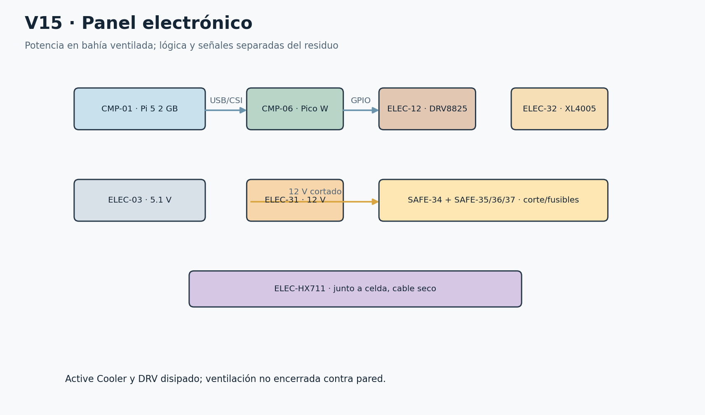

E06 y V15 Layout del panel electrónico, con fuentes externas.

## 19 Distribución de potencia

**Dominio lógico:** ELEC-03 5.1 V/5 A → USB-C CMP-01 → CSI CMP-02, FAN ELEC-04 y USB HAR-08 hacia CMP-06. Los sensores toman el dominio lógico de baja tensión según su consumo y módulo. No alimentar actuadores de Pi, Pico, GPIO ni 3V3.

**Dominio de actuadores:** ELEC-31 12 V/5 A → SAFE-35 con SAFE-38 → contacto de corte SAFE-34 → rama SAFE-36/39 a VMOT DRV8825 y rama SAFE-37/40 a XL4005 → aproximadamente 6 V MG996R. La rama auxiliar de señalización/luz, si su modelo corresponde a 12 V, debe permanecer antes del corte motriz para poder indicar el fallo; su driver y protección se cierran en la revisión eléctrica.

Los positivos 5.1 V y 12 V nunca se unen. El retorno de NEMA/DRV y servo/buck vuelve a una estrella de potencia próxima al negativo de ELEC-31. La referencia de señal se une una sola vez desde GND Pico a ese punto. No hacer circular corriente del servo por una pista GND del Pico. La carcasa metálica y la puesta a tierra de protección de las fuentes requieren revisar su clase; no confundir GND de señal con PE ni inventar un conductor de red dentro del equipo.

E01 unifilar y E02 potencia aparecen en la figura. El contacto de potencia está en serie con la energía motriz; la cadena de autorización gobierna su apertura. Los bordes de control discontinuos significan que el circuito real no está resuelto con las referencias genéricas recibidas.

**Corte físico y rearme:** abrir tapa/servicio o presionar paro durante maniobra debe retirar energía aunque Pi esté congelada. El firmware recibe el evento y enclava FAULT. Cerrar resguardos o liberar paro no mueve nada; se requiere inspección, retirada, rearme físico y homing vacío. En carga normal READY, abrir tapa es previsto y cierra la autorización temporalmente. Resolver cómo se permite el ciclo siguiente sin convertir el cierre después de un fallo en auto-rearme exige un circuito de autorización/retención definido.

La BOM no acredita contactos separados para leer resguardos a 3.3 V y cortar una cadena a 12 V, ni una salida libre del Pico para gobernar permiso, ni feedback aislado. Un único contacto SPDT no se conecta simultáneamente a 12 V y GPIO por cambiar de borne. No usar un jumper para borrar esa falta. HARDWARE-RISK-02 y 04 permanecen BLOCKER. El simulador implementa el contrato lógico deseado, claramente separado de su realizabilidad eléctrica.

**Relay HARDWARE-RISK-01:** registrar fabricante, referencia de cápsula y módulo, tensión de bobina, polaridad/umbral de IN, aislamiento, rating DC del contacto con tipo de carga, capacidad de terminales y pistas, corriente de arranque y margen térmico. Un impreso «10 A» para AC resistiva no prueba corte DC de motor/buck. Revisar arco, vida eléctrica, contacto soldado y tiempo de caída. Si falla, proponer por ECN un dispositivo con rating adecuado; no se considera comprado ni sustituido.

ELEC-41-0 puede suprimir bobina con cátodo al positivo y ánodo al lado bajo, según circuito real y diodo ya incorporado. Un diodo de rueda libre puede retrasar la liberación del relay; medirla. ELEC-41-1 queda reservado a aislamiento de una propuesta de retención por cerrar. No colocar 1N4007 indiscriminadamente sobre salidas de bobinas bipolares o sobre el servo para «proteger todo».

**Fusibles:** 5 A principal, 2–3 A motor y 3–5 A servo son asignaciones iniciales. Su curva, capacidad de interrupción DC, inrush y coordinación con la fuente limitada a 5 A deben verificarse. El fusible del buck está en 12 V y no protege automáticamente todo defecto a 6 V. Una fuente limitada puede no generar corriente suficiente para abrir rápido un fusible sobredimensionado. Medir demanda y escoger valores/curvas dentro de un cambio trazado; no realizar un cortocircuito improvisado para probarlos.

18 AWG para distribución y retorno de potencia; 22 AWG para sensores/señales y auxiliares de consumo comprobado. La caída se calcula con longitud de ida y vuelta y resistencia del conductor, y después se mide durante el pico. Los dos capacitores 100 µF/35 V se asignan a VMOT y entrada del buck. No se presupone que 100 µF garantice estabilidad del servo.

E01 y E02 Dos dominios y ramas de energía. Control/feedback pendientes marcados como BLOCKER.

| Protección | Ubicación | Valor inicial y validación |
| --- | --- | --- |
| SAFE-38 | Principal después de fuente12 | ≈5 A; 1 activo + 1 reserva; curva y DC TBC |
| SAFE-39 | Antes de VMOT | ≈2–3 A; no equivale a corriente de fase; 1+1 |
| SAFE-40 | Entrada12 V buck | ≈3–5 A; revisar selectividad y cable6 V; 1+1 |

## 20 Arnés y conexiones

E03 es el mapa de señales de la sección 21; E04/E07 corresponden a V16. E05 lista J01–J14; E08 contiene cada wire-from/wire-to, y E09 su asignación de conector. E10 está en la tabla de fusibles precedente. Cada extremo se identifica con Wxxx y la tensión, además del color.

HAR-P agrupa potencia; HAR-S señales. R-P recorre el borde posterior de potencia; R-M lleva bobinas hacia NEMA; R-S ocupa el borde contrario para lógica y sensores; R-I es la rama de I2C; R-HX mantiene corto el puente de celda; R-C es el CSI alto; R-A lleva iluminación e indicadores. No se calcula longitud final sumando líneas gráficas: seguir la ruta real con hilo, añadir holgura de servicio y registrar TBC-MEDIR.

En 18 AWG rojo se identifica +12 V o +6 V en ambos extremos; negro es retorno. En 22 AWG rojo se etiqueta explícitamente 3V3 o auxiliar12; negro retorno; amarillo/azul diferencian señales acompañadas de Wxxx. No confiar en color para reparar. Los cables existentes de motor, servo, fuente, CSI y USB conservan sus colores originales y se etiquetan sin reasignarlos.

KF301: seis de 2 polos =12 posiciones; cuatro de 3 =12; cuatro de 4 =16; total 40. Se asignan J01–J14 sin multiplicar bloques en la BOM. H01/H02 son las dos tiras de 40 posiciones macho; no implican conectores hembra incluidos. Donde no hay pareja comprada se especifica soldadura protegida, con el costo de desoldar para mantenimiento; adquirir conectores desmontables requiere cambio separado.

Faston se selecciona por ancho real de terminal y sección; anillo/horquilla cuando la fijación lo permite. Virolas compatibles con el tornillo evitan hilos sueltos. No estañar alambres flexibles bajo presión de bornera. Cada crimpado tiene prueba de tracción moderada y revisión de cobre expuesto. Termorretráctil no sustituye soporte mecánico. Los PG7/PG9 se ajustan a diámetro de cable y taladro real.

Las conexiones BLOCKER se conservan en la tabla para mostrar qué falta. Nunca son una instrucción de cableado provisional. En particular, W de GPIO28 representa la relación de feedback a través de una interfaz ausente; no un conductor directo desde NO12 V al Pico. Tampoco se atribuye nEN pull-up a un cable ni un driver de lámparas a la función gráfica.

E04 y E07 Arnés conceptual. Rutas reales y longitudes se congelan tras medición.

| Conector | Polos | Asignación |
| --- | --- | --- |
| J01 | 2 | Entrada fuente 12 V +/− |
| J02 | 2 | Principal protegido +12 V / retorno |
| J03 | 2 | Rama motor +12 V / retorno |
| J04 | 2 | Rama buck +12 V / retorno |
| J05 | 2 | Salida buck +6 V / retorno |
| J06 | 2 | Iluminación auxiliar TBC |
| J07 | 3 | Servo +6 V / GND / PWM |
| J08 | 3 | Relay alimentación / retorno / control TBC |
| J09 | 3 | Indicadores retorno G/Y/R; drivers ausentes |
| J10 | 3 | Referencia señal 3V3 / GND / reserva |
| J11 | 4 | Motor A1 A2 B1 B2 |
| J12 | 4 | HX711 E+ E− A+ A− |
| J13 | 4 | I2C 3V3 GND SDA SCL distribución |
| J14 | 4 | Cadena resguardos interfaz TBC |

| W / ruta | Origen → destino | Tensión / señal | AWG color / conector | Estado / fusible |
| --- | --- | --- | --- | --- |
| W001 R-L exterior/alivio | ELEC-03.USB-C → CMP-01.USB-C | 5.1 V / LOGIC | original negro / Cable fuente oficial | REFERENCE / fuente |
| W002 R-C alto; radio TBC | CMP-01.CSI22 → CMP-02.CSI15 | CSI / CSI | original FPC / HAR-07 | REFERENCE / — |
| W003 R-S posterior señal | CMP-01.FAN → ELEC-04.FAN | según Pi / FAN | original cable original / conector original | REFERENCE / — |
| W004 R-S posterior señal | CMP-01.USB-A → CMP-06.USB | USB 5 V + datos / USB CDC | original negro / HAR-08 | REFERENCE / — |
| W005 R-S posterior señal | CMP-01.SD → CMP-05.contactos | bus SD / STORAGE | original integrado / ranura SD | REFERENCE / — |
| W006 R-P potencia fija | ELEC-31.+ → SAFE-35.IN | 12 V / MAIN | 18 rojo / J01:1 | REFERENCE / SAFE-38-ACTIVE |
| W007 R-P potencia fija | SAFE-35.OUT → SAFE-34.COM | 12 V / PROTECTED | 18 rojo / J02:1 | REFERENCE / SAFE-38-ACTIVE |
| W008 R-P potencia fija | SAFE-34.NO → SAFE-36.IN | 12 V switched / MOTOR BRANCH | 18 rojo / J03:1 | REFERENCE / SAFE-39-ACTIVE |
| W009 R-P potencia fija | SAFE-36.OUT → ELEC-12.VMOT | 12 V switched / VMOT | 18 rojo / J03:1 | REFERENCE / SAFE-39-ACTIVE |
| W010 R-P potencia fija | SAFE-34.NO → SAFE-37.IN | 12 V switched / SERVO BRANCH | 18 rojo / J04:1 | REFERENCE / SAFE-40-ACTIVE |
| W011 R-P potencia fija | SAFE-37.OUT → ELEC-32.IN+ | 12 V switched / BUCK INPUT | 18 rojo / J04:1 | REFERENCE / SAFE-40-ACTIVE |
| W012 R-P potencia fija | ELEC-32.OUT+ → ACT-15.V+ | 6 V / SERVO POWER | 18 rojo / J05:1→J07:1 | REFERENCE / SAFE-40-ACTIVE |
| W013 R-P estrella potencia | ELEC-12.PGND → ELEC-31.− | 0 V / POWER RETURN | 18 negro / J03:2 | REFERENCE / — |
| W014 R-P estrella potencia | ELEC-32.IN− → ELEC-31.− | 0 V / POWER RETURN | 18 negro / J04:2 | REFERENCE / — |
| W015 R-P estrella potencia | ACT-15.GND → ELEC-31.− | 0 V / POWER RETURN | 18 negro / J07:2 | REFERENCE / — |
| W016 R-P estrella potencia | SAFE-34.COIL− → ELEC-31.− | 0 V / POWER RETURN | 18 negro / J08:2 | REFERENCE / — |
| W017 R-S posterior señal | ELEC-32.OUT− → ELEC-31.− | 0 V / BUCK COMMON | 18 negro / J05:2 | REFERENCE / — |
| W018 R-S unión única junto entrada potencia | CMP-06.GND pin38 → ELEC-31.− estrella | 0 V / SINGLE SIGNAL REFERENCE | 22 negro / J10:2 | REFERENCE / — |
| W019 R-S posterior señal | ELEC-12.VMOT → ELEC-14-0.+ | 12 V switched / DECOUPLING | 18 rojo / terminal corto | REFERENCE / — |
| W020 R-S posterior señal | ELEC-14-0.− → ELEC-31.− | 0 V / CAP RETURN | 18 negro / terminal corto | REFERENCE / — |
| W021 R-S posterior señal | ELEC-32.IN+ → ELEC-14-1.+ | 12 V switched / DECOUPLING | 18 rojo / terminal corto | REFERENCE / — |
| W022 R-S posterior señal | ELEC-14-1.− → ELEC-31.− | 0 V / CAP RETURN | 18 negro / terminal corto | REFERENCE / — |
| W023 R-M bobinas separadas señal | ELEC-12.A1 → ACT-09.coil A end1 | PWM bobina / COIL | 18 rojo / J11:1 | REFERENCE / SAFE-39-ACTIVE |
| W024 R-M bobinas separadas señal | ELEC-12.A2 → ACT-09.coil A end2 | PWM bobina / COIL | 18 negro / J11:2 | REFERENCE / SAFE-39-ACTIVE |
| W025 R-M bobinas separadas señal | ELEC-12.B1 → ACT-09.coil B end1 | PWM bobina / COIL | 18 rojo / J11:3 | REFERENCE / SAFE-39-ACTIVE |
| W026 R-M bobinas separadas señal | ELEC-12.B2 → ACT-09.coil B end2 | PWM bobina / COIL | 18 negro / J11:4 | REFERENCE / SAFE-39-ACTIVE |
| W027 R-S señal fija | CMP-06.GPIO0 / pin1 → ELEC-12.STEP | ≤3.3 V / STEP | 22 amarillo / H01:1 | REFERENCE / — |
| W028 R-S señal fija | CMP-06.GPIO1 / pin2 → ELEC-12.DIR | ≤3.3 V / DIR | 22 azul / H01:2 | REFERENCE / — |
| W029 R-S señal fija | CMP-06.GPIO2 / pin4 → ELEC-12.nEN | ≤3.3 V / nEN | 22 amarillo / H01:3 | BLOCKER / — |
| W030 R-S señal; bucle libre bandeja | CMP-06.GPIO3 / pin5 → ACT-15.SERVO PWM | ≤3.3 V / SERVO PWM | 22 azul / H01:4 | REFERENCE / — |
| W031 R-I bus corto separado bobinas | CMP-06.GPIO4 / pin6 → SENS-TOF0.SDA | 3.3 V / SDA | 22 amarillo / J13 / H02 | REFERENCE / — |
| W032 R-I bus corto separado bobinas | CMP-06.GPIO4 / pin6 → SENS-TOF1.SDA | 3.3 V / SDA | 22 amarillo / J13 / H02 | REFERENCE / — |
| W033 R-I bus corto separado bobinas | CMP-06.GPIO4 / pin6 → SENS-TOF2.SDA | 3.3 V / SDA | 22 amarillo / J13 / H02 | REFERENCE / — |
| W034 R-I bus corto separado bobinas | CMP-06.GPIO4 / pin6 → SENS-TOF3.SDA | 3.3 V / SDA | 22 amarillo / J13 / H02 | REFERENCE / — |
| W035 R-I bus corto separado bobinas | CMP-06.GPIO5 / pin7 → SENS-TOF0.SCL | 3.3 V / SCL | 22 azul / J13 / H02 | REFERENCE / — |
| W036 R-I bus corto separado bobinas | CMP-06.GPIO5 / pin7 → SENS-TOF1.SCL | 3.3 V / SCL | 22 azul / J13 / H02 | REFERENCE / — |
| W037 R-I bus corto separado bobinas | CMP-06.GPIO5 / pin7 → SENS-TOF2.SCL | 3.3 V / SCL | 22 azul / J13 / H02 | REFERENCE / — |
| W038 R-I bus corto separado bobinas | CMP-06.GPIO5 / pin7 → SENS-TOF3.SCL | 3.3 V / SCL | 22 azul / J13 / H02 | REFERENCE / — |
| W039 R-S señal fija | CMP-06.GPIO6 / pin9 → SENS-TOF0.XSHUT0 | ≤3.3 V / XSHUT0 | 22 amarillo / H01:7 | REFERENCE / — |
| W040 R-S señal fija | CMP-06.GPIO7 / pin10 → SENS-TOF1.XSHUT1 | ≤3.3 V / XSHUT1 | 22 azul / H01:8 | REFERENCE / — |
| W041 R-S señal fija | CMP-06.GPIO8 / pin11 → SENS-TOF2.XSHUT2 | ≤3.3 V / XSHUT2 | 22 amarillo / H01:9 | REFERENCE / — |
| W042 R-S señal fija | CMP-06.GPIO9 / pin12 → SENS-TOF3.XSHUT3 | ≤3.3 V / XSHUT3 | 22 azul / H01:10 | REFERENCE / — |
| W043 R-S señal; bucle libre bandeja | CMP-06.GPIO10 / pin14 → ELEC-HX711.HX711 DOUT | ≤3.3 V / HX711 DOUT | 22 amarillo / H01:11 | REFERENCE / — |
| W044 R-S señal; bucle libre bandeja | CMP-06.GPIO11 / pin15 → ELEC-HX711.HX711 SCK | ≤3.3 V / HX711 SCK | 22 azul / H01:12 | REFERENCE / — |
| W045 R-S señal fija | CMP-06.GPIO12 / pin16 → SENS-24.TOP LID | ≤3.3 V / TOP LID | 22 amarillo / H01:13 | BLOCKER / — |
| W046 R-S señal; bucle libre bandeja | CMP-06.GPIO13 / pin17 → SENS-22.GATE CLOSED | ≤3.3 V / GATE CLOSED | 22 azul / H01:14 | REFERENCE / — |
| W047 R-S señal; bucle libre bandeja | CMP-06.GPIO14 / pin19 → SENS-23.GATE OPEN | ≤3.3 V / GATE OPEN | 22 amarillo / H01:15 | REFERENCE / — |
| W048 R-S señal fija | CMP-06.GPIO15 / pin20 → SENS-26.RESET | ≤3.3 V / RESET | 22 azul / H01:16 | REFERENCE / — |
| W049 R-S señal fija | CMP-06.GPIO16 / pin21 → SENS-ROT0.ROT0 | ≤3.3 V / ROT0 | 22 amarillo / H01:17 | REFERENCE / — |
| W050 R-S señal fija | CMP-06.GPIO17 / pin22 → SENS-ROT1.ROT1 | ≤3.3 V / ROT1 | 22 azul / H01:18 | REFERENCE / — |
| W051 R-S señal fija | CMP-06.GPIO18 / pin24 → SENS-ROT2.ROT2 | ≤3.3 V / ROT2 | 22 amarillo / H01:19 | REFERENCE / — |
| W052 R-S señal fija | CMP-06.GPIO19 / pin25 → SENS-ROT3.ROT3 | ≤3.3 V / ROT3 | 22 azul / H01:20 | REFERENCE / — |
| W053 R-S señal fija | CMP-06.GPIO20 / pin26 → SENS-27.FALL0 | ≤3.3 V / FALL0 | 22 amarillo / H01:21 | REFERENCE / — |
| W054 R-S señal fija | CMP-06.GPIO21 / pin27 → SENS-28.FALL1 | ≤3.3 V / FALL1 | 22 azul / H01:22 | REFERENCE / — |
| W055 R-S señal fija | CMP-06.GPIO22 / pin29 → SENS-29.FALL2 | ≤3.3 V / FALL2 | 22 amarillo / H01:23 | REFERENCE / — |
| W056 R-S señal fija | CMP-06.GPIO26 / pin31 → SENS-30.FALL3 | ≤3.3 V / FALL3 | 22 amarillo / H01:27 | REFERENCE / — |
| W057 R-S señal fija | CMP-06.GPIO27 / pin32 → SENS-25.SERVICE DOOR | ≤3.3 V / SERVICE DOOR | 22 azul / H01:28 | BLOCKER / — |
| W058 R-S señal fija | CMP-06.GPIO28 / pin34 → SAFE-34.ACTUATOR POWER | ≤3.3 V / ACTUATOR POWER | 22 amarillo / H01:29 | BLOCKER / — |
| W059 R-S señal | CMP-06.3V3 pin36 → SENS-TOF0.VCC | 3.3 V validado módulo / SENSOR SUPPLY | 22 rojo / J10:1 / H02 | TBC-MEDIR / — |
| W060 R-S posterior señal | SENS-TOF0.GND → CMP-06.GND | 0 V / SENSOR RETURN | 22 negro / H02 | REFERENCE / — |
| W061 R-S señal | CMP-06.3V3 pin36 → SENS-TOF1.VCC | 3.3 V validado módulo / SENSOR SUPPLY | 22 rojo / J10:1 / H02 | TBC-MEDIR / — |
| W062 R-S posterior señal | SENS-TOF1.GND → CMP-06.GND | 0 V / SENSOR RETURN | 22 negro / H02 | REFERENCE / — |
| W063 R-S señal | CMP-06.3V3 pin36 → SENS-TOF2.VCC | 3.3 V validado módulo / SENSOR SUPPLY | 22 rojo / J10:1 / H02 | TBC-MEDIR / — |
| W064 R-S posterior señal | SENS-TOF2.GND → CMP-06.GND | 0 V / SENSOR RETURN | 22 negro / H02 | REFERENCE / — |
| W065 R-S señal | CMP-06.3V3 pin36 → SENS-TOF3.VCC | 3.3 V validado módulo / SENSOR SUPPLY | 22 rojo / J10:1 / H02 | TBC-MEDIR / — |
| W066 R-S posterior señal | SENS-TOF3.GND → CMP-06.GND | 0 V / SENSOR RETURN | 22 negro / H02 | REFERENCE / — |
| W067 R-S señal | CMP-06.3V3 pin36 → ELEC-HX711.VCC | 3.3 V validado módulo / SENSOR SUPPLY | 22 rojo / J10:1 / H02 | TBC-MEDIR / — |
| W068 R-S posterior señal | ELEC-HX711.GND → CMP-06.GND | 0 V / SENSOR RETURN | 22 negro / H02 | REFERENCE / — |
| W069 R-S señal | CMP-06.3V3 pin36 → SENS-27.VCC | 3.3 V validado módulo / SENSOR SUPPLY | 22 rojo / J10:1 / H02 | TBC-MEDIR / — |
| W070 R-S posterior señal | SENS-27.GND → CMP-06.GND | 0 V / SENSOR RETURN | 22 negro / H02 | REFERENCE / — |
| W071 R-S señal | CMP-06.3V3 pin36 → SENS-28.VCC | 3.3 V validado módulo / SENSOR SUPPLY | 22 rojo / J10:1 / H02 | TBC-MEDIR / — |
| W072 R-S posterior señal | SENS-28.GND → CMP-06.GND | 0 V / SENSOR RETURN | 22 negro / H02 | REFERENCE / — |
| W073 R-S señal | CMP-06.3V3 pin36 → SENS-29.VCC | 3.3 V validado módulo / SENSOR SUPPLY | 22 rojo / J10:1 / H02 | TBC-MEDIR / — |
| W074 R-S posterior señal | SENS-29.GND → CMP-06.GND | 0 V / SENSOR RETURN | 22 negro / H02 | REFERENCE / — |
| W075 R-S señal | CMP-06.3V3 pin36 → SENS-30.VCC | 3.3 V validado módulo / SENSOR SUPPLY | 22 rojo / J10:1 / H02 | TBC-MEDIR / — |
| W076 R-S posterior señal | SENS-30.GND → CMP-06.GND | 0 V / SENSOR RETURN | 22 negro / H02 | REFERENCE / — |
| W077 R-S posterior señal | SENS-24.COM seco → CMP-06.GND | 0 V / CONTACT RETURN | 22 negro / H02 | BLOCKER / — |
| W078 R-S posterior señal | SENS-22.COM seco → CMP-06.GND | 0 V / CONTACT RETURN | 22 negro / H02 | REFERENCE / — |
| W079 R-S posterior señal | SENS-23.COM seco → CMP-06.GND | 0 V / CONTACT RETURN | 22 negro / H02 | REFERENCE / — |
| W080 R-S posterior señal | SENS-26.COM seco → CMP-06.GND | 0 V / CONTACT RETURN | 22 negro / H02 | REFERENCE / — |
| W081 R-S posterior señal | SENS-ROT0.COM seco → CMP-06.GND | 0 V / CONTACT RETURN | 22 negro / H02 | REFERENCE / — |
| W082 R-S posterior señal | SENS-ROT1.COM seco → CMP-06.GND | 0 V / CONTACT RETURN | 22 negro / H02 | REFERENCE / — |
| W083 R-S posterior señal | SENS-ROT2.COM seco → CMP-06.GND | 0 V / CONTACT RETURN | 22 negro / H02 | REFERENCE / — |
| W084 R-S posterior señal | SENS-ROT3.COM seco → CMP-06.GND | 0 V / CONTACT RETURN | 22 negro / H02 | REFERENCE / — |
| W085 R-S posterior señal | SENS-25.COM seco → CMP-06.GND | 0 V / CONTACT RETURN | 22 negro / H02 | BLOCKER / — |
| W086 R-HX corto junto celda; bucle flexible | ELEC-HX711.E+ → SENS-19.E+ | puente / LOAD BRIDGE | 22 rojo / J12:1 | REFERENCE / — |
| W087 R-HX corto junto celda; bucle flexible | ELEC-HX711.E− → SENS-19.E− | puente / LOAD BRIDGE | 22 negro / J12:2 | REFERENCE / — |
| W088 R-HX corto junto celda; bucle flexible | ELEC-HX711.A+ → SENS-19.A+ | puente / LOAD BRIDGE | 22 amarillo / J12:3 | REFERENCE / — |
| W089 R-HX corto junto celda; bucle flexible | ELEC-HX711.A− → SENS-19.A− | puente / LOAD BRIDGE | 22 azul / J12:4 | REFERENCE / — |
| W090 R-P control físico | SAFE-35.OUT → SAFE-33.NC | 12 V control TBC / SAFETY CHAIN | 22 rojo / J14 / Faston | BLOCKER / SAFE-38-ACTIVE |
| W091 R-P control físico | SAFE-33.NC OUT → SENS-24.polo corte | 12 V control TBC / SAFETY CHAIN | 22 rojo / J14 / Faston | BLOCKER / SAFE-38-ACTIVE |
| W092 R-P control físico | SENS-24.polo corte OUT → SENS-25.polo corte | 12 V control TBC / SAFETY CHAIN | 22 rojo / J14 / Faston | BLOCKER / SAFE-38-ACTIVE |
| W093 R-P control físico | SENS-25.polo corte OUT → SAFE-34.autorización bobina | 12 V control TBC / SAFETY CHAIN | 22 rojo / J14 / Faston | BLOCKER / SAFE-38-ACTIVE |
| W094 R-P control físico | SENS-26.contacto rearme → SAFE-34.retención | 12 V control TBC / SAFETY CHAIN | 22 rojo / J14 / Faston | BLOCKER / SAFE-38-ACTIVE |
| W095 R-A iluminación/indicadores | SAFE-35.OUT → ELEC-42.+ | 12 V / AUXILIARY | 22 rojo / Faston | BLOCKER / SAFE-38-ACTIVE |
| W096 R-A | ELEC-42.− → ELEC-31.retorno controlado AUSENTE | 0 V / MISSING DRIVER | 22 negro / J09 | BLOCKER / — |
| W097 R-A iluminación/indicadores | SAFE-35.OUT → ELEC-43.+ | 12 V / AUXILIARY | 22 rojo / Faston | BLOCKER / SAFE-38-ACTIVE |
| W098 R-A | ELEC-43.− → ELEC-31.retorno controlado AUSENTE | 0 V / MISSING DRIVER | 22 negro / J09 | BLOCKER / — |
| W099 R-A iluminación/indicadores | SAFE-35.OUT → ELEC-44.+ | 12 V / AUXILIARY | 22 rojo / Faston | BLOCKER / SAFE-38-ACTIVE |
| W100 R-A | ELEC-44.− → ELEC-31.retorno controlado AUSENTE | 0 V / MISSING DRIVER | 22 negro / J09 | BLOCKER / — |
| W101 R-A iluminación/indicadores | SAFE-35.OUT → ELEC-45.+ | 12 V auxiliar TBC / AUXILIARY | 22 rojo / J06 | BLOCKER / SAFE-38-ACTIVE |
| W102 R-A | ELEC-45.− → ELEC-31.retorno controlado AUSENTE | 0 V / LED DRIVER TBC | 22 negro / J06 | BLOCKER / — |
| W103 R-P control | ELEC-41-0.A/K → SAFE-34.bobina/retención TBC | 12 V control / DIODE | 22 azul / soldado aislado | BLOCKER / — |
| W104 R-P control | ELEC-41-1.A/K → SAFE-34.bobina/retención TBC | 12 V control / DIODE | 22 azul / soldado aislado | BLOCKER / — |

## 21 Pinout del Pico W

Se usa numeración GPIO del RP2040, no BCM de Raspberry Pi. Los 26 GPIO expuestos del mapa quedan asignados: no hay tres salidas libres para indicadores ni una salida adicional de permiso del relay. Cualquier solución que use GPIO de Pi para señalización necesita sus drivers y un contrato explícito; no modifica la autoridad física del Pico. [S5]

Las entradas de contacto usan pull-up a 3.3 V y contacto seco a GND; el estado activo lógico suele ser LOW. El feedback de potencia será HIGH cuando exista autorización, pero solo después de definir su interfaz. GPIO2 nEN inicia HIGH y GPIO3 sin PWM. GPIO6–9 se manejan LOW/alta impedancia cuando XSHUT lo requiera.

Pines de alimentación de referencia: 3V3 OUT físico36, GND físico38 y otros GND del header. VSYS/VBUS no son salidas de potencia para motores. Confirmar orientación USB y pin1 sobre la placa recibida, especialmente si headers fueron soldados por el proveedor.

La tabla es el contrato inicial congelado de señales. El nivel seguro de entradas desconectadas debe ensayarse; un pull-up de software no sustituye el corte físico independiente.
| GPIO | Pin | Señal y destino | Dir / activo | Estado seguro |
| --- | --- | --- | --- | --- |
| 0 | 1 | STEP → ELEC-12 | OUT / HIGH | LOW |
| 1 | 2 | DIR → ELEC-12 | OUT / HIGH | LOW |
| 2 | 4 | nEN → ELEC-12 | OUT / LOW | HIGH / deshabilitado; pull-up externo AUSENTE BOM |
| 3 | 5 | SERVO PWM → ACT-15 | OUT / HIGH | HIGH-Z / sin PWM |
| 4 | 6 | SDA → SENS-TOF0..3 | BIDIR / HIGH | OPEN/UNKNOWN |
| 5 | 7 | SCL → SENS-TOF0..3 | BIDIR / HIGH | OPEN/UNKNOWN |
| 6 | 9 | XSHUT0 → SENS-TOF0 | OUT / HIGH | LOW |
| 7 | 10 | XSHUT1 → SENS-TOF1 | OUT / HIGH | LOW |
| 8 | 11 | XSHUT2 → SENS-TOF2 | OUT / HIGH | LOW |
| 9 | 12 | XSHUT3 → SENS-TOF3 | OUT / HIGH | LOW |
| 10 | 14 | HX711 DOUT → ELEC-HX711 | IN / HIGH | OPEN/UNKNOWN |
| 11 | 15 | HX711 SCK → ELEC-HX711 | OUT / HIGH | LOW |
| 12 | 16 | TOP LID → SENS-24 | IN / LOW | OPEN/UNKNOWN |
| 13 | 17 | GATE CLOSED → SENS-22 | IN / LOW | OPEN/UNKNOWN |
| 14 | 19 | GATE OPEN → SENS-23 | IN / LOW | OPEN/UNKNOWN |
| 15 | 20 | RESET → SENS-26 | IN / LOW | OPEN/UNKNOWN |
| 16 | 21 | ROT0 → SENS-ROT0 | IN / LOW | OPEN/UNKNOWN |
| 17 | 22 | ROT1 → SENS-ROT1 | IN / LOW | OPEN/UNKNOWN |
| 18 | 24 | ROT2 → SENS-ROT2 | IN / LOW | OPEN/UNKNOWN |
| 19 | 25 | ROT3 → SENS-ROT3 | IN / LOW | OPEN/UNKNOWN |
| 20 | 26 | FALL0 → SENS-27 | IN / LOW | OPEN/UNKNOWN |
| 21 | 27 | FALL1 → SENS-28 | IN / LOW | OPEN/UNKNOWN |
| 22 | 29 | FALL2 → SENS-29 | IN / LOW | OPEN/UNKNOWN |
| 26 | 31 | FALL3 → SENS-30 | IN / LOW | OPEN/UNKNOWN |
| 27 | 32 | SERVICE DOOR → SENS-25 | IN / LOW | OPEN/UNKNOWN |
| 28 | 34 | ACTUATOR POWER → SAFE-34 | IN / HIGH | OPEN/UNKNOWN |

## 22 Raspberry Pi 5

CMP-01 ejecutará Raspberry Pi OS de 64 bits y servicios pequeños sin escritorio cuando no haga falta. microSD64 almacena OS, modelo y evidencia; Active Cooler y ventilación se ensayan en gabinete cerrado. Se mide RAM, swap, CPU, temperatura y latencia durante sesión, no solo una inferencia aislada.

El servicio productivo se instala con usuario dedicado, dependencias fijadas, configuración legible y reinicio limitado. Arrancar Pi no arma el Pico ni reenvía automáticamente una orden pendiente. Tras reconectar: HELLO/STATUS, comprobar boot_id, revisar journal, esperar READY y crear solo el siguiente ciclo físico autorizado.

No se entrena en Pi. No se usan nube, internet obligatorio, ROS 2, otra SBC o acelerador. ONNX Runtime CPU con batch1 y FP32 es el baseline. INT8 solo se acepta tras medir mejora de latencia y conservación de criterios de calidad.

La ubicación alta responde al límite CSI. La alimentación USB-C, microSD y USB de Pico permanecen alcanzables desde mantenimiento. No encerrar cooler contra un panel ni poner el cable CSI sobre su ventilador. Las versiones exactas del entorno físico se registran al instalar y comprobar la imagen real; la versión de Three.js del gemelo no es una dependencia de Pi.

## 23 Pico como autoridad física

FW-01 es el contrato de máquina de estados; FW-02 adquisición/antirrebote; FW-03 temporizadores y watchdog; FW-04 protocolo; FW-05 control STEP/DIR/PWM. El firmware real usará C++ y Pico SDK con bucle no bloqueante, tick objetivo de 1 ms, PWM hardware y temporizador/PIO para STEP. El watchdog solo se alimenta después de completar todas las comprobaciones del bucle.

SORT destination=N es una intención. No existen comandos productivos «servo 80°» o «437 pasos». El controlador comprueba ciclo, boot, vigencia, resguardos, potencia, CLOSED, presencia estable, guía vacía y destino disponible antes de aceptar. La interfaz de operador productiva solo consulta y exporta.

La simulación ejecuta JavaScript equivalente a ese contrato, con un tick de 20 ms y planta idealizada; no emula un RP2040 ni certifica tiempos de interrupción. Menos de 50 ms de reconocimiento lógico es una meta física que se mide con señal de entrada y salida. El corte eléctrico es independiente de esa meta y su tiempo también se mide.

Durante reset: nEN deshabilitado, PWM ausente, nuevo boot_id, ciclo anterior inválido y permiso de rearme perdido. El homing solo se permite después de inspección de recorrido vacío. Los fines de carrera no se fuerzan por tiempo: un PWM terminado sin señal válida no cambia el resultado a confirmado.

## 24 Arquitectura software

La arquitectura productiva se mantiene separada de los archivos del navegador. Estructura prevista: app/capture.py, quality.py, inference.py, decision.py, transport.py, controller.py, evidence.py y operator_ui/; training/; firmware/; tests/; config/; models/; docs/; evidence/. docs/production-contracts.md describe entradas/salidas y gates de integración. No se entrega código flasheable ni un modelo entrenado ficticio.

El gemelo usa src/core, simulation, sensors, protocol, three, engineering y evidence. ModelBuilder/SceneManager agrupan geometría y vistas para evitar duplicar piezas en decenas de archivos vacíos. La UI aplica estímulos de laboratorio virtual —tapa, objeto, paro—; no recibe acceso directo a las salidas de motor. La selección manual de objeto se convierte en evidencia sintética de percepción, claramente rotulada.

Frame contiene frame_id, cycle_id, timestamp monótono Pi, RGB y controles exposure/gain/WB. Los timestamps de firmware y Pi no se restan entre sí sin sincronización: edad de imagen se calcula en Pi; plazo de decisión desde INSPECT se mide en Pico. Se preservan ambos dominios en registro.

Las pruebas de software reales deben incluir imágenes y tensores de referencia, parser bajo fragmentación, estados contradictorios y reinicio. La prueba del gemelo acredita únicamente la implementación digital; cada adaptador de hardware requerirá sus ensayos.
| ID módulo | Entrada | Proceso y salida | Fallos/dependencias |
| --- | --- | --- | --- |
| SW-01 capture | INSPECT(cycle_id) | Picamera2 produce tres frames RGB nuevos, timestamp monótono y controles → Frame{frame_id,cycle_id,timestamp,RGB,exposure,gain,WB} | buffer viejo, cámara ausente / CMP-02, reloj Pi |
| SW-02 quality | Frame y ROI calibrada | Verifica edad≤300 ms, ocupación, foco y exposición → QualityResult{valid,reason} | tapada, blur, ROI inválida / SW-01, configuración |
| SW-03 inference | Tensor FP32 1×3×224×224 | ONNX Runtime CPU batch1 MobileNetV3 Small → probabilities[4], model_sha256 | modelo faltante, salida inválida / models/, SW-02 |
| SW-04 decision | Tres predicciones válidas | top1>0.80, margen>0.15, consenso≥2/3 → Decision{predicted_class,decision,requested_bin} | incertidumbre u OOD no detectado / SW-03, labels/thresholds |
| SW-05 transport | JSON compacto y CRC16 | Acota 512 bytes, timeout, clave idempotente → ACK/NACK/DONE/FAULT | CRC, truncado, boot viejo / USB CDC, FW-01 |
| SW-06 controller | Eventos un ciclo | No pide SORT hasta persistir intención; vigencia de sesión → Intención y estado lógico | reinicio o duplicado de ciclo / SW-01..07 |
| SW-07 evidence | Eventos y resumen | JSONL append, flush/fsync de intent antes SORT; deduplicación → CSV/JSONL/hash | ENOSPC, corte antes commit / microSD, reloj Pi |
| SW-08 operator_ui | Snapshot inmutable | Consulta/exporta estado → Visualización sin mando motor | estado obsoleto, enlace ausente / SW-06/07 |

## 25 IA y dataset

MobileNetV3 Small parte de pesos ImageNet y una cabeza de cuatro salidas; la arquitectura está disponible en Torchvision [S7]. El orden contractual es [PET, PAPEL_CARTON, METAL_LATAS, OTRO_SECO_CONOCIDO] y su mapping a bins es [0,1,2,3]. labels.json, el índice de salida y destination mapping deben coincidir exactamente. Un modelo correcto con etiquetas permutadas descarga en un bin incorrecto.

Preprocesamiento único: ROI calibrada que preserve objeto entero → RGB explícito → resize224×224 según política congelada → float32 → /255 → normalización mean[0.485,0.456,0.406], std[0.229,0.224,0.225] → NCHW 1×3×224×224. Si se usa letterbox se congela su relleno y se reproduce en entrenamiento. No mezclar BGR de una librería con RGB supuesto por otra.

Entrenamiento de referencia: backbone congelado 5 epochs, AdamW lr0.001 y batch32; después bloques finales descongelados, 10–20 epochs, lr0.0001 y early stopping≈5. Seleccionar por macro-F1 de validación. Conservar semilla, versiones, manifest, transformaciones, pesos iniciales y registro de experimento. Son parámetros de partida, no promesa de convergencia.

Paquete: model.onnx FP32 shape fija; labels.json; preprocess.json; thresholds.json; dataset_manifest.csv; training/entrenamiento.json; SHA-256 por archivo. Comprobar equivalencia PyTorch/ONNX en al menos 50 imágenes, comparar logits/probabilidades y clases con tolerancia explicada, y ejecutar el mismo tensor en laptop y Pi antes de aceptar latencias.

Baseline de captura: TRAIN 25 objetos por clase ×4 ×12 imágenes≈1200; VALID 10×4×4≈160; TEST 15×4×4≈240; 40 desafíos fuera del catálogo. El split es por objeto físico, no por imagen. Todas las vistas de un objeto quedan en una partición; considerar además sesión/familia. El test se congela antes de elegir umbrales y no se reutiliza para ajustar.

Manifest mínimo: object_id, session_id, class_id, split, image_path, source, lighting_setup, operator y excluded_reason. Mezclar orden y posiciones para no enseñar el fondo. Documentar objetos deformados, materiales compuestos, desconocidos y dos piezas; no borrar errores difíciles sin motivo predefinido.

Política inicial: top1>0.80, margen top1−top2>0.15 y al menos dos de tres frames válidos votan la misma clase. La implementación exige los tres frames válidos antes del consenso; si calidad falla → REVIEW. Softmax alto no demuestra pertenencia al dominio conocido. El operador supervisa restricciones de ingreso y se publican desafíos con alta confianza errónea.

Separar predicted_class, decision, requested_bin, confirmed_bin y physical_result. ACK solo acredita aceptación del contrato. En el gemelo se aplican realmente los umbrales a probabilidades sintéticas; no se ejecuta un archivo ONNX inexistente ni se presenta una exactitud aprendida.

## 26 Protocolo Pi y Pico

El transporte es USB CDC mediante HAR-08. Cada mensaje es JSON ASCII compacto, seguido de |, CRC hexadecimal de cuatro dígitos y LF. CRC16-CCITT-FALSE: polinomio0x1021, inicial0xFFFF, sin reflexión ni XOR final. La entrada de prueba ASCII 123456789 debe producir 29B1. El CRC protege errores accidentales, no autentica mensajes.

Máximo total 512 bytes incluyendo CRC y LF. El parser incremental limita buffer, descarta hasta fin de línea tras exceso y abandona una línea incompleta tras 250 ms de referencia. Rechaza JSON inválido, versión equivocada, campos mal tipados y destino fuera de0–3 antes de actuar. Una línea truncada no bloquea el bucle de control.

Clave idempotente: boot+cycle+request. Repetición idéntica devuelve ACK/status conocido sin actuar otra vez; misma clave y distinto destino → NACK ID_CONFLICT. Además, un request nuevo para el mismo ciclo ya reclamado se rechaza: no sirve cambiar request para repetir una descarga. Un nuevo boot invalida órdenes del anterior.

**Normal:** Pico HELLO/STATUS → Pico INSPECT → Pi persiste intención → Pi SORT → Pico ACK → posición/OPEN/caída/CLOSED → Pico DONE → Pi persiste y suma una vez. **ACK perdido:** Pi QUERY o mismo SORT; el historial devuelve estado sin segunda descarga. **Duplicado conflictivo:** NACK; conservar operación original. **CRC inválido:** NACK y ninguna activación causada por el mensaje. **Truncado:** timeout de parser, recuperar próxima línea. **USB ausente/Pi congelada:** heartbeat vencido, parada y recuperación manual. **Pi reiniciada:** reconecta sin reemitir orden pendiente; conciliar. **Pico reiniciado:** nuevo boot, BOOT_SAFE, sin permiso previo.

Una Pi puede recibir ACK después de que el mecanismo ya comenzó: ACK no prueba resultado físico. Si DONE se pierde pero Pico conserva estado, QUERY puede recuperar el resultado confirmado. Si ambos reinician tras caída y antes de persistencia, no existe una garantía física de exactamente una vez; el journal marca incertidumbre y exige inspección.

La entrega incluye serializador, CRC y parser ejecutables en src/protocol/Protocol.js y tests de fragmentación/error. La consola RAW muestra los bytes generados; DECODED muestra campos y edad en reloj virtual. Los ejemplos y registros llevan source SIMULATION.
| Mensaje | Origen | Efecto |
| --- | --- | --- |
| HELLO/STATUS | Pico | Versión, boot, estado y sensores; no movimiento |
| INSPECT | Pico | Nuevo ciclo e inicio de plazo local |
| SORT | Pi | Intención destino0–3; valida guardas |
| ACK/NACK | Pico | Aceptación/rechazo, no éxito físico |
| DONE/FAULT | Pico | Resultado confirmado o causa de fallo |
| HEARTBEAT | Pi y contrato ambos | Vigencia; cada200 ms referencia |
| QUERY | Pi | Consulta idempotente sin movimiento |

## 27 Máquina de estados

La máquina tiene un único ciclo activo. DONE es un evento de resultado, no un estado duradero adicional. La UI lee la transición y anima la planta; no elige una transición libre para dibujar éxito.

Todas las maniobras exigen resguardos y energía válidos. Antes de girar se requiere CLOSED y guía considerada libre. Antes de abrir, un índice exclusivo confirmado. Antes de DONE, OPEN observado, secuencia de haz correcta, bandeja vacía y CLOSED sin OPEN. Si se rompe un invariante, se corta permiso y se enclava el motivo.

Heartbeat cada200 ms; pérdida≈1000 ms. WAIT_DECISION≈2 s; POSITIONING≈3 s; OPEN≈1 s; caída≈2 s después de OPEN; CLOSE≈1 s. Plazo global de ciclo≈10 s para evitar acumulaciones. Las metas p95 son independientes: no se suman p95 parciales ni se ensanchan timeouts para ocultar un atasco.

READY permite abrir tapa como carga normal y no ordena movimiento. Una apertura durante inspección cancela esa inspección. Una apertura durante CHECK_HOME/POSITIONING/DISPENSING/VERIFY_CLOSE lleva a FAULT. Servicio abierto invalida operación. La recuperación implica retirar el objeto con potencia aislada; cerrar puertas nunca salta directamente a la maniobra suspendida.

El código verifica reed vigente durante dispensado y cierre. No supone que un índice observado una vez siga siendo correcto después de un desplazamiento no esperado. Las barreras se verifican por flancos y el contador solo incrementa tras el conjunto de confirmaciones.
| Estado | Evento y acción | Guarda de salida | Plazo / fallo |
| --- | --- | --- | --- |
| BOOT_SAFE | Reinicio; nEN HIGH; PWM inactivo; nuevo boot; sin rearme | rearme físico y recorrido vacío → CHECK_HOME | reposo ms; FAULT/REVIEW según causa |
| CHECK_HOME | Rearme válido; Girar vacío lentamente a ROT0 | CLOSED, resguardos, energía, ROT0 exclusivo 100 ms → READY | 3000 ms; FAULT/REVIEW según causa |
| READY | Homing o DONE; Quieto; permitir carga, tapa abierta corta potencia | Objeto único, tapa cerrada → WAIT_STABLE | reposo ms; FAULT/REVIEW según causa |
| WAIT_STABLE | Tapa cerrada; Leer masa y estabilidad | Presencia estable; ≤200 g; recorrido libre → WAIT_DECISION | 2000 ms; FAULT/REVIEW según causa |
| WAIT_DECISION | INSPECT; Pipeline Pi; un ciclo activo | SORT válido; permisos físicos y destino disponible → POSITIONING | 2000 ms; FAULT/REVIEW según causa |
| POSITIONING | SORT aceptado; STEP/DIR; guía vacía; CLOSED | Reed destino exclusivo y estable 100 ms → DISPENSING | 3000 ms; FAULT/REVIEW según causa |
| DISPENSING | Índice confirmado; Abrir una sola vez; observar OPEN y haz | OPEN confirmado; ruta y vacío válidos → VERIFY_CLOSE | 3000 ms; FAULT/REVIEW según causa |
| VERIFY_CLOSE | Caída confirmada; Cerrar; observar CLOSED sin OPEN | Haz correcto completo y bandeja vacía → READY + DONE único | 1000 ms; FAULT/REVIEW según causa |
| FAULT | Fallo físico; Deshabilitar; enclavar; evidencia | Inspección, retirar objeto, cerrar, rearme → CHECK_HOME | reposo ms; FAULT/REVIEW según causa |
| REVIEW | Calidad/capacidad/peso inválido; Sin descarga; revisión explícita | Retiro y rearme físico; nuevo ciclo → CHECK_HOME | reposo ms; FAULT/REVIEW según causa |

## 28 Ciclo completo

El storyboard de la lata contiene 39 frames conceptuales. No son 39 fotografías medidas. La aplicación mantiene en cada evento sensores, estado Pico, fase Pi, potencia, actuadores, mensajes y evidencia. La exportación JSONL permite inspeccionar esos canales simultáneamente. El archivo normal-cycle.json conserva una ejecución digital y storyboard.json el orden narrado.

El movimiento continuo se calcula entre eventos; el objeto permanece retenido hasta liberación de la hoja y recorre guía y boca sin teletransportarse al destino. El paso por el haz es un evento independiente del ángulo. Si el objeto cae sin haz, el ciclo queda FAULT aunque el dibujo lo muestre dentro del bin.

Los valores de tiempo de una ejecución del modelo son SIMULADOS. La secuencia no prueba velocidad de Pi, servo o firmware. La captura y las probabilidades son sintéticas; la política sí se evalúa. Después de DONE, la persistencia y el contador son acciones separadas y deduplicadas.
| Frame | Vista física y causa | Pico / Pi / señales y evidencia |
| --- | --- | --- |
| 00 | READY | Ver registro por evento: physical, sensors, pico, pi, power, protocol, actuators, evidence. READY y lógica supervisando. |
| 01 | Verde nominal | Ver registro por evento: physical, sensors, pico, pi, power, protocol, actuators, evidence. READY y lógica supervisando. |
| 02 | Abrir tapa | Ver registro por evento: physical, sensors, pico, pi, power, protocol, actuators, evidence. Actuadores OFF; lógica ON. |
| 03 | Actuadores OFF | Ver registro por evento: physical, sensors, pico, pi, power, protocol, actuators, evidence. Actuadores OFF; lógica ON. |
| 04 | Depositar lata | Ver registro por evento: physical, sensors, pico, pi, power, protocol, actuators, evidence. Actuadores OFF; lógica ON. |
| 05 | Masa presente | Ver registro por evento: physical, sensors, pico, pi, power, protocol, actuators, evidence. Actuadores OFF; lógica ON. |
| 06 | Cerrar tapa | Ver registro por evento: physical, sensors, pico, pi, power, protocol, actuators, evidence. Retención CLOSED; captura y decisión. |
| 07 | Estabilidad | Ver registro por evento: physical, sensors, pico, pi, power, protocol, actuators, evidence. Retención CLOSED; captura y decisión. |
| 08 | Nuevo cycle_id | Ver registro por evento: physical, sensors, pico, pi, power, protocol, actuators, evidence. Retención CLOSED; captura y decisión. |
| 09 | INSPECT | Ver registro por evento: physical, sensors, pico, pi, power, protocol, actuators, evidence. Retención CLOSED; captura y decisión. |
| 10 | Luz estable | Ver registro por evento: physical, sensors, pico, pi, power, protocol, actuators, evidence. Retención CLOSED; captura y decisión. |
| 11 | Frame A | Ver registro por evento: physical, sensors, pico, pi, power, protocol, actuators, evidence. Retención CLOSED; captura y decisión. |
| 12 | Frame B | Ver registro por evento: physical, sensors, pico, pi, power, protocol, actuators, evidence. Retención CLOSED; captura y decisión. |
| 13 | Frame C | Ver registro por evento: physical, sensors, pico, pi, power, protocol, actuators, evidence. Retención CLOSED; captura y decisión. |
| 14 | Quality PASS | Ver registro por evento: physical, sensors, pico, pi, power, protocol, actuators, evidence. Retención CLOSED; captura y decisión. |
| 15 | Inferencia A B C | Ver registro por evento: physical, sensors, pico, pi, power, protocol, actuators, evidence. Retención CLOSED; captura y decisión. |
| 16 | METAL_LATAS | Ver registro por evento: physical, sensors, pico, pi, power, protocol, actuators, evidence. Retención CLOSED; captura y decisión. |
| 17 | Consenso ACCEPT | Ver registro por evento: physical, sensors, pico, pi, power, protocol, actuators, evidence. Retención CLOSED; captura y decisión. |
| 18 | SORT dest2 | Ver registro por evento: physical, sensors, pico, pi, power, protocol, actuators, evidence. Retención CLOSED; captura y decisión. |
| 19 | Guardas Pico | Ver registro por evento: physical, sensors, pico, pi, power, protocol, actuators, evidence. Retención CLOSED; captura y decisión. |
| 20 | nEN activo | Ver registro por evento: physical, sensors, pico, pi, power, protocol, actuators, evidence. CLOSED; guía vacía; nEN activo; reed real. |
| 21 | Giro NEMA | Ver registro por evento: physical, sensors, pico, pi, power, protocol, actuators, evidence. CLOSED; guía vacía; nEN activo; reed real. |
| 22 | Guía vacía gira | Ver registro por evento: physical, sensors, pico, pi, power, protocol, actuators, evidence. CLOSED; guía vacía; nEN activo; reed real. |
| 23 | ROT2 detectado | Ver registro por evento: physical, sensors, pico, pi, power, protocol, actuators, evidence. CLOSED; guía vacía; nEN activo; reed real. |
| 24 | ROT2 estable100ms | Ver registro por evento: physical, sensors, pico, pi, power, protocol, actuators, evidence. CLOSED; guía vacía; nEN activo; reed real. |
| 25 | Motor detenido | Ver registro por evento: physical, sensors, pico, pi, power, protocol, actuators, evidence. CLOSED; guía vacía; nEN activo; reed real. |
| 26 | Servo apertura | Ver registro por evento: physical, sensors, pico, pi, power, protocol, actuators, evidence. Índice confirmado; OPEN; caída y haz correctos. |
| 27 | OPEN confirmado | Ver registro por evento: physical, sensors, pico, pi, power, protocol, actuators, evidence. Índice confirmado; OPEN; caída y haz correctos. |
| 28 | Liberación lata | Ver registro por evento: physical, sensors, pico, pi, power, protocol, actuators, evidence. Índice confirmado; OPEN; caída y haz correctos. |
| 29 | Paso por guía | Ver registro por evento: physical, sensors, pico, pi, power, protocol, actuators, evidence. Índice confirmado; OPEN; caída y haz correctos. |
| 30 | Haz BIN2 FREE-BLOCKED-FREE | Ver registro por evento: physical, sensors, pico, pi, power, protocol, actuators, evidence. Índice confirmado; OPEN; caída y haz correctos. |
| 31 | Bandeja vacía | Ver registro por evento: physical, sensors, pico, pi, power, protocol, actuators, evidence. Índice confirmado; OPEN; caída y haz correctos. |
| 32 | Servo cierre | Ver registro por evento: physical, sensors, pico, pi, power, protocol, actuators, evidence. CLOSED y resultado consolidado sin duplicar. |
| 33 | CLOSED confirmado | Ver registro por evento: physical, sensors, pico, pi, power, protocol, actuators, evidence. CLOSED y resultado consolidado sin duplicar. |
| 34 | DONE | Ver registro por evento: physical, sensors, pico, pi, power, protocol, actuators, evidence. CLOSED y resultado consolidado sin duplicar. |
| 35 | JSONL persistido | Ver registro por evento: physical, sensors, pico, pi, power, protocol, actuators, evidence. CLOSED y resultado consolidado sin duplicar. |
| 36 | Contador BIN2 +1 | Ver registro por evento: physical, sensors, pico, pi, power, protocol, actuators, evidence. CLOSED y resultado consolidado sin duplicar. |
| 37 | ToF actualizado | Ver registro por evento: physical, sensors, pico, pi, power, protocol, actuators, evidence. CLOSED y resultado consolidado sin duplicar. |
| 38 | READY | Ver registro por evento: physical, sensors, pico, pi, power, protocol, actuators, evidence. CLOSED y resultado consolidado sin duplicar. |

## 29 Panel operador y navegación

El estado principal se traduce a LISTO, PROCESANDO, REVISIÓN o FALLO, con BOOT_SAFE sin armar. El panel muestra tapa, servicio, energía, enlace Pico, boot/cycle, clase, destino solicitado/confirmado, resultado, latencia virtual, niveles, almacenamiento, versión de software/firmware y estado del modelo. El hash de modelo es null cuando no hay modelo entrenado; no se fabrica un hash de pesos inexistentes.

La UI productiva es de consulta/exportación. Los botones del gemelo «rearme», «depositar», «abrir tapa» y «E-STOP» son estímulos de laboratorio virtual. No abren un puerto físico ni envían PWM al prototipo. No hay botón abierto «mover motor» ni «servo+10°».

Navegación: PRODUCTO, INTERIOR, EXPLODED, MECÁNICA, ELECTRÓNICA, CABLEADO, SEÑALES, SOFTWARE, ESTADOS, SIMULACIÓN, FALLOS, ENSAMBLAJE, MEDICIONES, BOM, MANTENIMIENTO, COMMISSIONING, TEST CENTER y EVIDENCIA. El selector V01–V20 cambia cámara y representación del mismo modelo.

Play/Pause controlan reloj virtual; STEP avanza hasta el siguiente evento observable, incluidos subestados de percepción. La velocidad cambia el ritmo de reproducción, no los timeouts expresados en tiempo de simulación. El monitor causal explica causa, señal, decisión, actuación, confirmación y evidencia. Un evento histórico abre su snapshot registrado; no se hace pasar por el estado actual de sensores.

En montaje, el panel lateral puede ampliarse; las etapas muestran qué necesita medirse, fijarse, cablearse y verificarse. En mediciones, seleccionar dos superficies calcula distancia virtual; introducir una cifra medida y congelarla son operaciones diferentes. Los checks de commissioning siguen siendo SIMULADOS.

## 30 Logging y observabilidad

SW-07 registra por separado inspección, predicción, decisión, SORT, ACK, posición, OPEN, caída, CLOSE y DONE. Cada evento conserva boot, cycle, request cuando aplica, timestamp local, versiones y fuente. Los datos de imágenes incluyen frame_id y edad al inicio de inferencia.

Antes de enviar SORT, la Pi real debe persistir intención con flush/fsync y comprobar espacio. Después de DONE se consolida el resultado una sola vez por boot:cycle. En el gemelo, journal y conteos reproducen esa semántica lógica; la durabilidad física de una microSD y la pérdida real de energía no se simulan como garantía.

Un reinicio tras caída y antes de guardar deja una intención pendiente. Se registra PENDING_PHYSICAL_RECONCILIATION y no se emite otro SORT para «completar». El operador revisa pieza, bin y registros. La conciliación debe añadir un evento con autor y evidencia, sin reescribir silenciosamente un fallo como DONE.

Ejemplo de esquema: cycle_id="sim-b17:42", predicted_class="METAL_LATAS", score=0.91, decision="ACCEPT", requested_bin=2, confirmed_bin=2, physical_result="DONE", source="SIMULATION", result_kind="SIMULATED", model_sha256=null, model_status="SIMULATED_NO_MODEL", cycle_ms=<reloj virtual>, error_code=null. La cifra0.91 es una probabilidad sintética; los tiempos exportados son del reloj virtual.

JSONL ofrece eventos completos; JSON agrupa eventos y contadores; CSV conserva tipo, origen, tiempo, identidad, estado y detalle. Los archivos físicos futuros deberán generarse por software del equipo con source=PHYSICAL. Nunca rellenar resultados físicos a partir de una exportación digital.

## 31 Simulaciones de fallo

F01–F30 se inyectan como cambios de planta, sensores o enlace. El controlador reacciona mediante sus guardas y timeouts; no se limita a imprimir un mensaje. E-STOP/tapa/puerta modifican energía y señales; fallos mecánicos impiden confirmación; los fallos de percepción evitan SORT; duplicados prueban idempotencia.

Después de fallo no se permite una nueva descarga ni un homing con recorrido incierto. La lógica puede permanecer energizada para registrar. El modelo corta autorización y congela actuadores de forma ideal; el equipo real conserva energía cinética y posibilidad de retroceso, por lo que el volumen de parada necesita ensayo.

F27 y F29 no tienen sensor adicional de voltaje/corriente: el estado se descubre por falta de OPEN/CLOSED. F17 demuestra que masa cero y dibujo del objeto dentro de un bin no sustituyen al haz. F30 separa caída física probable de persistencia confirmada. F08 debe terminar normalmente, con una única apertura y contador.

La matriz siguiente especifica estímulo, observación, estado, evidencia y recuperación. Para todos los casos distintos de F08: prohibir nuevas maniobras hasta el procedimiento correspondiente; conservar Pi/Pico para diagnóstico cuando su alimentación siga disponible. Ningún resultado de esta matriz se etiqueta MEDIDO.
| Fallo y fase | Observación y detector | Estado / energía | Recuperación y evidencia |
| --- | --- | --- | --- |
| F01 E-STOP durante giro / POSITIONING | Corte NC inmediato; GPIO28 cae; E-STOP visible; FW-01 guardas/temporizadores | FAULT; OFF ante FAULT/REVIEW/reinicio; F08 conserva nominal | Liberar, inspeccionar guía, retirar residuo y rearme; FAULT/NACK/REVIEW + sensores + boot/cycle/request; source SIMULATION |
| F02 Tapa abierta durante movimiento / POSITIONING | GPIO12 abre y GPIO28 cae; FW-01 guardas/temporizadores | FAULT; OFF ante FAULT/REVIEW/reinicio; F08 conserva nominal | Cerrar tras inspección; rearme; FAULT/NACK/REVIEW + sensores + boot/cycle/request; source SIMULATION |
| F03 Puerta servicio abierta / POSITIONING | GPIO27 abre y GPIO28 cae; FW-01 guardas/temporizadores | FAULT; OFF ante FAULT/REVIEW/reinicio; F08 conserva nominal | Reponer bins, cerrar y rearme; FAULT/NACK/REVIEW + sensores + boot/cycle/request; source SIMULATION |
| F04 USB desconectado / POSITIONING | Heartbeat ausente 1000 ms; USB desconectado; FW-01 guardas/temporizadores | FAULT; OFF ante FAULT/REVIEW/reinicio; F08 conserva nominal | Reconectar, sesión nueva y rearme; FAULT/NACK/REVIEW + sensores + boot/cycle/request; source SIMULATION |
| F05 Pi congelada / POSITIONING | Heartbeat vencido aunque cable presente; FW-01 guardas/temporizadores | FAULT; OFF ante FAULT/REVIEW/reinicio; F08 conserva nominal | Reiniciar servicio; reconciliar ciclo y rearme; FAULT/NACK/REVIEW + sensores + boot/cycle/request; source SIMULATION |
| F06 Pico reiniciado / POSITIONING | Nuevo boot_id; nEN seguro; permiso anterior perdido; FW-01 guardas/temporizadores | BOOT_SAFE; OFF ante FAULT/REVIEW/reinicio; F08 conserva nominal | Retiro manual, homing con nuevo boot; FAULT/NACK/REVIEW + sensores + boot/cycle/request; source SIMULATION |
| F07 CRC inválido / WAIT_DECISION | Parser CRC rechaza; timeout decisión; FW-01 y SW-02/04/05/07 | REVIEW; OFF ante FAULT/REVIEW/reinicio; F08 conserva nominal | Comprobar enlace; retirar y repetir con ciclo nuevo; FAULT/NACK/REVIEW + sensores + boot/cycle/request; source SIMULATION |
| F08 SORT duplicado / WAIT_DECISION | ACK duplicado sin nueva operación; FW-01 y SW-02/04/05/07 | READY; OFF ante FAULT/REVIEW/reinicio; F08 conserva nominal | Ninguna si DONE único; no es fallo físico; FAULT/NACK/REVIEW + sensores + boot/cycle/request; source SIMULATION |
| F09 destination=4 / WAIT_DECISION | NACK DEST; timeout sin movimiento; FW-01 y SW-02/04/05/07 | REVIEW; OFF ante FAULT/REVIEW/reinicio; F08 conserva nominal | Corregir contrato y rearme; FAULT/NACK/REVIEW + sensores + boot/cycle/request; source SIMULATION |
| F10 Reed destino no aparece / POSITIONING | Sin índice confirmado al vencer 3 s; FW-01 guardas/temporizadores | FAULT; OFF ante FAULT/REVIEW/reinicio; F08 conserva nominal | Medir imán/cable/alineación; FAULT/NACK/REVIEW + sensores + boot/cycle/request; source SIMULATION |
| F11 Dos reed activos / POSITIONING | Más de un índice activo; FW-01 guardas/temporizadores | FAULT; OFF ante FAULT/REVIEW/reinicio; F08 conserva nominal | Inspeccionar corona e imán único; FAULT/NACK/REVIEW + sensores + boot/cycle/request; source SIMULATION |
| F12 Compuerta no abre / DISPENSING | OPEN ausente en 1 s; FW-01 guardas/temporizadores | FAULT; OFF ante FAULT/REVIEW/reinicio; F08 conserva nominal | Aislar, revisar enlace y switch; FAULT/NACK/REVIEW + sensores + boot/cycle/request; source SIMULATION |
| F13 Compuerta no cierra / VERIFY_CLOSE | CLOSED ausente en 1 s; FW-01 guardas/temporizadores | FAULT; OFF ante FAULT/REVIEW/reinicio; F08 conserva nominal | Aislar, revisar obstáculo y switch; FAULT/NACK/REVIEW + sensores + boot/cycle/request; source SIMULATION |
| F14 Objeto atascado / DISPENSING | No caída; masa o recorrido incierto al timeout; FW-01 guardas/temporizadores | FAULT; OFF ante FAULT/REVIEW/reinicio; F08 conserva nominal | Retirar manualmente con energía aislada; FAULT/NACK/REVIEW + sensores + boot/cycle/request; source SIMULATION |
| F15 Caída a depósito incorrecto / DISPENSING | Barrera otro bin activa; no DONE; FW-01 guardas/temporizadores | FAULT; OFF ante FAULT/REVIEW/reinicio; F08 conserva nominal | Conciliar destino manual y calibrar guía; FAULT/NACK/REVIEW + sensores + boot/cycle/request; source SIMULATION |
| F16 Barrera queda bloqueada / DISPENSING | FREE-BLOCKED sin retorno FREE; FW-01 guardas/temporizadores | FAULT; OFF ante FAULT/REVIEW/reinicio; F08 conserva nominal | Limpiar y realinear, retirar objeto; FAULT/NACK/REVIEW + sensores + boot/cycle/request; source SIMULATION |
| F17 Papel no activa barrera / DISPENSING | Bandeja vacía sin secuencia de haz; FW-01 guardas/temporizadores | FAULT; OFF ante FAULT/REVIEW/reinicio; F08 conserva nominal | No inferir éxito; revisar cobertura óptica; FAULT/NACK/REVIEW + sensores + boot/cycle/request; source SIMULATION |
| F18 Celda inestable / WAIT_STABLE | Dispersión de masa fuera de ventana; FW-01 y SW-02/04/05/07 | REVIEW; OFF ante FAULT/REVIEW/reinicio; F08 conserva nominal | Eliminar vibración/rutas paralelas y tarar; FAULT/NACK/REVIEW + sensores + boot/cycle/request; source SIMULATION |
| F19 Sobrepeso / WAIT_STABLE | Masa >200 g; FW-01 y SW-02/04/05/07 | REVIEW; OFF ante FAULT/REVIEW/reinicio; F08 conserva nominal | Retirar; inspeccionar topes/celda; FAULT/NACK/REVIEW + sensores + boot/cycle/request; source SIMULATION |
| F20 ToF inválido / WAIT_DECISION | Destino UNKNOWN; FW-01 y SW-02/04/05/07 | REVIEW; OFF ante FAULT/REVIEW/reinicio; F08 conserva nominal | Limpiar óptica y recalibrar; no inferir vacío; FAULT/NACK/REVIEW + sensores + boot/cycle/request; source SIMULATION |
| F21 Depósito lleno / WAIT_DECISION | Nivel persistente FULL; FW-01 y SW-02/04/05/07 | REVIEW; OFF ante FAULT/REVIEW/reinicio; F08 conserva nominal | Aislar y vaciar; presencia manual; FAULT/NACK/REVIEW + sensores + boot/cycle/request; source SIMULATION |
| F22 Cámara tapada / WAIT_DECISION | Calidad exposición/presencia falla; FW-01 y SW-02/04/05/07 | REVIEW; OFF ante FAULT/REVIEW/reinicio; F08 conserva nominal | Limpiar, verificar imagen antes rearme; FAULT/NACK/REVIEW + sensores + boot/cycle/request; source SIMULATION |
| F23 Imagen desenfocada / WAIT_DECISION | Calidad foco falla; FW-01 y SW-02/04/05/07 | REVIEW; OFF ante FAULT/REVIEW/reinicio; F08 conserva nominal | Fijar cámara y enfocar; FAULT/NACK/REVIEW + sensores + boot/cycle/request; source SIMULATION |
| F24 Frame viejo / WAIT_DECISION | Edad >300 ms; FW-01 y SW-02/04/05/07 | REVIEW; OFF ante FAULT/REVIEW/reinicio; F08 conserva nominal | Vaciar buffers; verificar relojes locales; FAULT/NACK/REVIEW + sensores + boot/cycle/request; source SIMULATION |
| F25 Modelo ausente / WAIT_DECISION | Carga/verificación paquete falla; FW-01 y SW-02/04/05/07 | REVIEW; OFF ante FAULT/REVIEW/reinicio; F08 conserva nominal | Restaurar paquete y hash; FAULT/NACK/REVIEW + sensores + boot/cycle/request; source SIMULATION |
| F26 Almacenamiento lleno / WAIT_DECISION | No se puede persistir intención; FW-01 y SW-02/04/05/07 | REVIEW; OFF ante FAULT/REVIEW/reinicio; F08 conserva nominal | Exportar/rotar evidencia antes nuevo ciclo; FAULT/NACK/REVIEW + sensores + boot/cycle/request; source SIMULATION |
| F27 Caída alimentación servo / DISPENSING | Sin OPEN/CLOSED a tiempo; no voltímetro adicional; FW-01 guardas/temporizadores | FAULT; OFF ante FAULT/REVIEW/reinicio; F08 conserva nominal | Medir 6 V con multímetro externo; revisar buck; FAULT/NACK/REVIEW + sensores + boot/cycle/request; source SIMULATION |
| F28 DRV pierde pasos / POSITIONING | Reed no corresponde dentro plazo; FW-01 guardas/temporizadores | FAULT; OFF ante FAULT/REVIEW/reinicio; F08 conserva nominal | Revisar corriente/roce/acople; nuevo homing; FAULT/NACK/REVIEW + sensores + boot/cycle/request; source SIMULATION |
| F29 Servo en stall / DISPENSING | Movimiento no confirmado; timeout, no sensor de corriente; FW-01 guardas/temporizadores | FAULT; OFF ante FAULT/REVIEW/reinicio; F08 conserva nominal | Aislar, enfriar, medir torque y tensión; FAULT/NACK/REVIEW + sensores + boot/cycle/request; source SIMULATION |
| F30 Reinicio tras caída antes de persistencia / VERIFY_CLOSE | Journal pendiente; caída posible no reconciliada; FW-01 guardas/temporizadores | REVIEW; OFF ante FAULT/REVIEW/reinicio; F08 conserva nominal | Inspección manual; jamás repetir descarga antigua; FAULT/NACK/REVIEW + sensores + boot/cycle/request; source SIMULATION |

## 32 Construcción física

El asistente ENSAMBLAJE reproduce estas 22 etapas. Se completa primero la ruta mecánica y se habilita energía progresivamente. No continuar por calendario si el gate actual falla. Los 50 pasos manuales no se reemplazan por una animación, y los 200 ciclos digitales no cuentan como prueba de construcción.

Cada etapa conserva entrada, trabajo, medición, criterio PASS, error típico y condición de parada. Las herramientas se presuponen prestadas según el plan: multímetro, calibrador, soldadura/crimpado, llaves, báscula y acceso de taller. No se suman a la BOM82 como adquisiciones silenciosas.

La entrega al taller se autoriza con cotas MEASURED revisadas y luego FROZEN, indicando material, espesor, tolerancias funcionales, acceso a montaje y una ronda de ajuste. Se solicitan STEP editables donde aplique, DXF de panel, STL de impresos y planos acotados. Los meshes de la app no son sustitutos de esos archivos de fabricación.
### Etapa 01 Medir recipientes

**Entrada:** Cuatro recipientes reales. **Trabajo:** Medir reborde, boca, base, altura y asas; numerar cada uno.

**Medición:** Cotas bin0..3, variación entre piezas y extracción. **PASS:** Los cuatro caben y salen sin deformarse.

**Error típico:** Suponer que 5 L define dimensiones. **No continuar si:** No existe recorrido de retirada.

**Herramientas y fijación:** Cinta, calibrador, escuadra; Sin tornillos. **IDs:** BIN-00, BIN-01, BIN-02, BIN-03.

### Etapa 02 Medir componentes reales

**Entrada:** Componentes recibidos y fichas. **Trabajo:** Identificar modelos y contactos; medir huellas, ejes y conectores.

**Medición:** Dimensiones y ratings de todos los TBC. **PASS:** No hay incompatibilidades sin registrar.

**Error típico:** Usar dimensiones de anuncio para perforar. **No continuar si:** Faltan contactos/interfaces de corte.

**Herramientas y fijación:** Calibrador, multímetro, cámara; Registrar sin modificar. **IDs:** ACT-09, ACT-15, MECH-11, MECH-70-0, CMP-02.

### Etapa 03 Maqueta de cartón

**Entrada:** Recipientes medidos y diez muestras límite. **Trabajo:** Armar niveles A-D y guía, sin energía.

**Medición:** Barrido hoja, guía y bocas; encuadre. **PASS:** Recorrido continuo y acceso de mantenimiento.

**Error típico:** Bajar altura sin reservar barrido de hoja. **No continuar si:** Eje invade canal u objeto puentea.

**Herramientas y fijación:** Cartón, regla, cinta; Uniones temporales. **IDs:** MECH-65, MECH-66, MECH-67, MECH-68.

### Etapa 04 50 descargas manuales

**Entrada:** Maqueta con resguardos y destinos conocidos. **Trabajo:** Descargar familias variadas; rotor siempre vacío.

**Medición:** Intervenciones, rutas, atascos, orientación. **PASS:** 50 ensayos documentados; resolver cada atasco antes automatizar.

**Error típico:** Descartar silenciosamente fallos. **No continuar si:** No pasa objeto límite o papel evita haz.

**Herramientas y fijación:** Muestras, registro, cámara; No motores. **IDs:** MECH-66, MECH-67, MECH-68, BIN-00.

### Etapa 05 Congelar geometría

**Entrada:** Cotas reales y acta maqueta. **Trabajo:** Pasar MEASURED a FROZEN solo tras revisar ensamblaje.

**Medición:** Holguras, CG, FOV, tolerancias. **PASS:** CAD revisado con criterios y responsable.

**Error típico:** Confundir visualización con plano de corte. **No continuar si:** Hay BLOCKER eléctrico o dimensión crítica sin medir.

**Herramientas y fijación:** CAD/plantillas; No fijar pares universales. **IDs:** MECH-65, MECH-68.

### Etapa 06 Fabricar bastidor

**Entrada:** CAD aprobado y material. **Trabajo:** Cortar, desbarbar, escuadrar y montar travesaños.

**Medición:** Diagonales, verticalidad y apoyo. **PASS:** Estructura estable, cantos protegidos.

**Error típico:** Cerrar paneles antes probar acceso. **No continuar si:** Balancea o choca extracción.

**Herramientas y fijación:** Escuadra, taladro, llaves; M4/M5; par por material validado. **IDs:** MECH-65, MECH-LEFT, MECH-RIGHT.

### Etapa 07 Montar rodamientos y eje

**Entrada:** Bastidor escuadrado. **Trabajo:** Alinear alojamientos y dejar eje libre; collarines sin precarga indebida.

**Medición:** Coaxialidad, juego axial, giro manual. **PASS:** Gira suave sin motor.

**Error típico:** Forzar eje con acople. **No continuar si:** Hay dureza o holgura no explicada.

**Herramientas y fijación:** Calibrador, reloj comparador, llaves; Ajuste definido por rodamientos recibidos. **IDs:** MECH-69, MECH-70-0, MECH-70-1, MECH-71-0, MECH-71-1.

### Etapa 08 Montar desviador

**Entrada:** Apoyos de eje validados. **Trabajo:** Fijar hub bajo piso del canal; comprobar cuatro salidas.

**Medición:** Envolvente 360°, paso mínimo y pendiente. **PASS:** Sin colisión ni invasión del eje al flujo.

**Error típico:** Usar motor como único rodamiento. **No continuar si:** Roza bins, arnés o compuerta.

**Herramientas y fijación:** Plantillas, galgas; Fijación cautiva al hub. **IDs:** MECH-68.

### Etapa 09 Montar NEMA

**Entrada:** Rotor manual libre. **Trabajo:** Fijar soporte y acople sin empujar eje motor.

**Medición:** Coaxialidad y marcas testigo. **PASS:** Motor transmite par, apoyos toman carga radial.

**Error típico:** Prisionero sobre zona equivocada. **No continuar si:** Eje se desplaza al apretar.

**Herramientas y fijación:** Allen, escuadra; M3 motor; M4/M5 bastidor. **IDs:** ACT-09, MECH-10, MECH-11.

### Etapa 10 Bandeja y celda

**Entrada:** Bastidor y celda identificada. **Trabajo:** Fijar extremo correcto; carga por extremo libre y topes separados.

**Medición:** Tara total, deflexión y carga excéntrica. **PASS:** Tara+objeto dentro capacidad validada; no apoyo paralelo.

**Error típico:** Cable tenso o bandeja toca marco. **No continuar si:** Se supera capacidad o histéresis.

**Herramientas y fijación:** Báscula, masas, galgas; Tornillos según roscas celda. **IDs:** SENS-19, ELEC-HX711, MECH-66.

### Etapa 11 Compuerta y servo

**Entrada:** Subconjunto de pesaje. **Trabajo:** Montar todo en lado pesado; ajustar varilla sin punto muerto.

**Medición:** Torque, ángulos, barrido y switches. **PASS:** OPEN/CLOSED con margen; sin zumbido en tope.

**Error típico:** Servo fijo al bastidor deriva fuerza de peso. **No continuar si:** No cierra, calienta o roza guía.

**Herramientas y fijación:** Llaves, dinamómetro, transportador; Pasadores cautivos; par del servo proveedor. **IDs:** MECH-67, MECH-72, ACT-15, MECH-16, MECH-17.

### Etapa 12 Cámara e iluminación

**Entrada:** Bandeja completa y soporte fijo. **Trabajo:** Cámara al bastidor; difusor sin tapar lente; CSI holgado.

**Medición:** FOV techo objeto, foco, uniformidad. **PASS:** Objeto íntegro a 150 mm de altura en ROI final.

**Error típico:** Probar solo bandeja vacía. **No continuar si:** Recorta esquina o lente golpea tapa.

**Herramientas y fijación:** Carta patrón, regla; M2/M3 según módulo; agujeros TBC. **IDs:** CMP-02, ELEC-45, MECH-46, HAR-07.

### Etapa 13 Sensores

**Entrada:** Mecánica libre. **Trabajo:** Montar cuatro reed, cuatro ToF, cuatro barreras y límites.

**Medición:** Ventanas exclusivas, cobertura y polaridades. **PASS:** Todos con soporte, ruta y prueba individual.

**Error típico:** Sensor usado como tope duro. **No continuar si:** Haz no detecta papel o dos reed simultáneos.

**Herramientas y fijación:** Multímetro, muestras, soporte ranurado; PETG incluido; geometría por medir. **IDs:** SENS-22, SENS-23, SENS-24, SENS-25, SENS-ROT0, SENS-TOF0, SENS-27.

### Etapa 14 Panel electrónico

**Entrada:** Componentes y esquema resuelto. **Trabajo:** Montar zona alta lógica, baja potencia y HX cerca celda.

**Medición:** Ventilación, acceso tornillos, distancia arnés. **PASS:** Separado del residuo y accesible.

**Error típico:** Cooler contra pared o bornera colgante. **No continuar si:** Queda interfaz de potencia sin resolver.

**Herramientas y fijación:** Taladro, separadores, multímetro; M3 y soporte aislante. **IDs:** CMP-01, CMP-06, ELEC-12, ELEC-32, SAFE-34.

### Etapa 15 Arnés

**Entrada:** Panel sin alimentación. **Trabajo:** Cortar a ruta medida; etiquetar ambos extremos; crimpar y revisar.

**Medición:** Wire-from/to, continuidad, caída y tirón. **PASS:** Sin positivos unidos ni retorno de motor por Pico.

**Error típico:** Usar color como única identificación. **No continuar si:** Corto, cobre expuesto o borde vivo.

**Herramientas y fijación:** Crimpadora, multímetro, termorretráctil; PG7/9 y cinchos con holgura. **IDs:** HAR-53, HAR-54, HAR-55, HAR-56, HAR-57, HAR-58.

### Etapa 16 Resguardos

**Entrada:** Arnés validado sin energía. **Trabajo:** Cerrar zonas móviles y contactos; validar accesos.

**Medición:** Apertura antes de acceso, volumen de parada. **PASS:** Interrupción física verificable.

**Error típico:** Confiar en UI para detener. **No continuar si:** Contactos no cortan o resguardo alcanzable.

**Herramientas y fijación:** Plantilla acceso, multímetro; Tornillos desmontables. **IDs:** SAFE-78, MECH-TOP, MECH-DOOR, SAFE-33.

### Etapa 17 Firmware sin motores

**Entrada:** Sensores y USB, potencia aislada. **Trabajo:** Verificar boot, GPIO, CRC, temporizadores y estados.

**Medición:** Estados nEN/PWM desde reset. **PASS:** Sin pulsos intempestivos; identidad nueva.

**Error típico:** Probar solo tras init software. **No continuar si:** nEN arranca habilitado.

**Herramientas y fijación:** Analizador lógico, laptop; No conectar motores. **IDs:** CMP-06.

### Etapa 18 Motor de banco

**Entrada:** DRV identificado y sensor índice de prueba. **Trabajo:** Leer Rsense; corriente conservadora; rampa lenta.

**Medición:** Fase, VREF, temperatura y pérdida de pasos. **PASS:** Repetible sin exceder térmica.

**Error típico:** Conectar bobinas con VMOT vivo. **No continuar si:** Sin control de corriente o calor excesivo.

**Herramientas y fijación:** Multímetro, sonda térmica; Resguardado y descargado. **IDs:** ACT-09, ELEC-12, ELEC-13.

### Etapa 19 Servo de banco

**Entrada:** Buck calibrado sin carga. **Trabajo:** Alimentar externo; probar recorrido sin forzar tope.

**Medición:** Tensión 6 V bajo pico, consumo, pulsos. **PASS:** Movimiento repetible sin stall.

**Error típico:** Usar bloqueo como régimen. **No continuar si:** Buck cae o servo zumba sin mover.

**Herramientas y fijación:** Multímetro, fuente protegida; Montaje firme sin residuo. **IDs:** ACT-15, ELEC-32.

### Etapa 20 Integración

**Entrada:** C0-C8 y fallos básicos. **Trabajo:** Ciclo diagnóstico protegido; destino conocido separado de IA.

**Medición:** Cadena causa-señal-movimiento-confirmación. **PASS:** Cuatro destinos y recuperaciones correctas.

**Error típico:** Contar ACK como caída. **No continuar si:** Un solo movimiento no autorizado.

**Herramientas y fijación:** Registros y observación externa; Resguardos cerrados. **IDs:** MECH-68, MECH-67, CMP-06, CMP-01.

### Etapa 21 Clasificación IA

**Entrada:** Modelo y preprocessing con hash. **Trabajo:** Activar decisiones a partir de tres imágenes nuevas.

**Medición:** Recall, pureza, cobertura y latencias. **PASS:** P08/P09, paquete coherente y sin fuga.

**Error típico:** Entrenar usando test o fondo sesgado. **No continuar si:** No hay modelo validado o frame viejo.

**Herramientas y fijación:** Laptop entrenamiento; Pi inferencia; No alterar hardware para acertar. **IDs:** CMP-01, CMP-02.

### Etapa 22 Pruebas de aceptación

**Entrada:** Versión congelada. **Trabajo:** P01-P16; F01-F30; 200 ciclos y térmica.

**Medición:** Denominadores, evidencia y fallos preservados. **PASS:** Criterios cumplidos con evidencia física.

**Error típico:** Rellenar PHYSICAL con simulación. **No continuar si:** Hay fallo de protección o resultado incierto.

**Herramientas y fijación:** Checklist, muestras, logs; Revisar tornillos tras sesión. **IDs:** MECH-65, CMP-01, CMP-06.

## 33 Commissioning

Nunca energizar todo simultáneamente por primera vez. C0–C10 son puertas de puesta en marcha, no una lista que se pueda marcar sin instrumentos. El asistente exige completar checks en orden y no genera PHYSICAL PASS. Sus registros solo ayudan al operador a seguir la secuencia.

Antes de C3 deben resolverse los BLOCKER de corte, feedback, arranque nEN e indicadores/iluminación que afecten al ensayo. No sustituir la prueba de continuidad y tensión por el color de un cable en el gemelo. Una protección mal cableada bloquea C4 aunque el software arranque correctamente.

La prueba de corte se hace primero sin movimiento, midiendo retiro de potencia en ambas ramas y conservación de lógica. Después se ensaya con movimiento protegido y útiles, registrando la distancia/tiempo de parada. Liberar E-STOP y cerrar resguardos no deben reanudar. Una falla de contacto soldado debe reconocerse como límite de la arquitectura básica, no como seguridad certificada.
### C0 Sin alimentación

Comprobar: Polaridad; Continuidad; Ausencia de cortos; Terminales; GND estrella; Tornillería; Fusibles.

Condición de bloqueo: Fuentes desconectadas; resolver bloqueos de cadena física antes de C3. Registrar instrumento, versión, operador y evidencia física fuera de los checks SIMULATION.

### C1 Solo fuentes

Comprobar: 12 V sin cargas; 6 V sin servo; 5.1 V fuente Pi; Polaridad buck.

Condición de bloqueo: Ninguna tensión fuera tolerancia del componente. Registrar instrumento, versión, operador y evidencia física fuera de los checks SIMULATION.

### C2 Lógica y sensores

Comprobar: Pi arranca; Pico BOOT_SAFE; ToF0–3 asignados; HX711; Entradas ≤3.3 V.

Condición de bloqueo: Potencia de motores aislada. Registrar instrumento, versión, operador y evidencia física fuera de los checks SIMULATION.

### C3 Corte sin movimiento

Comprobar: E-STOP corta; Tapa corta; Servicio corta; Feedback válido; No auto-rearme.

Condición de bloqueo: Resolver HARDWARE-RISK-01..05; medir caída real de tensión. Registrar instrumento, versión, operador y evidencia física fuera de los checks SIMULATION.

### C4 NEMA sin carga

Comprobar: Rsense identificado; Corriente limitada; Bobinas identificadas; Temperatura; Reset nEN.

Condición de bloqueo: No conectar/desconectar bobinas con energía. Registrar instrumento, versión, operador y evidencia física fuera de los checks SIMULATION.

### C5 Rotor vacío

Comprobar: Giro manual; Homing ROT0; Cuatro índices; Sin colisión; Timeout.

Condición de bloqueo: Guía vacía inspeccionada por operador. Registrar instrumento, versión, operador y evidencia física fuera de los checks SIMULATION.

### C6 Servo sin residuo

Comprobar: 6 V bajo carga; Pulsos acotados; Sin stall; Alimentación externa.

Condición de bloqueo: Servo sujeto y zona resguardada. Registrar instrumento, versión, operador y evidencia física fuera de los checks SIMULATION.

### C7 Compuerta

Comprobar: OPEN real; CLOSED real; Ambos nunca activos; Torque; Retención sin energía.

Condición de bloqueo: No usar ángulo PWM como prueba de posición. Registrar instrumento, versión, operador y evidencia física fuera de los checks SIMULATION.

### C8 Descarga manual dirigida

Comprobar: Cuatro rutas; Papel; Objeto límite; Barrera correcta; Vaciado.

Condición de bloqueo: Motor deshabilitado durante manipulación. Registrar instrumento, versión, operador y evidencia física fuera de los checks SIMULATION.

### C9 Ciclo diagnóstico

Comprobar: SORT intención; Índice; OPEN; Haz; Vacío; CLOSED; DONE único.

Condición de bloqueo: Destino diagnóstico no cuenta como clasificación IA. Registrar instrumento, versión, operador y evidencia física fuera de los checks SIMULATION.

### C10 IA habilitada

Comprobar: Modelo y hashes; Tres frames; Quality; Consenso; Evidencia; P08/P09.

Condición de bloqueo: Solo después de anteriores; resultados físicos requieren registro independiente. Registrar instrumento, versión, operador y evidencia física fuera de los checks SIMULATION.

## 34 Calibración

**Mecánica:** medir todos los bins; ubicar bocas; validar eje y alojamientos; ajustar topes; asegurar holgura de compuerta y acceso. Marcar tornillos que cambian alineación. Cualquier cambio de altura de bin obliga a repetir barrido, barreras y ToF.

**Celda:** tara completa, escala por masas conocidas, carga excéntrica, ruido y deriva; verificar que servo/cables no generan rutas paralelas. **Compuerta:** fijar centro mecánico, barrer pulsos conservadores sin residuo, registrar OPEN/CLOSED y límites de tiempo; asegurar que el servo no sostiene un bloqueo contra el tope. **Rotor:** ubicar ROT0 real, centrar cada salida y ventana reed, medir dispersión desde ambas direcciones y establecer rampa.

**DRV:** identificar Rsense y placa, fijar corriente conservadora, medir temperatura/ripple y pérdida de pasos. **Buck:** ajustar6 V sin servo; luego comprobar mínimo durante apertura/cierre y consumo; no tocar potenciómetro sin método que evite cortos.

**Óptica:** calibrar ROI con objeto al techo de150 mm y en todas las posiciones admitidas; foco, WB, exposición, luz y fondo. Guardar imagen/tensor patrón y parámetros comunes laptop/Pi. **Barreras:** probar FREE/BLOCKED/FREE con papel de canto y rutas extremas. **ToF:** D_EMPTY/D_FULL individual, mediana, histéresis, superficies difíciles y secuencia de arranque.

Cada calibración genera registro con valor, unidad, incertidumbre, instrumento, fecha, pieza y versión. Medir no congela: una revisión conjunta confirma compatibilidad mecánica, eléctrica y de software antes de pasar a FROZEN. Si falta una lectura, conservar UNKNOWN/TBC en vez de rellenar un cero.

Una recalibración que cambia tiempos, ROI, mapeo o ventanas invalida las pruebas afectadas. No reiniciar toda la validación sin causa, pero repetir al menos la cadena que utiliza el parámetro modificado.

## 35 Mantenimiento

Antes de cada sesión: cuatro bins presentes y asentados; guía vacía; bandeja limpia; cámara firme; difusor sin suciedad; tara estable; almacenamiento disponible; comprobación de paro, resguardos y rearme; un ciclo de prueba por bin. Tras transporte revisar alineación, conectores, imán y marcas de tornillos antes de operar.

Después: actuadores OFF, apagar Pi correctamente, aislar fuentes, retirar residuos, limpiar superficies de contacto en seco o desmontadas según material, revisar tornillería, copiar registros y anotar incidentes. No aplicar líquido cerca de HX711, cámara, rodamientos o PCBs. Nunca liberar un atasco metiendo la mano con potencia motriz disponible.

Puerta frontal: bins, bandeja de acceso y limpieza de guía. Panel posterior: Pi, microSD, Pico, DRV, buck, relay, fusibles y borneras. Panel lateral próximo al módulo pesado: servo, varilla y celda. Tapa/soporte superior: cámara y LED. El mantenimiento de rodamientos se realiza descargando el rotor y soportando el eje, no dejando todo el peso sobre el acople.

Para cambiar fusible: apagar/aislar fuente, verificar ausencia de tensión, identificar causa y reemplazar por tipo/curva/valor aprobados. No aumentar amperaje por disparos repetidos. Para servo/NEMA: preservar marcas y revalidar límites o índices. Para sensor: comprobar soporte, cable y señal antes de recalibrar.

Mantener lista de repuestos por referencia exacta; una pieza distinta puede requerir cambio de configuración, cable o pruebas. Los consumibles y logística permanecen en la trazabilidad aunque no sean un mesh operativo individual.
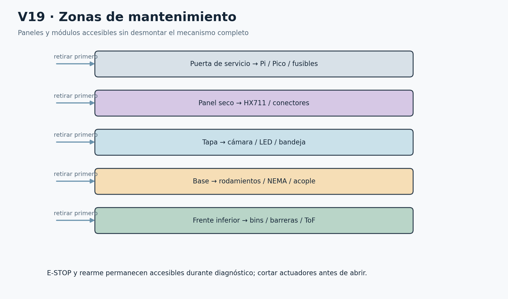

V19 Accesos de mantenimiento. Paneles y piezas seleccionables conservan su identidad.

## 36 Pruebas de aceptación

Los criterios son metas; no resultados físicos de esta entrega. El test center ejecuta los aspectos lógicos reproducibles y deja physical_result=null. P09 no mide un modelo entrenado; P15 no genera calor físico; P16 no reproduce fricción, polvo, desgaste ni diversidad de residuos.

Para latencias reales, registrar versión, backend, resolución, hilos, temperatura, carga y tamaño de muestra. Inferencia: calentamiento100 y medidas1000 como punto de partida. Medir p50, p95 y máximo; inspección desde INSPECT hasta decisión; ciclo desde estabilidad/cierre válido hasta las confirmaciones finales. No sumar percentiles parciales.

IA: recall≥0.85 por clase; pureza selectiva≥0.95 por salida reciclable aceptada; coverage≥0.80. Mostrar matriz de confusión, rechazos y denominadores. Un test de240 imágenes de60 objetos no equivale a240 objetos independientes. Reportar incertidumbre y familias repetidas.

Mecánica: ≥196/200 rutas confirmadas sin intervención en ensayo independiente de destino conocido. Integrado S0: al menos170/200 correctos sin intervención, además de gates IA y mecánicos. Aproximadamente50 intentos por clase; conservar fallos y rechazos en denominadores elegibles. No mezclar diagnóstico con clasificación autónoma.

Cualquier movimiento no autorizado o fallo de resguardo bloquea la liberación, aunque el promedio de clasificación sea alto. Tras corrección se repite el caso y sus rutas afectadas. La app exporta simulación; el acta física identifica equipo, operador, instrumentos, software, firmware, modelo y evidencia de cada intento.
| Prueba | Criterio | Resultado físico |
| --- | --- | --- |
| P01 Arranque | Sin movimiento espontáneo tras reset | PENDIENTE; nunca rellenado por gemelo |
| P02 Resguardos | Corte físico y latch durante maniobra | PENDIENTE; nunca rellenado por gemelo |
| P03 Paro | Liberar paro no reanuda | PENDIENTE; nunca rellenado por gemelo |
| P04 Protocolo | CRC/truncado/>512/tipos rechazados | PENDIENTE; nunca rellenado por gemelo |
| P05 Identidad | Boot/cycle/destino inválido sin movimiento | PENDIENTE; nunca rellenado por gemelo |
| P06 Duplicados | Una ejecución por ciclo incluso request nuevo | PENDIENTE; nunca rellenado por gemelo |
| P07 Pérdida USB | Heartbeat 200 ms, pérdida 1000 ms | PENDIENTE; nunca rellenado por gemelo |
| P08 Captura | Tres frames nuevos, edad ≤300 ms | PENDIENTE; nunca rellenado por gemelo |
| P09 Materiales | Recall≥0.85/clase; pureza≥0.95 por salida reciclable; coverage≥0.80 | PENDIENTE; nunca rellenado por gemelo |
| P10 Índices | Índice exclusivo estable 100 ms antes de abrir | PENDIENTE; nunca rellenado por gemelo |
| P11 Descarga | Haz correcto FREE→BLOCKED→FREE, vacío y CLOSED | PENDIENTE; nunca rellenado por gemelo |
| P12 Peso | ≤200 g estable; masa ligera requiere presencia visual | PENDIENTE; nunca rellenado por gemelo |
| P13 Capacidad | FULL/UNKNOWN bloquean destino; bins inspección manual | PENDIENTE; nunca rellenado por gemelo |
| P14 Persistencia | Sin falso DONE ni contador doble tras crash | PENDIENTE; nunca rellenado por gemelo |
| P15 Duración | 60 min físicos; inferencia p95≤200 ms, inspección≤1 s, ciclo≤6 s | PENDIENTE; nunca rellenado por gemelo |
| P16 200 ciclos | Mecánica independiente≥196/200; integrado plan≥170/200 más gates IA | PENDIENTE; nunca rellenado por gemelo |

## 37 Matriz BOM y fichas completas

Las 82 entradas conservan nombre, cantidad y selección del encargo. BOM-19 se representa por SENS-19 y ELEC-HX711; BOM-64 por BIN-00…03; BOM-18 y20 por cuatro instancias cada uno. Un conjunto o kit no se multiplica en presupuesto por tener varias geometrías. Los repuestos de fusible permanecen fuera del circuito; solo una unidad de cada par está activa.

La matriz compacta cruza compra, ubicación, función, interfaz, fijación y prueba. A continuación cada ficha conserva entrada/salida, alimentación, control, cableado, calibración, fallo y acceso. Los identificadores se comparten con components.json, ModelBuilder y traceability.json.
| BOM / ID / cant. | Ubicación y función | Interfaz | Fijación / prueba |
| --- | --- | --- | --- |
| BOM-01 CMP-01 ×1 Raspberry Pi 5 2 GB | Panel posterior alto, junto a cámara; Percepción y evidencia local | USB-C 5.1 V; CSI; USB CDC | Separadores M3 sobre soporte PETG aislante; P08/P14/P15 captura, disco y térmica |
| BOM-02 CMP-02 ×1 Raspberry Pi Camera Module 3 estándar visible | Recinto superior fijo, lente hacia bandeja; Capturar objeto completo | CSI a CMP-01 mediante HAR-07 | Soporte ranurado PETG sobre bastidor fijo; P08 objeto de 150 mm y frame fresco |
| BOM-03 ELEC-03 ×1 Fuente oficial Raspberry Pi 5 27 W 5.1 V/5 A | Exterior posterior, aislada del residuo; Alimentar dominio lógico | Red externa cerrada → USB-C 5.1 V | Soporte ventilado y alivio del cordón; C1/C2 sin conectar 12 V a esta red |
| BOM-04 ELEC-04 ×1 Active Cooler Raspberry Pi 5 | Sobre procesador Pi; Extraer calor | Conector FAN de Pi; alimentación interna | Anclajes originales; P15 sesión térmica |
| BOM-05 CMP-05 ×1 microSD ADATA 64 GB Clase 10 | Ranura Pi accesible por panel; OS, modelos, evidencia | Bus microSD | Inserción sin forzar; P14 reinicio y ENOSPC |
| BOM-06 CMP-06 ×1 Raspberry Pi Pico W con headers | Panel posterior señal; Autoridad física conceptual | USB de Pi; 26 GPIO 3.3 V | Soporte aislante; headers accesibles; P01/P05/P07 salidas seguras |
| BOM-07 HAR-07 ×1 CSI/FPC 15→22 pines 16–30 cm | Canal alto cámara a Pi; Transportar imagen | 15 pines cámara → 22 Pi | Bucle libre y abrazaderas sin prensar FPC; P08 continuidad funcional |
| BOM-08 HAR-08 ×1 USB-A→Micro-USB datos | Canal posterior fijo; Datos CDC y energía Pico | USB-A Pi → Micro-USB Pico | Dos alivios de tensión; P04/P07 |
| BOM-09 ACT-09 ×1 NEMA 17 17HS8401 bipolar 1.8°, 1.8 A/fase | Centro inferior, bajo eje; Transmitir par al rotor vacío | A1 A2 B1 B2 desde ELEC-12 | MECH-10 con M3; C4/C5/P10 |
| BOM-10 MECH-10 ×1 soporte metálico NEMA 17 | Travesaño inferior; Sostener motor sin absorber carga del rotor | Patrón del ACT-09 | M3 al motor, M4/M5 a bastidor; Giro desacoplado suave |
| BOM-11 MECH-11 ×1 acople flexible 5→8 mm | Entre motor y eje; Transmitir par y tolerar desalineación pequeña | 5 mm motor / 8 mm eje de referencia | Tornillos prisioneros sobre planos; Marca testigo sin deslizamiento |
| BOM-12 ELEC-12 ×1 DRV8825 | Panel potencia ventilado; Regular bobinas | 12 V VMOT; GPIO0/1/2; bobinas | Soporte aislante y disipador; C4/P10 sin hot-plug |
| BOM-13 ELEC-13 ×1 disipador DRV8825 | Cara térmica DRV; Disipar calor | Interfaz térmica ELEC-12 | Adhesivo térmico compatible sin cortos; P15 estable |
| BOM-14 ELEC-14 ×2 capacitor 100 µF/35 V | Junto VMOT y entrada XL4005; Desacoplo local de 12 V | Electrolítico polarizado 100 µF 35 V | Terminal corto aislado; no flotante; C1 tensión; C4 ripple |
| BOM-15 ACT-15 ×1 MG996R engranes metálicos | Lateral de conjunto pesado de bandeja; Abrir/cerrar hoja | 6 V externo + PWM GPIO3 | Soporte PETG/M3 sobre soporte pesado, no bastidor; C6/C7/P11 OPEN/CLOSED |
| BOM-16 MECH-16 ×1 horn de servo | Eje de salida servo; Convertir giro a desplazamiento | Estriado y tornillo ACT-15 | Tornillo original compatible; Juego sin pérdida de transmisión |
| BOM-17 MECH-17 ×1 varilla metálica de enlace | Entre horn y brazo de hoja; Transmitir fuerza axial | Articulaciones de MECH-16 y MECH-67 | Uniones cautivas con rondanas; Barrido completo sin singularidad |
| BOM-18 SENS-18 ×4 VL53L0X | Sobre cada boca de bin fuera del flujo; Estimar nivel, nunca caída | I2C 3.3 V; XSHUT individual | Soporte fijo PETG protegido; P13 UNKNOWN bloquea destino |
| BOM-19 SENS-19 ×1 celda de carga 1 kg + HX711 | Celda bajo bandeja; HX711 atrás junto a celda; Presencia, estabilidad, sobrepeso, vacío | Puente E+/E-/A+/A-; DOUT10 SCK11 3.3 V | Extremo fijo a bastidor; extremo libre al conjunto pesado; P12 carga en centro y esquinas |
| BOM-20 SENS-20 ×4 reed switch NO rotor | Corona fija sobre rotor; Confirmar índice real | Contacto NO a GND y pull-up 3.3 V; GPIO16–19 | Soporte ranurado, encapsulado protegido; P10 cuatro índices exclusivos |
| BOM-21 MECH-21 ×1–2 imán neodimio | Pestaña del rotor; Excitar reed | Campo magnético, sin cable | Cautivo mecánico, no solo pegamento; Repetir vueltas sin ambigüedad |
| BOM-22 SENS-22 ×1 final de carrera compuerta CLOSED | Soporte pesado junto bisagra; Confirmar cierre | Contacto seco GPIO13 | Ranura ajustable; actuador no usado como tope; P11 ambos límites incompatibles |
| BOM-23 SENS-23 ×1 final de carrera compuerta OPEN | Soporte pesado junto apertura; Confirmar apertura | Contacto seco GPIO14 | Ranura ajustable; P11 PWM no equivale a posición |
| BOM-24 SENS-24 ×1 final de carrera tapa superior | Marco fijo tapa; Observar resguardo y cortar potencia | GPIO12 seco + polo físico separado TBC | Soporte firme accionado por tapa; P02; BLOCKER interfaz real |
| BOM-25 SENS-25 ×1 final de carrera puerta servicio | Marco puerta servicio; Observar resguardo y cortar potencia | GPIO27 seco + polo físico separado TBC | Soporte antiaflojamiento; P02; BLOCKER interfaz real |
| BOM-26 SENS-26 ×1 pulsador momentáneo de rearme | Panel frontal separado del paro; Rearme deliberado | GPIO15; interfaz de retención por cerrar | Montaje por tuerca según pieza; P03 no reanudar al liberar paro |
| BOM-27 SENS-27 ×1 barrera óptica BIN0 | Boca BIN0; Confirmar paso | TX/RX; salida 3.3 V compatible GPIO20 | Par de soportes opuestos fuera de impacto; P11/P12 cobertura física |
| BOM-28 SENS-28 ×1 barrera óptica BIN1 | Boca BIN1; Confirmar paso | TX/RX; salida 3.3 V compatible GPIO21 | Par de soportes opuestos; P11 transición completa |
| BOM-29 SENS-29 ×1 barrera óptica BIN2 | Boca BIN2; Confirmar paso | TX/RX; salida 3.3 V compatible GPIO22 | Par de soportes opuestos; P11 destino correcto |
| BOM-30 SENS-30 ×1 barrera óptica BIN3 | Boca BIN3; Confirmar paso | TX/RX; salida 3.3 V compatible GPIO26 | Par de soportes opuestos; P11 no inferir caída por ToF |
| BOM-31 ELEC-31 ×1 fuente conmutada externa 12 V/5 A/60 W | Exterior posterior; Fuente actuadores/auxiliares | 12 V 5 A a SAFE-35 | Cerrada; sujeción y ventilación; C1/C4/C7 |
| BOM-32 ELEC-32 ×1 XL4005 buck 5 A → ≈6.0 V | Panel potencia, después fusible servo; Reducir 12 V a 6 V | IN12; OUT6; retorno común | Separadores aislantes ventilados; C1/C7; 5 A nominal no prueba térmica |
| BOM-33 SAFE-33 ×1 paro emergencia LAY37 enclavable NC+NO | Frente superior accesible; Cortar autorización físicamente | NC en cadena; NO auxiliar según contactos | Tuerca de panel, identificación; P03 medir corte DC |
| BOM-34 SAFE-34 ×1 relevador 12 V 1 canal 10 A | Panel potencia; Corte común de actuadores | 12 V bobina; COM/NO carga; lógica módulo TBC | Separadores, terminales cubiertos; HARDWARE-RISK-01; C3 |
| BOM-35 SAFE-35 ×1 portafusible principal 5×20 | Entrada 12 V inmediata; Alojar fusible principal | Entrada fuente / distribución | Montaje accesible sin tocar vivos; C0/C1 |
| BOM-36 SAFE-36 ×1 portafusible rama NEMA | Rama NEMA; Alojar fusible motor | 12 V cortado → VMOT | Panel accesible; C0/C4 |
| BOM-37 SAFE-37 ×1 portafusible rama servo | Rama servo, antes buck; Alojar fusible servo | 12 V cortado → XL4005 | Panel accesible; C0/C7 |
| BOM-38 SAFE-38 ×2 fusible principal ≈5 A | Uno en SAFE-35 y uno reserva; Proteger conductor principal | ≈5 A, valor por coordinación | Dentro portador; repuesto etiquetado; C0 prueba de coordinación sin cortocircuito improvisado |
| BOM-39 SAFE-39 ×2 fusible NEMA ≈2–3 A | Uno en SAFE-36 y uno reserva; Proteger rama motor | ≈2–3 A entrada, no corriente de fase | Portador + reserva; C4/P15 |
| BOM-40 SAFE-40 ×2 fusible servo ≈3–5 A | Uno en SAFE-37 y uno reserva; Proteger rama buck | ≈3–5 A a 12 V, valor por revisar | Portador + reserva; C7/P15 |
| BOM-41 ELEC-41 ×2 1N4007 | Panel relay; Supresión bobina y aislamiento de retención propuesto | D1 cátodo +bobina; D2 retención propuesta TBC | Soldado aislado y fijado; C3 medir tiempo real; nunca en paralelo a bobinas NEMA |
| BOM-42 ELEC-42 ×1 indicador verde AD16-22D 12 V | Frente superior izquierdo; READY | 12 V auxiliar + retorno con driver faltante | Tuerca panel; BLOCKER ELEC-LED |
| BOM-43 ELEC-43 ×1 indicador amarillo AD16-22D 12 V | Frente superior centro; PROCESANDO o REVIEW | 12 V auxiliar + retorno con driver faltante | Tuerca panel; BLOCKER ELEC-LED |
| BOM-44 ELEC-44 ×1 indicador rojo AD16-22D 12 V | Frente superior derecho; FAULT/paro/resguardo | 12 V auxiliar + retorno con driver faltante | Tuerca panel; BLOCKER ELEC-LED |
| BOM-45 ELEC-45 ×1 LED blanco recinto | Cielo recinto, lateral lente; Iluminación fija homogénea | Tensión/driver del LED TBC; rama auxiliar | Soporte térmico fuera bandeja pesada; BLOCKER tipo de LED no especificado |
| BOM-46 MECH-46 ×1 difusor acrílico opalino | Bajo LED; Suavizar luz | Óptica pasiva | Marco desmontable del bastidor; P08 sombras y reflejos |
| BOM-47 HAR-47 ×6 KF301 2 pines | Panel potencia y auxiliares; Seis bloques de dos polos | J01–J06; 12 polos | Montaje soldado sobre soporte adecuado TBC; C0; no usar colgantes |
| BOM-48 HAR-48 ×4 KF301 3 pines | Panel servo/HX/auxiliar; Cuatro bloques de tres polos | J07–J10; 12 polos | Igual soporte aislado; C0 correspondencia wire-to |
| BOM-49 HAR-49 ×4 KF301 4 pines | Panel motor y sensores; Cuatro bloques de cuatro polos | J11–J14; 16 polos | Igual soporte aislado; C0/C4 |
| BOM-50 HAR-50 ×2 tiras header macho 2.54 mm 40 pines | Panel señal/distribución; 80 posiciones macho disponibles | H01/H02, 2.54 mm | Cortar a longitud; soldar y aislar, sin suponer hembra; C0; soldadura directa documentada |
| BOM-51 HAR-51 ×1 kit kit terminales Faston/anillo/horquilla | Contactos paro/fusibles/tierra funcional; Terminación segura | Faston según ancho real; anillo/horquilla | Crimpado con herramienta correcta; C0 |
| BOM-52 HAR-52 ×1 kit kit ferrules/virolas | Borneras de tornillo; Evitar hilos sueltos | Virola compatible AWG18/22 | Crimpado; no estañar bajo tornillo; C0 tracción |
| BOM-53 HAR-53 ×≈5 m cable 18 AWG rojo | Canal potencia; Positivos 12/6 V | 18 AWG rojo con etiqueta tensión | Cincho flojo + pasacables; C0 caída bajo carga |
| BOM-54 HAR-54 ×≈5 m cable 18 AWG negro | Canal potencia; Retorno de alta corriente | 18 AWG negro | Retorno estrella a ELEC-31 negativo; C0/C7 |
| BOM-55 HAR-55 ×≈5 m cable 22 AWG rojo | Canal señal; Alimentación sensores/auxiliar etiquetada | 22 AWG rojo | Bucle libre en bandeja; C0 polaridad |
| BOM-56 HAR-56 ×≈5 m cable 22 AWG negro | Canal señal; Retorno sensores | 22 AWG negro | Pareado a señal, estrella señal; C0/P12 |
| BOM-57 HAR-57 ×≈5 m cable 22 AWG amarillo | Canal señal; Datos y señales pares | 22 AWG amarillo | Alejado bobinas; P04/P10 |
| BOM-58 HAR-58 ×≈5 m cable 22 AWG azul | Canal señal; Datos y señales complementarias | 22 AWG azul | Alejado potencia; C2 I2C |
| BOM-59 HAR-59 ×1 kit termorretráctil surtido | Uniones soldadas y crimpados; Aislamiento y alivio local | Pasivo | Contraer sin dañar sensores; C0 visual |
| BOM-60 HAR-60 ×1 bolsa cinchos | Rutas de arnés; Sujetar sin estrangular | Pasivo | Holgura en CSI y celda; C0/P12 |
| BOM-61 HAR-61 ×1 bolsa bases adhesivas cinchos | Panel fijo; Anclar cinchos | Pasivo | Superficie limpia; respaldo mecánico si cae adhesivo; Audit G |
| BOM-62 HAR-62 ×≈10 PG7/PG9 | Entradas/salidas de panel; Alivio de tensión y borde | Diámetro cable PG7/PG9 real | Tuerca/prensado correcto; C0 tracción |
| BOM-63 HAR-63 ×1 cinta aislante | Reserva/identificación provisional; Aislamiento secundario | Pasivo | Nunca único alivio ni unión eléctrica; C0 |
| BOM-64 BIN-64 ×4 recipientes 5–8 L | Nivel D 2×2; Recibir materiales separados | BIN0 PET; BIN1 papel; BIN2 metal; BIN3 general | Apoyos indexados en bastidor; extraíbles; P13 inspección manual |
| BOM-65 MECH-65 ×1 conjunto bastidor/paneles funcionales | Envolvente cuatro niveles; Estructura, paneles, tapa, puerta y soporte eléctrico | Mecánica; sin pantalla agregada | M4/M5, paneles desmontables; Audit A–O |
| BOM-66 MECH-66 ×1 bandeja ≈200×200 mm | Nivel A; Retener y pesar objeto | Celda→soporte→bandeja/hoja | Conjunto pesado completo sobre extremo libre; P12/P11 |
| BOM-67 MECH-67 ×1 compuerta ≈160×160 mm | Nivel B; Retener/liberar residuo | Servo-varilla; OPEN/CLOSED | Bisagra sobre conjunto pesado; C7/P11 |
| BOM-68 MECH-68 ×1 conducto/desviador rotatorio | Nivel C; Canalizar caída a cuatro bins | Hub a eje; una boca central y salida radial | Pieza lisa apoyada por hub bajo suelo de guía; 50 descargas; BLOCKER hasta CAD medido |
| BOM-69 MECH-69 ×1 eje desviador | Centro, debajo suelo de guía; Transmitir giro sin invadir paso del objeto | Acople/rodamientos/hub | Dos rodamientos estructurales; C5 giro vacío |
| BOM-70 MECH-70 ×2 rodamiento | Travesaños centrales, dos alturas; Absorber carga radial | Diámetro interior eje TBC | Alojamiento mecanizado en soportes independientes; C5 giro manual sin motor |
| BOM-71 MECH-71 ×2 collarín | Junto apoyos de eje; Limitar desplazamiento axial | Abrazan eje | Prisionero/abrazadera según pieza; C5 |
| BOM-72 MECH-72 ×1 bisagra compuerta | Borde bandeja pesada; Pivotar hoja | MECH-66/67 | Tornillos cautivos sobre mismo conjunto pesado; C7/P12 |
| BOM-73 MECH-73 ×2 bisagras tapa | Marco tapa superior; Permitir carga | MECH-65 tapa y marco | Dos bisagras con tornillos; Audit F |
| BOM-74 MECH-74 ×2 bisagras puerta servicio | Frente puerta servicio; Acceder a cuatro bins y paneles | MECH-65 puerta | Dos bisagras; Audit D/E |
| BOM-75 MECH-75 ×1 pestillo puerta servicio | Puerta servicio; Mantener cierre | Marco y hoja | Tornillería inaccesible al residuo; P02 |
| BOM-76 MECH-76 ×surtida tornillería M3/M4/M5 | Uniones estructura/electrónica; Fijación mecánica | M3 electrónica; M4/M5 estructura según fabricante | Rondanas adecuadas; Marca testigo y revisión |
| BOM-77 MECH-77 ×surtidas Nyloc + rondanas | Uniones sometidas a vibración; Retención y reparto de carga | Nyloc/rondanas compatibles | No precargar piezas móviles; P15 revisión |
| BOM-78 SAFE-78 ×por medir policarbonato/acrílico para resguardo | Separación residuo/energía y ventanas; Resguardo contra acceso y proyección | Panel pasivo | Atornillado, retirado solo sin energía; P02/inspección |
| BOM-79 MECH-79 ×por medir PETG para guías/soportes | Guías, soportes cámara y sensores; Material de fabricación ya contemplado | Pasivo | Impresión con orientación de esfuerzo documentada; Ensayo pieza antes montaje |
| BOM-80 MECH-80 ×1 servicio fabricación mecánica completa | Taller, documentación; Fabricar todas las piezas de MECH-65–79 | CAD medido, DXF/STL/STEP según pieza | No componente añadido; 22 etapas y acta recepción |
| BOM-81 SAFE-81 ×1 lote repuestos menores | Almacén externo; Reposición menores sin aumentar conteo operativo | Etiquetado por BOM | Caja fuera mecanismo; Comparar referencia antes montar |
| BOM-82 HAR-82 ×1 partida envíos/logística | Cadena suministro; Transporte y recepción | Guías, fechas, costo separado | No geometría operativa; Recepción y presupuesto independiente |

### BOM-01 Raspberry Pi 5 2 GB

**ID y cantidad:** CMP-01; 1. **Ubicación:** Panel posterior alto, junto a cámara. **Función:** Percepción y evidencia local.

**Entrada e interfaz:** USB-C 5.1 V; CSI; USB CDC. **Salida:** Percepción y evidencia local. **Alimentación:** USB-C 5.1 V; CSI; USB CDC. **Controlador:** Según interfaz; Pi para percepción.

**Fijación:** Separadores M3 sobre soporte PETG aislante. **Cableado:** ver Wxxx por CMP-01 en E08 y las instancias de components.json; para piezas pasivas, interfaz mecánica sin señal.

**Calibración:** Versionar OS y medir temperatura/RAM. **Fallo típico:** Throttling o reinicio. **Prueba:** P08/P14/P15 captura, disco y térmica. **Accesibilidad:** Aislar actuadores; retirar panel de servicio MECH-65, acceder por Panel posterior alto, junto a cámara.

### BOM-02 Raspberry Pi Camera Module 3 estándar visible

**ID y cantidad:** CMP-02; 1. **Ubicación:** Recinto superior fijo, lente hacia bandeja. **Función:** Capturar objeto completo.

**Entrada e interfaz:** CSI a CMP-01 mediante HAR-07. **Salida:** Capturar objeto completo. **Alimentación:** CSI a CMP-01 mediante HAR-07. **Controlador:** Según interfaz; Pi para percepción.

**Fijación:** Soporte ranurado PETG sobre bastidor fijo. **Cableado:** ver Wxxx por CMP-02 en E08 y las instancias de components.json; para piezas pasivas, interfaz mecánica sin señal.

**Calibración:** ROI, foco, exposición, WB y carta límite. **Fallo típico:** Recorte de objeto, desenfoque. **Prueba:** P08 objeto de 150 mm y frame fresco. **Accesibilidad:** Aislar actuadores; retirar panel de servicio MECH-65, acceder por Recinto superior fijo, lente hacia bandeja.

### BOM-03 Fuente oficial Raspberry Pi 5 27 W 5.1 V/5 A

**ID y cantidad:** ELEC-03; 1. **Ubicación:** Exterior posterior, aislada del residuo. **Función:** Alimentar dominio lógico.

**Entrada e interfaz:** Red externa cerrada → USB-C 5.1 V. **Salida:** Alimentar dominio lógico. **Alimentación:** Red externa cerrada → USB-C 5.1 V. **Controlador:** Según interfaz; Pi para percepción.

**Fijación:** Soporte ventilado y alivio del cordón. **Cableado:** ver Wxxx por ELEC-03 en E08 y las instancias de components.json; para piezas pasivas, interfaz mecánica sin señal.

**Calibración:** Medir 5.1 V bajo carga. **Fallo típico:** Undervoltage. **Prueba:** C1/C2 sin conectar 12 V a esta red. **Accesibilidad:** Aislar actuadores; retirar panel de servicio MECH-65, acceder por Exterior posterior, aislada del residuo.

### BOM-04 Active Cooler Raspberry Pi 5

**ID y cantidad:** ELEC-04; 1. **Ubicación:** Sobre procesador Pi. **Función:** Extraer calor.

**Entrada e interfaz:** Conector FAN de Pi; alimentación interna. **Salida:** Extraer calor. **Alimentación:** Conector FAN de Pi; alimentación interna. **Controlador:** Según interfaz; Pi para percepción.

**Fijación:** Anclajes originales. **Cableado:** ver Wxxx por ELEC-04 en E08 y las instancias de components.json; para piezas pasivas, interfaz mecánica sin señal.

**Calibración:** Leer temperatura y ventilación. **Fallo típico:** Aire recirculado. **Prueba:** P15 sesión térmica. **Accesibilidad:** Aislar actuadores; retirar panel de servicio MECH-65, acceder por Sobre procesador Pi.

### BOM-05 microSD ADATA 64 GB Clase 10

**ID y cantidad:** CMP-05; 1. **Ubicación:** Ranura Pi accesible por panel. **Función:** OS, modelos, evidencia.

**Entrada e interfaz:** Bus microSD. **Salida:** OS, modelos, evidencia. **Alimentación:** Bus microSD. **Controlador:** Según interfaz; Pi para percepción.

**Fijación:** Inserción sin forzar. **Cableado:** ver Wxxx por CMP-05 en E08 y las instancias de components.json; para piezas pasivas, interfaz mecánica sin señal.

**Calibración:** Imagen de respaldo y hashes. **Fallo típico:** Corrupción o llena. **Prueba:** P14 reinicio y ENOSPC. **Accesibilidad:** Aislar actuadores; retirar panel de servicio MECH-65, acceder por Ranura Pi accesible por panel.

### BOM-06 Raspberry Pi Pico W con headers

**ID y cantidad:** CMP-06; 1. **Ubicación:** Panel posterior señal. **Función:** Autoridad física conceptual.

**Entrada e interfaz:** USB de Pi; 26 GPIO 3.3 V. **Salida:** Autoridad física conceptual. **Alimentación:** USB de Pi; 26 GPIO 3.3 V. **Controlador:** Según interfaz; Pi para percepción.

**Fijación:** Soporte aislante; headers accesibles. **Cableado:** ver Wxxx por CMP-06 en E08 y las instancias de components.json; para piezas pasivas, interfaz mecánica sin señal.

**Calibración:** Pinout y watchdog. **Fallo típico:** Boot/reset o heartbeat vencido. **Prueba:** P01/P05/P07 salidas seguras. **Accesibilidad:** Aislar actuadores; retirar panel de servicio MECH-65, acceder por Panel posterior señal.

### BOM-07 CSI/FPC 15→22 pines 16–30 cm

**ID y cantidad:** HAR-07; 1. **Ubicación:** Canal alto cámara a Pi. **Función:** Transportar imagen.

**Entrada e interfaz:** 15 pines cámara → 22 Pi. **Salida:** Transportar imagen. **Alimentación:** Pasivo / sin alimentación. **Controlador:** Según interfaz; Pi para percepción.

**Fijación:** Bucle libre y abrazaderas sin prensar FPC. **Cableado:** ver Wxxx por HAR-07 en E08 y las instancias de components.json; para piezas pasivas, interfaz mecánica sin señal.

**Calibración:** Orientación contactos, radio del fabricante TBC. **Fallo típico:** Fatiga/roce. **Prueba:** P08 continuidad funcional. **Accesibilidad:** Aislar actuadores; retirar panel de servicio MECH-65, acceder por Canal alto cámara a Pi.

### BOM-08 USB-A→Micro-USB datos

**ID y cantidad:** HAR-08; 1. **Ubicación:** Canal posterior fijo. **Función:** Datos CDC y energía Pico.

**Entrada e interfaz:** USB-A Pi → Micro-USB Pico. **Salida:** Datos CDC y energía Pico. **Alimentación:** Pasivo / sin alimentación. **Controlador:** Según interfaz; Pi para percepción.

**Fijación:** Dos alivios de tensión. **Cableado:** ver Wxxx por HAR-08 en E08 y las instancias de components.json; para piezas pasivas, interfaz mecánica sin señal.

**Calibración:** Identidad USB y CRC. **Fallo típico:** Desconexión o cable solo carga. **Prueba:** P04/P07. **Accesibilidad:** Aislar actuadores; retirar panel de servicio MECH-65, acceder por Canal posterior fijo.

### BOM-09 NEMA 17 17HS8401 bipolar 1.8°, 1.8 A/fase

**ID y cantidad:** ACT-09; 1. **Ubicación:** Centro inferior, bajo eje. **Función:** Transmitir par al rotor vacío.

**Entrada e interfaz:** A1 A2 B1 B2 desde ELEC-12. **Salida:** Transmitir par al rotor vacío. **Alimentación:** A1 A2 B1 B2 desde ELEC-12. **Controlador:** Pico W.

**Fijación:** MECH-10 con M3. **Cableado:** ver Wxxx por ACT-09 en E08 y las instancias de components.json; para piezas pasivas, interfaz mecánica sin señal.

**Calibración:** Bobinas, corriente, rampa e índices. **Fallo típico:** Pérdida de pasos/calor. **Prueba:** C4/C5/P10. **Accesibilidad:** Aislar actuadores; retirar panel de servicio MECH-65, acceder por Centro inferior, bajo eje.

### BOM-10 soporte metálico NEMA 17

**ID y cantidad:** MECH-10; 1. **Ubicación:** Travesaño inferior. **Función:** Sostener motor sin absorber carga del rotor.

**Entrada e interfaz:** Patrón del ACT-09. **Salida:** Sostener motor sin absorber carga del rotor. **Alimentación:** Pasivo / sin alimentación. **Controlador:** Según interfaz; Pi para percepción.

**Fijación:** M3 al motor, M4/M5 a bastidor. **Cableado:** ver Wxxx por MECH-10 en E08 y las instancias de components.json; para piezas pasivas, interfaz mecánica sin señal.

**Calibración:** Escuadra/coaxialidad. **Fallo típico:** Desalineación. **Prueba:** Giro desacoplado suave. **Accesibilidad:** Aislar actuadores; retirar panel de servicio MECH-65, acceder por Travesaño inferior.

### BOM-11 acople flexible 5→8 mm

**ID y cantidad:** MECH-11; 1. **Ubicación:** Entre motor y eje. **Función:** Transmitir par y tolerar desalineación pequeña.

**Entrada e interfaz:** 5 mm motor / 8 mm eje de referencia. **Salida:** Transmitir par y tolerar desalineación pequeña. **Alimentación:** Pasivo / sin alimentación. **Controlador:** Según interfaz; Pi para percepción.

**Fijación:** Tornillos prisioneros sobre planos. **Cableado:** ver Wxxx por MECH-11 en E08 y las instancias de components.json; para piezas pasivas, interfaz mecánica sin señal.

**Calibración:** Diámetros y separación axial TBC. **Fallo típico:** Patina o flexiona excesivo. **Prueba:** Marca testigo sin deslizamiento. **Accesibilidad:** Aislar actuadores; retirar panel de servicio MECH-65, acceder por Entre motor y eje.

### BOM-12 DRV8825

**ID y cantidad:** ELEC-12; 1. **Ubicación:** Panel potencia ventilado. **Función:** Regular bobinas.

**Entrada e interfaz:** 12 V VMOT; GPIO0/1/2; bobinas. **Salida:** Regular bobinas. **Alimentación:** 12 V VMOT; GPIO0/1/2; bobinas. **Controlador:** Según interfaz; Pi para percepción.

**Fijación:** Soporte aislante y disipador. **Cableado:** ver Wxxx por ELEC-12 en E08 y las instancias de components.json; para piezas pasivas, interfaz mecánica sin señal.

**Calibración:** Leer Rsense, fórmula TI y medir corriente. **Fallo típico:** Sobretemperatura o shoot-through de cableado. **Prueba:** C4/P10 sin hot-plug. **Accesibilidad:** Aislar actuadores; retirar panel de servicio MECH-65, acceder por Panel potencia ventilado.

### BOM-13 disipador DRV8825

**ID y cantidad:** ELEC-13; 1. **Ubicación:** Cara térmica DRV. **Función:** Disipar calor.

**Entrada e interfaz:** Interfaz térmica ELEC-12. **Salida:** Disipar calor. **Alimentación:** Interfaz térmica ELEC-12. **Controlador:** Según interfaz; Pi para percepción.

**Fijación:** Adhesivo térmico compatible sin cortos. **Cableado:** ver Wxxx por ELEC-13 en E08 y las instancias de components.json; para piezas pasivas, interfaz mecánica sin señal.

**Calibración:** Temperatura real. **Fallo típico:** Se despega/toca pines. **Prueba:** P15 estable. **Accesibilidad:** Aislar actuadores; retirar panel de servicio MECH-65, acceder por Cara térmica DRV.

### BOM-14 capacitor 100 µF/35 V

**ID y cantidad:** ELEC-14; 2. **Ubicación:** Junto VMOT y entrada XL4005. **Función:** Desacoplo local de 12 V.

**Entrada e interfaz:** Electrolítico polarizado 100 µF 35 V. **Salida:** Desacoplo local de 12 V. **Alimentación:** Electrolítico polarizado 100 µF 35 V. **Controlador:** Según interfaz; Pi para percepción.

**Fijación:** Terminal corto aislado; no flotante. **Cableado:** ver Wxxx por ELEC-14 en E08 y las instancias de components.json; para piezas pasivas, interfaz mecánica sin señal.

**Calibración:** Polaridad y capacidad. **Fallo típico:** Inversión o transitorio residual. **Prueba:** C1 tensión; C4 ripple. **Accesibilidad:** Aislar actuadores; retirar panel de servicio MECH-65, acceder por Junto VMOT y entrada XL4005.

### BOM-15 MG996R engranes metálicos

**ID y cantidad:** ACT-15; 1. **Ubicación:** Lateral de conjunto pesado de bandeja. **Función:** Abrir/cerrar hoja.

**Entrada e interfaz:** 6 V externo + PWM GPIO3. **Salida:** Abrir/cerrar hoja. **Alimentación:** 6 V externo + PWM GPIO3. **Controlador:** Pico W.

**Fijación:** Soporte PETG/M3 sobre soporte pesado, no bastidor. **Cableado:** ver Wxxx por ACT-15 en E08 y las instancias de components.json; para piezas pasivas, interfaz mecánica sin señal.

**Calibración:** Pulsos límite sin bloqueo y torque. **Fallo típico:** Stall o brownout. **Prueba:** C6/C7/P11 OPEN/CLOSED. **Accesibilidad:** Aislar actuadores; retirar panel de servicio MECH-65, acceder por Lateral de conjunto pesado de bandeja.

### BOM-16 horn de servo

**ID y cantidad:** MECH-16; 1. **Ubicación:** Eje de salida servo. **Función:** Convertir giro a desplazamiento.

**Entrada e interfaz:** Estriado y tornillo ACT-15. **Salida:** Convertir giro a desplazamiento. **Alimentación:** Pasivo / sin alimentación. **Controlador:** Según interfaz; Pi para percepción.

**Fijación:** Tornillo original compatible. **Cableado:** ver Wxxx por MECH-16 en E08 y las instancias de components.json; para piezas pasivas, interfaz mecánica sin señal.

**Calibración:** Radio útil y cero. **Fallo típico:** Diente flojo. **Prueba:** Juego sin pérdida de transmisión. **Accesibilidad:** Aislar actuadores; retirar panel de servicio MECH-65, acceder por Eje de salida servo.

### BOM-17 varilla metálica de enlace

**ID y cantidad:** MECH-17; 1. **Ubicación:** Entre horn y brazo de hoja. **Función:** Transmitir fuerza axial.

**Entrada e interfaz:** Articulaciones de MECH-16 y MECH-67. **Salida:** Transmitir fuerza axial. **Alimentación:** Pasivo / sin alimentación. **Controlador:** Según interfaz; Pi para percepción.

**Fijación:** Uniones cautivas con rondanas. **Cableado:** ver Wxxx por MECH-17 en E08 y las instancias de components.json; para piezas pasivas, interfaz mecánica sin señal.

**Calibración:** Longitud y ángulos anti punto muerto. **Fallo típico:** Roce o pandeo. **Prueba:** Barrido completo sin singularidad. **Accesibilidad:** Aislar actuadores; retirar panel de servicio MECH-65, acceder por Entre horn y brazo de hoja.

### BOM-18 VL53L0X

**ID y cantidad:** SENS-18; 4. **Ubicación:** Sobre cada boca de bin fuera del flujo. **Función:** Estimar nivel, nunca caída.

**Entrada e interfaz:** I2C 3.3 V; XSHUT individual. **Salida:** Estimar nivel, nunca caída. **Alimentación:** I2C 3.3 V; XSHUT individual. **Controlador:** Pico W.

**Fijación:** Soporte fijo PETG protegido. **Cableado:** ver Wxxx por SENS-18 en E08 y las instancias de components.json; para piezas pasivas, interfaz mecánica sin señal.

**Calibración:** D_EMPTY D_FULL por bin y prueba de reflectancia. **Fallo típico:** Dato inválido o crosstalk. **Prueba:** P13 UNKNOWN bloquea destino. **Accesibilidad:** Aislar actuadores; retirar panel de servicio MECH-65, acceder por Sobre cada boca de bin fuera del flujo.

### BOM-19 celda de carga 1 kg + HX711

**ID y cantidad:** SENS-19; 1. **Ubicación:** Celda bajo bandeja; HX711 atrás junto a celda. **Función:** Presencia, estabilidad, sobrepeso, vacío.

**Entrada e interfaz:** Puente E+/E-/A+/A-; DOUT10 SCK11 3.3 V. **Salida:** Presencia, estabilidad, sobrepeso, vacío. **Alimentación:** Puente E+/E-/A+/A-; DOUT10 SCK11 3.3 V. **Controlador:** Pico W.

**Fijación:** Extremo fijo a bastidor; extremo libre al conjunto pesado. **Cableado:** ver Wxxx por SENS-19 en E08 y las instancias de components.json; para piezas pasivas, interfaz mecánica sin señal.

**Calibración:** Tara con hoja cerrada; masas trazables; topes. **Fallo típico:** Ruta de carga paralela/deriva. **Prueba:** P12 carga en centro y esquinas. **Accesibilidad:** Aislar actuadores; retirar panel de servicio MECH-65, acceder por Celda bajo bandeja; HX711 atrás junto a celda.

### BOM-20 reed switch NO rotor

**ID y cantidad:** SENS-20; 4. **Ubicación:** Corona fija sobre rotor. **Función:** Confirmar índice real.

**Entrada e interfaz:** Contacto NO a GND y pull-up 3.3 V; GPIO16–19. **Salida:** Confirmar índice real. **Alimentación:** Contacto NO a GND y pull-up 3.3 V; GPIO16–19. **Controlador:** Pico W.

**Fijación:** Soporte ranurado, encapsulado protegido. **Cableado:** ver Wxxx por SENS-20 en E08 y las instancias de components.json; para piezas pasivas, interfaz mecánica sin señal.

**Calibración:** Un imán; ventanas sin solape; 100 ms. **Fallo típico:** Reed ausente o doble. **Prueba:** P10 cuatro índices exclusivos. **Accesibilidad:** Aislar actuadores; retirar panel de servicio MECH-65, acceder por Corona fija sobre rotor.

### BOM-21 imán neodimio

**ID y cantidad:** MECH-21; 1–2. **Ubicación:** Pestaña del rotor. **Función:** Excitar reed.

**Entrada e interfaz:** Campo magnético, sin cable. **Salida:** Excitar reed. **Alimentación:** Pasivo / sin alimentación. **Controlador:** Según interfaz; Pi para percepción.

**Fijación:** Cautivo mecánico, no solo pegamento. **Cableado:** ver Wxxx por MECH-21 en E08 y las instancias de components.json; para piezas pasivas, interfaz mecánica sin señal.

**Calibración:** Separación imán-reed. **Fallo típico:** Imán suelto o dos índices. **Prueba:** Repetir vueltas sin ambigüedad. **Accesibilidad:** Aislar actuadores; retirar panel de servicio MECH-65, acceder por Pestaña del rotor.

### BOM-22 final de carrera compuerta CLOSED

**ID y cantidad:** SENS-22; 1. **Ubicación:** Soporte pesado junto bisagra. **Función:** Confirmar cierre.

**Entrada e interfaz:** Contacto seco GPIO13. **Salida:** Confirmar cierre. **Alimentación:** Contacto seco GPIO13. **Controlador:** Pico W.

**Fijación:** Ranura ajustable; actuador no usado como tope. **Cableado:** ver Wxxx por SENS-22 en E08 y las instancias de components.json; para piezas pasivas, interfaz mecánica sin señal.

**Calibración:** Antirrebote 20 ms. **Fallo típico:** Nunca cierra o queda pegado. **Prueba:** P11 ambos límites incompatibles. **Accesibilidad:** Aislar actuadores; retirar panel de servicio MECH-65, acceder por Soporte pesado junto bisagra.

### BOM-23 final de carrera compuerta OPEN

**ID y cantidad:** SENS-23; 1. **Ubicación:** Soporte pesado junto apertura. **Función:** Confirmar apertura.

**Entrada e interfaz:** Contacto seco GPIO14. **Salida:** Confirmar apertura. **Alimentación:** Contacto seco GPIO14. **Controlador:** Pico W.

**Fijación:** Ranura ajustable. **Cableado:** ver Wxxx por SENS-23 en E08 y las instancias de components.json; para piezas pasivas, interfaz mecánica sin señal.

**Calibración:** Disparo antes del tope duro. **Fallo típico:** Ausencia de OPEN. **Prueba:** P11 PWM no equivale a posición. **Accesibilidad:** Aislar actuadores; retirar panel de servicio MECH-65, acceder por Soporte pesado junto apertura.

### BOM-24 final de carrera tapa superior

**ID y cantidad:** SENS-24; 1. **Ubicación:** Marco fijo tapa. **Función:** Observar resguardo y cortar potencia.

**Entrada e interfaz:** GPIO12 seco + polo físico separado TBC. **Salida:** Observar resguardo y cortar potencia. **Alimentación:** GPIO12 seco + polo físico separado TBC. **Controlador:** Pico W.

**Fijación:** Soporte firme accionado por tapa. **Cableado:** ver Wxxx por SENS-24 en E08 y las instancias de components.json; para piezas pasivas, interfaz mecánica sin señal.

**Calibración:** Verificar contactos independientes del modelo. **Fallo típico:** Un solo polo comparte 12 V y GPIO. **Prueba:** P02; BLOCKER interfaz real. **Accesibilidad:** Aislar actuadores; retirar panel de servicio MECH-65, acceder por Marco fijo tapa.

### BOM-25 final de carrera puerta servicio

**ID y cantidad:** SENS-25; 1. **Ubicación:** Marco puerta servicio. **Función:** Observar resguardo y cortar potencia.

**Entrada e interfaz:** GPIO27 seco + polo físico separado TBC. **Salida:** Observar resguardo y cortar potencia. **Alimentación:** GPIO27 seco + polo físico separado TBC. **Controlador:** Pico W.

**Fijación:** Soporte antiaflojamiento. **Cableado:** ver Wxxx por SENS-25 en E08 y las instancias de components.json; para piezas pasivas, interfaz mecánica sin señal.

**Calibración:** Verificar apertura antes de acceso. **Fallo típico:** Contacto puenteado o roto. **Prueba:** P02; BLOCKER interfaz real. **Accesibilidad:** Aislar actuadores; retirar panel de servicio MECH-65, acceder por Marco puerta servicio.

### BOM-26 pulsador momentáneo de rearme

**ID y cantidad:** SENS-26; 1. **Ubicación:** Panel frontal separado del paro. **Función:** Rearme deliberado.

**Entrada e interfaz:** GPIO15; interfaz de retención por cerrar. **Salida:** Rearme deliberado. **Alimentación:** GPIO15; interfaz de retención por cerrar. **Controlador:** Pico W.

**Fijación:** Montaje por tuerca según pieza. **Cableado:** ver Wxxx por SENS-26 en E08 y las instancias de components.json; para piezas pasivas, interfaz mecánica sin señal.

**Calibración:** Flanco, antirrebote, no nivel mantenido. **Fallo típico:** Rearme pegado. **Prueba:** P03 no reanudar al liberar paro. **Accesibilidad:** Aislar actuadores; retirar panel de servicio MECH-65, acceder por Panel frontal separado del paro.

### BOM-27 barrera óptica BIN0

**ID y cantidad:** SENS-27; 1. **Ubicación:** Boca BIN0. **Función:** Confirmar paso.

**Entrada e interfaz:** TX/RX; salida 3.3 V compatible GPIO20. **Salida:** Confirmar paso. **Alimentación:** TX/RX; salida 3.3 V compatible GPIO20. **Controlador:** Pico W.

**Fijación:** Par de soportes opuestos fuera de impacto. **Cableado:** ver Wxxx por SENS-27 en E08 y las instancias de components.json; para piezas pasivas, interfaz mecánica sin señal.

**Calibración:** FREE-BLOCKED-FREE y cobertura papel. **Fallo típico:** Haz fino omite papel. **Prueba:** P11/P12 cobertura física. **Accesibilidad:** Aislar actuadores; retirar panel de servicio MECH-65, acceder por Boca BIN0.

### BOM-28 barrera óptica BIN1

**ID y cantidad:** SENS-28; 1. **Ubicación:** Boca BIN1. **Función:** Confirmar paso.

**Entrada e interfaz:** TX/RX; salida 3.3 V compatible GPIO21. **Salida:** Confirmar paso. **Alimentación:** TX/RX; salida 3.3 V compatible GPIO21. **Controlador:** Pico W.

**Fijación:** Par de soportes opuestos. **Cableado:** ver Wxxx por SENS-28 en E08 y las instancias de components.json; para piezas pasivas, interfaz mecánica sin señal.

**Calibración:** Cobertura del paso. **Fallo típico:** Bloqueo permanente. **Prueba:** P11 transición completa. **Accesibilidad:** Aislar actuadores; retirar panel de servicio MECH-65, acceder por Boca BIN1.

### BOM-29 barrera óptica BIN2

**ID y cantidad:** SENS-29; 1. **Ubicación:** Boca BIN2. **Función:** Confirmar paso.

**Entrada e interfaz:** TX/RX; salida 3.3 V compatible GPIO22. **Salida:** Confirmar paso. **Alimentación:** TX/RX; salida 3.3 V compatible GPIO22. **Controlador:** Pico W.

**Fijación:** Par de soportes opuestos. **Cableado:** ver Wxxx por SENS-29 en E08 y las instancias de components.json; para piezas pasivas, interfaz mecánica sin señal.

**Calibración:** Alineación con lata. **Fallo típico:** Reflejo o cable cortado. **Prueba:** P11 destino correcto. **Accesibilidad:** Aislar actuadores; retirar panel de servicio MECH-65, acceder por Boca BIN2.

### BOM-30 barrera óptica BIN3

**ID y cantidad:** SENS-30; 1. **Ubicación:** Boca BIN3. **Función:** Confirmar paso.

**Entrada e interfaz:** TX/RX; salida 3.3 V compatible GPIO26. **Salida:** Confirmar paso. **Alimentación:** TX/RX; salida 3.3 V compatible GPIO26. **Controlador:** Pico W.

**Fijación:** Par de soportes opuestos. **Cableado:** ver Wxxx por SENS-30 en E08 y las instancias de components.json; para piezas pasivas, interfaz mecánica sin señal.

**Calibración:** FREE-BLOCKED-FREE. **Fallo típico:** Caída fuera del haz. **Prueba:** P11 no inferir caída por ToF. **Accesibilidad:** Aislar actuadores; retirar panel de servicio MECH-65, acceder por Boca BIN3.

### BOM-31 fuente conmutada externa 12 V/5 A/60 W

**ID y cantidad:** ELEC-31; 1. **Ubicación:** Exterior posterior. **Función:** Fuente actuadores/auxiliares.

**Entrada e interfaz:** 12 V 5 A a SAFE-35. **Salida:** Fuente actuadores/auxiliares. **Alimentación:** 12 V 5 A a SAFE-35. **Controlador:** Según interfaz; Pi para percepción.

**Fijación:** Cerrada; sujeción y ventilación. **Cableado:** ver Wxxx por ELEC-31 en E08 y las instancias de components.json; para piezas pasivas, interfaz mecánica sin señal.

**Calibración:** Voltaje/corriente bajo carga. **Fallo típico:** Colapso o sobrecarga. **Prueba:** C1/C4/C7. **Accesibilidad:** Aislar actuadores; retirar panel de servicio MECH-65, acceder por Exterior posterior.

### BOM-32 XL4005 buck 5 A → ≈6.0 V

**ID y cantidad:** ELEC-32; 1. **Ubicación:** Panel potencia, después fusible servo. **Función:** Reducir 12 V a 6 V.

**Entrada e interfaz:** IN12; OUT6; retorno común. **Salida:** Reducir 12 V a 6 V. **Alimentación:** IN12; OUT6; retorno común. **Controlador:** Según interfaz; Pi para percepción.

**Fijación:** Separadores aislantes ventilados. **Cableado:** ver Wxxx por ELEC-32 en E08 y las instancias de components.json; para piezas pasivas, interfaz mecánica sin señal.

**Calibración:** Ajustar sin servo; ensayo carga. **Fallo típico:** Calor o 6 V caen. **Prueba:** C1/C7; 5 A nominal no prueba térmica. **Accesibilidad:** Aislar actuadores; retirar panel de servicio MECH-65, acceder por Panel potencia, después fusible servo.

### BOM-33 paro emergencia LAY37 enclavable NC+NO

**ID y cantidad:** SAFE-33; 1. **Ubicación:** Frente superior accesible. **Función:** Cortar autorización físicamente.

**Entrada e interfaz:** NC en cadena; NO auxiliar según contactos. **Salida:** Cortar autorización físicamente. **Alimentación:** NC en cadena; NO auxiliar según contactos. **Controlador:** Según interfaz; Pi para percepción.

**Fijación:** Tuerca de panel, identificación. **Cableado:** ver Wxxx por SAFE-33 en E08 y las instancias de components.json; para piezas pasivas, interfaz mecánica sin señal.

**Calibración:** Continuidad ambos estados. **Fallo típico:** Contacto soldado o mal cableado. **Prueba:** P03 medir corte DC. **Accesibilidad:** Aislar actuadores; retirar panel de servicio MECH-65, acceder por Frente superior accesible.

### BOM-34 relevador 12 V 1 canal 10 A

**ID y cantidad:** SAFE-34; 1. **Ubicación:** Panel potencia. **Función:** Corte común de actuadores.

**Entrada e interfaz:** 12 V bobina; COM/NO carga; lógica módulo TBC. **Salida:** Corte común de actuadores. **Alimentación:** 12 V bobina; COM/NO carga; lógica módulo TBC. **Controlador:** Según interfaz; Pi para percepción.

**Fijación:** Separadores, terminales cubiertos. **Cableado:** ver Wxxx por SAFE-34 en E08 y las instancias de components.json; para piezas pasivas, interfaz mecánica sin señal.

**Calibración:** Rating DC, corriente arranque, drop-out. **Fallo típico:** Contacto soldado; auto-rearme. **Prueba:** HARDWARE-RISK-01; C3. **Accesibilidad:** Aislar actuadores; retirar panel de servicio MECH-65, acceder por Panel potencia.

### BOM-35 portafusible principal 5×20

**ID y cantidad:** SAFE-35; 1. **Ubicación:** Entrada 12 V inmediata. **Función:** Alojar fusible principal.

**Entrada e interfaz:** Entrada fuente / distribución. **Salida:** Alojar fusible principal. **Alimentación:** Entrada fuente / distribución. **Controlador:** Según interfaz; Pi para percepción.

**Fijación:** Montaje accesible sin tocar vivos. **Cableado:** ver Wxxx por SAFE-35 en E08 y las instancias de components.json; para piezas pasivas, interfaz mecánica sin señal.

**Calibración:** 5×20 real y portador DC. **Fallo típico:** Contacto flojo. **Prueba:** C0/C1. **Accesibilidad:** Aislar actuadores; retirar panel de servicio MECH-65, acceder por Entrada 12 V inmediata.

### BOM-36 portafusible rama NEMA

**ID y cantidad:** SAFE-36; 1. **Ubicación:** Rama NEMA. **Función:** Alojar fusible motor.

**Entrada e interfaz:** 12 V cortado → VMOT. **Salida:** Alojar fusible motor. **Alimentación:** 12 V cortado → VMOT. **Controlador:** Según interfaz; Pi para percepción.

**Fijación:** Panel accesible. **Cableado:** ver Wxxx por SAFE-36 en E08 y las instancias de components.json; para piezas pasivas, interfaz mecánica sin señal.

**Calibración:** Rating DC/portador. **Fallo típico:** No protege ramal. **Prueba:** C0/C4. **Accesibilidad:** Aislar actuadores; retirar panel de servicio MECH-65, acceder por Rama NEMA.

### BOM-37 portafusible rama servo

**ID y cantidad:** SAFE-37; 1. **Ubicación:** Rama servo, antes buck. **Función:** Alojar fusible servo.

**Entrada e interfaz:** 12 V cortado → XL4005. **Salida:** Alojar fusible servo. **Alimentación:** 12 V cortado → XL4005. **Controlador:** Según interfaz; Pi para percepción.

**Fijación:** Panel accesible. **Cableado:** ver Wxxx por SAFE-37 en E08 y las instancias de components.json; para piezas pasivas, interfaz mecánica sin señal.

**Calibración:** Corriente entrada buck, curva fusible. **Fallo típico:** Fusible demasiado grande. **Prueba:** C0/C7. **Accesibilidad:** Aislar actuadores; retirar panel de servicio MECH-65, acceder por Rama servo, antes buck.

### BOM-38 fusible principal ≈5 A

**ID y cantidad:** SAFE-38; 2. **Ubicación:** Uno en SAFE-35 y uno reserva. **Función:** Proteger conductor principal.

**Entrada e interfaz:** ≈5 A, valor por coordinación. **Salida:** Proteger conductor principal. **Alimentación:** ≈5 A, valor por coordinación. **Controlador:** Según interfaz; Pi para percepción.

**Fijación:** Dentro portador; repuesto etiquetado. **Cableado:** ver Wxxx por SAFE-38 en E08 y las instancias de components.json; para piezas pasivas, interfaz mecánica sin señal.

**Calibración:** Curva/ruptura DC TBC. **Fallo típico:** No abre con fuente limitada. **Prueba:** C0 prueba de coordinación sin cortocircuito improvisado. **Accesibilidad:** Aislar actuadores; retirar panel de servicio MECH-65, acceder por Uno en SAFE-35 y uno reserva.

### BOM-39 fusible NEMA ≈2–3 A

**ID y cantidad:** SAFE-39; 2. **Ubicación:** Uno en SAFE-36 y uno reserva. **Función:** Proteger rama motor.

**Entrada e interfaz:** ≈2–3 A entrada, no corriente de fase. **Salida:** Proteger rama motor. **Alimentación:** ≈2–3 A entrada, no corriente de fase. **Controlador:** Según interfaz; Pi para percepción.

**Fijación:** Portador + reserva. **Cableado:** ver Wxxx por SAFE-39 en E08 y las instancias de components.json; para piezas pasivas, interfaz mecánica sin señal.

**Calibración:** Medir inrush y curva. **Fallo típico:** Nuisance trip. **Prueba:** C4/P15. **Accesibilidad:** Aislar actuadores; retirar panel de servicio MECH-65, acceder por Uno en SAFE-36 y uno reserva.

### BOM-40 fusible servo ≈3–5 A

**ID y cantidad:** SAFE-40; 2. **Ubicación:** Uno en SAFE-37 y uno reserva. **Función:** Proteger rama buck.

**Entrada e interfaz:** ≈3–5 A a 12 V, valor por revisar. **Salida:** Proteger rama buck. **Alimentación:** ≈3–5 A a 12 V, valor por revisar. **Controlador:** Según interfaz; Pi para percepción.

**Fijación:** Portador + reserva. **Cableado:** ver Wxxx por SAFE-40 en E08 y las instancias de components.json; para piezas pasivas, interfaz mecánica sin señal.

**Calibración:** Coordinar cable y corriente fuente. **Fallo típico:** 3–5 A puede ser excesivo. **Prueba:** C7/P15. **Accesibilidad:** Aislar actuadores; retirar panel de servicio MECH-65, acceder por Uno en SAFE-37 y uno reserva.

### BOM-41 1N4007

**ID y cantidad:** ELEC-41; 2. **Ubicación:** Panel relay. **Función:** Supresión bobina y aislamiento de retención propuesto.

**Entrada e interfaz:** D1 cátodo +bobina; D2 retención propuesta TBC. **Salida:** Supresión bobina y aislamiento de retención propuesto. **Alimentación:** D1 cátodo +bobina; D2 retención propuesta TBC. **Controlador:** Según interfaz; Pi para percepción.

**Fijación:** Soldado aislado y fijado. **Cableado:** ver Wxxx por ELEC-41 en E08 y las instancias de components.json; para piezas pasivas, interfaz mecánica sin señal.

**Calibración:** Verificar diodo ya incorporado. **Fallo típico:** Drop-out lento o polaridad invertida. **Prueba:** C3 medir tiempo real; nunca en paralelo a bobinas NEMA. **Accesibilidad:** Aislar actuadores; retirar panel de servicio MECH-65, acceder por Panel relay.

### BOM-42 indicador verde AD16-22D 12 V

**ID y cantidad:** ELEC-42; 1. **Ubicación:** Frente superior izquierdo. **Función:** READY.

**Entrada e interfaz:** 12 V auxiliar + retorno con driver faltante. **Salida:** READY. **Alimentación:** 12 V auxiliar + retorno con driver faltante. **Controlador:** Según interfaz; Pi para percepción.

**Fijación:** Tuerca panel. **Cableado:** ver Wxxx por ELEC-42 en E08 y las instancias de components.json; para piezas pasivas, interfaz mecánica sin señal.

**Calibración:** Brillo y corriente. **Fallo típico:** No hay salida de potencia en BOM. **Prueba:** BLOCKER ELEC-LED. **Accesibilidad:** Aislar actuadores; retirar panel de servicio MECH-65, acceder por Frente superior izquierdo.

### BOM-43 indicador amarillo AD16-22D 12 V

**ID y cantidad:** ELEC-43; 1. **Ubicación:** Frente superior centro. **Función:** PROCESANDO o REVIEW.

**Entrada e interfaz:** 12 V auxiliar + retorno con driver faltante. **Salida:** PROCESANDO o REVIEW. **Alimentación:** 12 V auxiliar + retorno con driver faltante. **Controlador:** Según interfaz; Pi para percepción.

**Fijación:** Tuerca panel. **Cableado:** ver Wxxx por ELEC-43 en E08 y las instancias de components.json; para piezas pasivas, interfaz mecánica sin señal.

**Calibración:** Semántica estable/intermitente. **Fallo típico:** Encendido ambiguo. **Prueba:** BLOCKER ELEC-LED. **Accesibilidad:** Aislar actuadores; retirar panel de servicio MECH-65, acceder por Frente superior centro.

### BOM-44 indicador rojo AD16-22D 12 V

**ID y cantidad:** ELEC-44; 1. **Ubicación:** Frente superior derecho. **Función:** FAULT/paro/resguardo.

**Entrada e interfaz:** 12 V auxiliar + retorno con driver faltante. **Salida:** FAULT/paro/resguardo. **Alimentación:** 12 V auxiliar + retorno con driver faltante. **Controlador:** Según interfaz; Pi para percepción.

**Fijación:** Tuerca panel. **Cableado:** ver Wxxx por ELEC-44 en E08 y las instancias de components.json; para piezas pasivas, interfaz mecánica sin señal.

**Calibración:** Prioridad sobre otros. **Fallo típico:** Se apaga al cortar actuadores si mal conectado. **Prueba:** BLOCKER ELEC-LED. **Accesibilidad:** Aislar actuadores; retirar panel de servicio MECH-65, acceder por Frente superior derecho.

### BOM-45 LED blanco recinto

**ID y cantidad:** ELEC-45; 1. **Ubicación:** Cielo recinto, lateral lente. **Función:** Iluminación fija homogénea.

**Entrada e interfaz:** Tensión/driver del LED TBC; rama auxiliar. **Salida:** Iluminación fija homogénea. **Alimentación:** Tensión/driver del LED TBC; rama auxiliar. **Controlador:** Según interfaz; Pi para percepción.

**Fijación:** Soporte térmico fuera bandeja pesada. **Cableado:** ver Wxxx por ELEC-45 en E08 y las instancias de components.json; para piezas pasivas, interfaz mecánica sin señal.

**Calibración:** Lux/uniformidad y consumo. **Fallo típico:** LED desnudo sin limitación. **Prueba:** BLOCKER tipo de LED no especificado. **Accesibilidad:** Aislar actuadores; retirar panel de servicio MECH-65, acceder por Cielo recinto, lateral lente.

### BOM-46 difusor acrílico opalino

**ID y cantidad:** MECH-46; 1. **Ubicación:** Bajo LED. **Función:** Suavizar luz.

**Entrada e interfaz:** Óptica pasiva. **Salida:** Suavizar luz. **Alimentación:** Pasivo / sin alimentación. **Controlador:** Según interfaz; Pi para percepción.

**Fijación:** Marco desmontable del bastidor. **Cableado:** ver Wxxx por MECH-46 en E08 y las instancias de components.json; para piezas pasivas, interfaz mecánica sin señal.

**Calibración:** Homogeneidad sin ocultar lente. **Fallo típico:** Suciedad/reflejos. **Prueba:** P08 sombras y reflejos. **Accesibilidad:** Aislar actuadores; retirar panel de servicio MECH-65, acceder por Bajo LED.

### BOM-47 KF301 2 pines

**ID y cantidad:** HAR-47; 6. **Ubicación:** Panel potencia y auxiliares. **Función:** Seis bloques de dos polos.

**Entrada e interfaz:** J01–J06; 12 polos. **Salida:** Seis bloques de dos polos. **Alimentación:** Pasivo / sin alimentación. **Controlador:** Según interfaz; Pi para percepción.

**Fijación:** Montaje soldado sobre soporte adecuado TBC. **Cableado:** ver Wxxx por HAR-47 en E08 y las instancias de components.json; para piezas pasivas, interfaz mecánica sin señal.

**Calibración:** Continuidad y torque fabricante. **Fallo típico:** Bornera para PCB sin soporte. **Prueba:** C0; no usar colgantes. **Accesibilidad:** Aislar actuadores; retirar panel de servicio MECH-65, acceder por Panel potencia y auxiliares.

### BOM-48 KF301 3 pines

**ID y cantidad:** HAR-48; 4. **Ubicación:** Panel servo/HX/auxiliar. **Función:** Cuatro bloques de tres polos.

**Entrada e interfaz:** J07–J10; 12 polos. **Salida:** Cuatro bloques de tres polos. **Alimentación:** Pasivo / sin alimentación. **Controlador:** Según interfaz; Pi para percepción.

**Fijación:** Igual soporte aislado. **Cableado:** ver Wxxx por HAR-48 en E08 y las instancias de components.json; para piezas pasivas, interfaz mecánica sin señal.

**Calibración:** Identificar polos. **Fallo típico:** Polos insuficientes para función. **Prueba:** C0 correspondencia wire-to. **Accesibilidad:** Aislar actuadores; retirar panel de servicio MECH-65, acceder por Panel servo/HX/auxiliar.

### BOM-49 KF301 4 pines

**ID y cantidad:** HAR-49; 4. **Ubicación:** Panel motor y sensores. **Función:** Cuatro bloques de cuatro polos.

**Entrada e interfaz:** J11–J14; 16 polos. **Salida:** Cuatro bloques de cuatro polos. **Alimentación:** Pasivo / sin alimentación. **Controlador:** Según interfaz; Pi para percepción.

**Fijación:** Igual soporte aislado. **Cableado:** ver Wxxx por HAR-49 en E08 y las instancias de components.json; para piezas pasivas, interfaz mecánica sin señal.

**Calibración:** Verificar pitch real. **Fallo típico:** Mal orden bobinas. **Prueba:** C0/C4. **Accesibilidad:** Aislar actuadores; retirar panel de servicio MECH-65, acceder por Panel motor y sensores.

### BOM-50 header macho 2.54 mm 40 pines

**ID y cantidad:** HAR-50; 2 tiras. **Ubicación:** Panel señal/distribución. **Función:** 80 posiciones macho disponibles.

**Entrada e interfaz:** H01/H02, 2.54 mm. **Salida:** 80 posiciones macho disponibles. **Alimentación:** Pasivo / sin alimentación. **Controlador:** Según interfaz; Pi para percepción.

**Fijación:** Cortar a longitud; soldar y aislar, sin suponer hembra. **Cableado:** ver Wxxx por HAR-50 en E08 y las instancias de components.json; para piezas pasivas, interfaz mecánica sin señal.

**Calibración:** Asignación y prueba tracción. **Fallo típico:** Falta conector hembra desmontable. **Prueba:** C0; soldadura directa documentada. **Accesibilidad:** Aislar actuadores; retirar panel de servicio MECH-65, acceder por Panel señal/distribución.

### BOM-51 kit terminales Faston/anillo/horquilla

**ID y cantidad:** HAR-51; 1 kit. **Ubicación:** Contactos paro/fusibles/tierra funcional. **Función:** Terminación segura.

**Entrada e interfaz:** Faston según ancho real; anillo/horquilla. **Salida:** Terminación segura. **Alimentación:** Pasivo / sin alimentación. **Controlador:** Según interfaz; Pi para percepción.

**Fijación:** Crimpado con herramienta correcta. **Cableado:** ver Wxxx por HAR-51 en E08 y las instancias de components.json; para piezas pasivas, interfaz mecánica sin señal.

**Calibración:** Tracción y sección. **Fallo típico:** Faston suelto. **Prueba:** C0. **Accesibilidad:** Aislar actuadores; retirar panel de servicio MECH-65, acceder por Contactos paro/fusibles/tierra funcional.

### BOM-52 kit ferrules/virolas

**ID y cantidad:** HAR-52; 1 kit. **Ubicación:** Borneras de tornillo. **Función:** Evitar hilos sueltos.

**Entrada e interfaz:** Virola compatible AWG18/22. **Salida:** Evitar hilos sueltos. **Alimentación:** Pasivo / sin alimentación. **Controlador:** Según interfaz; Pi para percepción.

**Fijación:** Crimpado; no estañar bajo tornillo. **Cableado:** ver Wxxx por HAR-52 en E08 y las instancias de components.json; para piezas pasivas, interfaz mecánica sin señal.

**Calibración:** Longitud pelado. **Fallo típico:** Mal crimpado. **Prueba:** C0 tracción. **Accesibilidad:** Aislar actuadores; retirar panel de servicio MECH-65, acceder por Borneras de tornillo.

### BOM-53 cable 18 AWG rojo

**ID y cantidad:** HAR-53; ≈5 m. **Ubicación:** Canal potencia. **Función:** Positivos 12/6 V.

**Entrada e interfaz:** 18 AWG rojo con etiqueta tensión. **Salida:** Positivos 12/6 V. **Alimentación:** Pasivo / sin alimentación. **Controlador:** Según interfaz; Pi para percepción.

**Fijación:** Cincho flojo + pasacables. **Cableado:** ver Wxxx por HAR-53 en E08 y las instancias de components.json; para piezas pasivas, interfaz mecánica sin señal.

**Calibración:** Longitud real; caída V. **Fallo típico:** Roce. **Prueba:** C0 caída bajo carga. **Accesibilidad:** Aislar actuadores; retirar panel de servicio MECH-65, acceder por Canal potencia.

### BOM-54 cable 18 AWG negro

**ID y cantidad:** HAR-54; ≈5 m. **Ubicación:** Canal potencia. **Función:** Retorno de alta corriente.

**Entrada e interfaz:** 18 AWG negro. **Salida:** Retorno de alta corriente. **Alimentación:** Pasivo / sin alimentación. **Controlador:** Según interfaz; Pi para percepción.

**Fijación:** Retorno estrella a ELEC-31 negativo. **Cableado:** ver Wxxx por HAR-54 en E08 y las instancias de components.json; para piezas pasivas, interfaz mecánica sin señal.

**Calibración:** Continuidad y caída. **Fallo típico:** Corriente servo atraviesa Pico. **Prueba:** C0/C7. **Accesibilidad:** Aislar actuadores; retirar panel de servicio MECH-65, acceder por Canal potencia.

### BOM-55 cable 22 AWG rojo

**ID y cantidad:** HAR-55; ≈5 m. **Ubicación:** Canal señal. **Función:** Alimentación sensores/auxiliar etiquetada.

**Entrada e interfaz:** 22 AWG rojo. **Salida:** Alimentación sensores/auxiliar etiquetada. **Alimentación:** Pasivo / sin alimentación. **Controlador:** Según interfaz; Pi para percepción.

**Fijación:** Bucle libre en bandeja. **Cableado:** ver Wxxx por HAR-55 en E08 y las instancias de components.json; para piezas pasivas, interfaz mecánica sin señal.

**Calibración:** Presupuesto de corriente. **Fallo típico:** Confusión 3.3/12 V. **Prueba:** C0 polaridad. **Accesibilidad:** Aislar actuadores; retirar panel de servicio MECH-65, acceder por Canal señal.

### BOM-56 cable 22 AWG negro

**ID y cantidad:** HAR-56; ≈5 m. **Ubicación:** Canal señal. **Función:** Retorno sensores.

**Entrada e interfaz:** 22 AWG negro. **Salida:** Retorno sensores. **Alimentación:** Pasivo / sin alimentación. **Controlador:** Según interfaz; Pi para percepción.

**Fijación:** Pareado a señal, estrella señal. **Cableado:** ver Wxxx por HAR-56 en E08 y las instancias de components.json; para piezas pasivas, interfaz mecánica sin señal.

**Calibración:** Continuidad. **Fallo típico:** Bucle de tierra. **Prueba:** C0/P12. **Accesibilidad:** Aislar actuadores; retirar panel de servicio MECH-65, acceder por Canal señal.

### BOM-57 cable 22 AWG amarillo

**ID y cantidad:** HAR-57; ≈5 m. **Ubicación:** Canal señal. **Función:** Datos y señales pares.

**Entrada e interfaz:** 22 AWG amarillo. **Salida:** Datos y señales pares. **Alimentación:** Pasivo / sin alimentación. **Controlador:** Según interfaz; Pi para percepción.

**Fijación:** Alejado bobinas. **Cableado:** ver Wxxx por HAR-57 en E08 y las instancias de components.json; para piezas pasivas, interfaz mecánica sin señal.

**Calibración:** Etiquetas ambos extremos. **Fallo típico:** EMI. **Prueba:** P04/P10. **Accesibilidad:** Aislar actuadores; retirar panel de servicio MECH-65, acceder por Canal señal.

### BOM-58 cable 22 AWG azul

**ID y cantidad:** HAR-58; ≈5 m. **Ubicación:** Canal señal. **Función:** Datos y señales complementarias.

**Entrada e interfaz:** 22 AWG azul. **Salida:** Datos y señales complementarias. **Alimentación:** Pasivo / sin alimentación. **Controlador:** Según interfaz; Pi para percepción.

**Fijación:** Alejado potencia. **Cableado:** ver Wxxx por HAR-58 en E08 y las instancias de components.json; para piezas pasivas, interfaz mecánica sin señal.

**Calibración:** Etiquetas ambos extremos. **Fallo típico:** SDA/SCL cruzados. **Prueba:** C2 I2C. **Accesibilidad:** Aislar actuadores; retirar panel de servicio MECH-65, acceder por Canal señal.

### BOM-59 termorretráctil surtido

**ID y cantidad:** HAR-59; 1 kit. **Ubicación:** Uniones soldadas y crimpados. **Función:** Aislamiento y alivio local.

**Entrada e interfaz:** Pasivo. **Salida:** Aislamiento y alivio local. **Alimentación:** Pasivo / sin alimentación. **Controlador:** Según interfaz; Pi para percepción.

**Fijación:** Contraer sin dañar sensores. **Cableado:** ver Wxxx por HAR-59 en E08 y las instancias de components.json; para piezas pasivas, interfaz mecánica sin señal.

**Calibración:** Diámetro/retracción. **Fallo típico:** Punta de cobre expuesta. **Prueba:** C0 visual. **Accesibilidad:** Aislar actuadores; retirar panel de servicio MECH-65, acceder por Uniones soldadas y crimpados.

### BOM-60 cinchos

**ID y cantidad:** HAR-60; 1 bolsa. **Ubicación:** Rutas de arnés. **Función:** Sujetar sin estrangular.

**Entrada e interfaz:** Pasivo. **Salida:** Sujetar sin estrangular. **Alimentación:** Pasivo / sin alimentación. **Controlador:** Según interfaz; Pi para percepción.

**Fijación:** Holgura en CSI y celda. **Cableado:** ver Wxxx por HAR-60 en E08 y las instancias de components.json; para piezas pasivas, interfaz mecánica sin señal.

**Calibración:** Radio/bucle. **Fallo típico:** Cable tenso falsea tara. **Prueba:** C0/P12. **Accesibilidad:** Aislar actuadores; retirar panel de servicio MECH-65, acceder por Rutas de arnés.

### BOM-61 bases adhesivas cinchos

**ID y cantidad:** HAR-61; 1 bolsa. **Ubicación:** Panel fijo. **Función:** Anclar cinchos.

**Entrada e interfaz:** Pasivo. **Salida:** Anclar cinchos. **Alimentación:** Pasivo / sin alimentación. **Controlador:** Según interfaz; Pi para percepción.

**Fijación:** Superficie limpia; respaldo mecánico si cae adhesivo. **Cableado:** ver Wxxx por HAR-61 en E08 y las instancias de components.json; para piezas pasivas, interfaz mecánica sin señal.

**Calibración:** Adherencia. **Fallo típico:** Desprendimiento sobre rotor. **Prueba:** Audit G. **Accesibilidad:** Aislar actuadores; retirar panel de servicio MECH-65, acceder por Panel fijo.

### BOM-62 PG7/PG9

**ID y cantidad:** HAR-62; ≈10. **Ubicación:** Entradas/salidas de panel. **Función:** Alivio de tensión y borde.

**Entrada e interfaz:** Diámetro cable PG7/PG9 real. **Salida:** Alivio de tensión y borde. **Alimentación:** Pasivo / sin alimentación. **Controlador:** Según interfaz; Pi para percepción.

**Fijación:** Tuerca/prensado correcto. **Cableado:** ver Wxxx por HAR-62 en E08 y las instancias de components.json; para piezas pasivas, interfaz mecánica sin señal.

**Calibración:** Diámetro de taladro del fabricante. **Fallo típico:** Cable cortado o sin retención. **Prueba:** C0 tracción. **Accesibilidad:** Aislar actuadores; retirar panel de servicio MECH-65, acceder por Entradas/salidas de panel.

### BOM-63 cinta aislante

**ID y cantidad:** HAR-63; 1. **Ubicación:** Reserva/identificación provisional. **Función:** Aislamiento secundario.

**Entrada e interfaz:** Pasivo. **Salida:** Aislamiento secundario. **Alimentación:** Pasivo / sin alimentación. **Controlador:** Según interfaz; Pi para percepción.

**Fijación:** Nunca único alivio ni unión eléctrica. **Cableado:** ver Wxxx por HAR-63 en E08 y las instancias de components.json; para piezas pasivas, interfaz mecánica sin señal.

**Calibración:** Inspección envejecimiento. **Fallo típico:** Despegue. **Prueba:** C0. **Accesibilidad:** Aislar actuadores; retirar panel de servicio MECH-65, acceder por Reserva/identificación provisional.

### BOM-64 recipientes 5–8 L

**ID y cantidad:** BIN-64; 4. **Ubicación:** Nivel D 2×2. **Función:** Recibir materiales separados.

**Entrada e interfaz:** BIN0 PET; BIN1 papel; BIN2 metal; BIN3 general. **Salida:** Recibir materiales separados. **Alimentación:** Pasivo / sin alimentación. **Controlador:** Según interfaz; Pi para percepción.

**Fijación:** Apoyos indexados en bastidor; extraíbles. **Cableado:** ver Wxxx por BIN-64 en E08 y las instancias de components.json; para piezas pasivas, interfaz mecánica sin señal.

**Calibración:** Bocas/altura/asas/extracción. **Fallo típico:** Ausente o mal asentado. **Prueba:** P13 inspección manual. **Accesibilidad:** Aislar actuadores; retirar panel de servicio MECH-65, acceder por Nivel D 2×2.

### BOM-65 bastidor/paneles funcionales

**ID y cantidad:** MECH-65; 1 conjunto. **Ubicación:** Envolvente cuatro niveles. **Función:** Estructura, paneles, tapa, puerta y soporte eléctrico.

**Entrada e interfaz:** Mecánica; sin pantalla agregada. **Salida:** Estructura, paneles, tapa, puerta y soporte eléctrico. **Alimentación:** Pasivo / sin alimentación. **Controlador:** Según interfaz; Pi para percepción.

**Fijación:** M4/M5, paneles desmontables. **Cableado:** ver Wxxx por MECH-65 en E08 y las instancias de components.json; para piezas pasivas, interfaz mecánica sin señal.

**Calibración:** Cotas recipientes/CG/puertas. **Fallo típico:** Vuelco o interferencia. **Prueba:** Audit A–O. **Accesibilidad:** Aislar actuadores; retirar panel de servicio MECH-65, acceder por Envolvente cuatro niveles.

### BOM-66 bandeja ≈200×200 mm

**ID y cantidad:** MECH-66; 1. **Ubicación:** Nivel A. **Función:** Retener y pesar objeto.

**Entrada e interfaz:** Celda→soporte→bandeja/hoja. **Salida:** Retener y pesar objeto. **Alimentación:** Pasivo / sin alimentación. **Controlador:** Según interfaz; Pi para percepción.

**Fijación:** Conjunto pesado completo sobre extremo libre. **Cableado:** ver Wxxx por MECH-66 en E08 y las instancias de components.json; para piezas pasivas, interfaz mecánica sin señal.

**Calibración:** 200×200 referencia; apertura libre. **Fallo típico:** Puente de carga a bastidor. **Prueba:** P12/P11. **Accesibilidad:** Aislar actuadores; retirar panel de servicio MECH-65, acceder por Nivel A.

### BOM-67 compuerta ≈160×160 mm

**ID y cantidad:** MECH-67; 1. **Ubicación:** Nivel B. **Función:** Retener/liberar residuo.

**Entrada e interfaz:** Servo-varilla; OPEN/CLOSED. **Salida:** Retener/liberar residuo. **Alimentación:** Pasivo / sin alimentación. **Controlador:** Según interfaz; Pi para percepción.

**Fijación:** Bisagra sobre conjunto pesado. **Cableado:** ver Wxxx por MECH-67 en E08 y las instancias de components.json; para piezas pasivas, interfaz mecánica sin señal.

**Calibración:** 160×160 referencia, paso≈140. **Fallo típico:** Choque rotor o falta par. **Prueba:** C7/P11. **Accesibilidad:** Aislar actuadores; retirar panel de servicio MECH-65, acceder por Nivel B.

### BOM-68 conducto/desviador rotatorio

**ID y cantidad:** MECH-68; 1. **Ubicación:** Nivel C. **Función:** Canalizar caída a cuatro bins.

**Entrada e interfaz:** Hub a eje; una boca central y salida radial. **Salida:** Canalizar caída a cuatro bins. **Alimentación:** Pasivo / sin alimentación. **Controlador:** Según interfaz; Pi para percepción.

**Fijación:** Pieza lisa apoyada por hub bajo suelo de guía. **Cableado:** ver Wxxx por MECH-68 en E08 y las instancias de components.json; para piezas pasivas, interfaz mecánica sin señal.

**Calibración:** Barrido, paso, radios y vaciado manual. **Fallo típico:** Atasco o eje en trayectoria. **Prueba:** 50 descargas; BLOCKER hasta CAD medido. **Accesibilidad:** Aislar actuadores; retirar panel de servicio MECH-65, acceder por Nivel C.

### BOM-69 eje desviador

**ID y cantidad:** MECH-69; 1. **Ubicación:** Centro, debajo suelo de guía. **Función:** Transmitir giro sin invadir paso del objeto.

**Entrada e interfaz:** Acople/rodamientos/hub. **Salida:** Transmitir giro sin invadir paso del objeto. **Alimentación:** Pasivo / sin alimentación. **Controlador:** Según interfaz; Pi para percepción.

**Fijación:** Dos rodamientos estructurales. **Cableado:** ver Wxxx por MECH-69 en E08 y las instancias de components.json; para piezas pasivas, interfaz mecánica sin señal.

**Calibración:** Diámetro/acabado/coaxialidad. **Fallo típico:** Flexión o interferencia. **Prueba:** C5 giro vacío. **Accesibilidad:** Aislar actuadores; retirar panel de servicio MECH-65, acceder por Centro, debajo suelo de guía.

### BOM-70 rodamiento

**ID y cantidad:** MECH-70; 2. **Ubicación:** Travesaños centrales, dos alturas. **Función:** Absorber carga radial.

**Entrada e interfaz:** Diámetro interior eje TBC. **Salida:** Absorber carga radial. **Alimentación:** Pasivo / sin alimentación. **Controlador:** Según interfaz; Pi para percepción.

**Fijación:** Alojamiento mecanizado en soportes independientes. **Cableado:** ver Wxxx por MECH-70 en E08 y las instancias de components.json; para piezas pasivas, interfaz mecánica sin señal.

**Calibración:** Ajuste y coaxialidad. **Fallo típico:** Gripado o juego. **Prueba:** C5 giro manual sin motor. **Accesibilidad:** Aislar actuadores; retirar panel de servicio MECH-65, acceder por Travesaños centrales, dos alturas.

### BOM-71 collarín

**ID y cantidad:** MECH-71; 2. **Ubicación:** Junto apoyos de eje. **Función:** Limitar desplazamiento axial.

**Entrada e interfaz:** Abrazan eje. **Salida:** Limitar desplazamiento axial. **Alimentación:** Pasivo / sin alimentación. **Controlador:** Según interfaz; Pi para percepción.

**Fijación:** Prisionero/abrazadera según pieza. **Cableado:** ver Wxxx por MECH-71 en E08 y las instancias de components.json; para piezas pasivas, interfaz mecánica sin señal.

**Calibración:** Juego axial libre sin precarga indebida. **Fallo típico:** Roce/aplastar rodamiento. **Prueba:** C5. **Accesibilidad:** Aislar actuadores; retirar panel de servicio MECH-65, acceder por Junto apoyos de eje.

### BOM-72 bisagra compuerta

**ID y cantidad:** MECH-72; 1. **Ubicación:** Borde bandeja pesada. **Función:** Pivotar hoja.

**Entrada e interfaz:** MECH-66/67. **Salida:** Pivotar hoja. **Alimentación:** Pasivo / sin alimentación. **Controlador:** Según interfaz; Pi para percepción.

**Fijación:** Tornillos cautivos sobre mismo conjunto pesado. **Cableado:** ver Wxxx por MECH-72 en E08 y las instancias de components.json; para piezas pasivas, interfaz mecánica sin señal.

**Calibración:** Eje y holgura barrido. **Fallo típico:** Fuerza deriva a bastidor. **Prueba:** C7/P12. **Accesibilidad:** Aislar actuadores; retirar panel de servicio MECH-65, acceder por Borde bandeja pesada.

### BOM-73 bisagras tapa

**ID y cantidad:** MECH-73; 2. **Ubicación:** Marco tapa superior. **Función:** Permitir carga.

**Entrada e interfaz:** MECH-65 tapa y marco. **Salida:** Permitir carga. **Alimentación:** Pasivo / sin alimentación. **Controlador:** Según interfaz; Pi para percepción.

**Fijación:** Dos bisagras con tornillos. **Cableado:** ver Wxxx por MECH-73 en E08 y las instancias de components.json; para piezas pasivas, interfaz mecánica sin señal.

**Calibración:** Barrido cámara y CSI. **Fallo típico:** Tapa golpea lente. **Prueba:** Audit F. **Accesibilidad:** Aislar actuadores; retirar panel de servicio MECH-65, acceder por Marco tapa superior.

### BOM-74 bisagras puerta servicio

**ID y cantidad:** MECH-74; 2. **Ubicación:** Frente puerta servicio. **Función:** Acceder a cuatro bins y paneles.

**Entrada e interfaz:** MECH-65 puerta. **Salida:** Acceder a cuatro bins y paneles. **Alimentación:** Pasivo / sin alimentación. **Controlador:** Según interfaz; Pi para percepción.

**Fijación:** Dos bisagras. **Cableado:** ver Wxxx por MECH-74 en E08 y las instancias de components.json; para piezas pasivas, interfaz mecánica sin señal.

**Calibración:** Apertura/extracción diagonal. **Fallo típico:** Asas chocan. **Prueba:** Audit D/E. **Accesibilidad:** Aislar actuadores; retirar panel de servicio MECH-65, acceder por Frente puerta servicio.

### BOM-75 pestillo puerta servicio

**ID y cantidad:** MECH-75; 1. **Ubicación:** Puerta servicio. **Función:** Mantener cierre.

**Entrada e interfaz:** Marco y hoja. **Salida:** Mantener cierre. **Alimentación:** Pasivo / sin alimentación. **Controlador:** Según interfaz; Pi para percepción.

**Fijación:** Tornillería inaccesible al residuo. **Cableado:** ver Wxxx por MECH-75 en E08 y las instancias de components.json; para piezas pasivas, interfaz mecánica sin señal.

**Calibración:** Juego y switch. **Fallo típico:** Puerta parece cerrada sin switch. **Prueba:** P02. **Accesibilidad:** Aislar actuadores; retirar panel de servicio MECH-65, acceder por Puerta servicio.

### BOM-76 tornillería M3/M4/M5

**ID y cantidad:** MECH-76; surtida. **Ubicación:** Uniones estructura/electrónica. **Función:** Fijación mecánica.

**Entrada e interfaz:** M3 electrónica; M4/M5 estructura según fabricante. **Salida:** Fijación mecánica. **Alimentación:** Pasivo / sin alimentación. **Controlador:** Según interfaz; Pi para percepción.

**Fijación:** Rondanas adecuadas. **Cableado:** ver Wxxx por MECH-76 en E08 y las instancias de components.json; para piezas pasivas, interfaz mecánica sin señal.

**Calibración:** Par según material/proveedor, no universal. **Fallo típico:** Rosca barrida. **Prueba:** Marca testigo y revisión. **Accesibilidad:** Aislar actuadores; retirar panel de servicio MECH-65, acceder por Uniones estructura/electrónica.

### BOM-77 Nyloc + rondanas

**ID y cantidad:** MECH-77; surtidas. **Ubicación:** Uniones sometidas a vibración. **Función:** Retención y reparto de carga.

**Entrada e interfaz:** Nyloc/rondanas compatibles. **Salida:** Retención y reparto de carga. **Alimentación:** Pasivo / sin alimentación. **Controlador:** Según interfaz; Pi para percepción.

**Fijación:** No precargar piezas móviles. **Cableado:** ver Wxxx por MECH-77 en E08 y las instancias de components.json; para piezas pasivas, interfaz mecánica sin señal.

**Calibración:** Juego y torque definido tras prueba. **Fallo típico:** Aflojamiento. **Prueba:** P15 revisión. **Accesibilidad:** Aislar actuadores; retirar panel de servicio MECH-65, acceder por Uniones sometidas a vibración.

### BOM-78 policarbonato/acrílico para resguardo

**ID y cantidad:** SAFE-78; por medir. **Ubicación:** Separación residuo/energía y ventanas. **Función:** Resguardo contra acceso y proyección.

**Entrada e interfaz:** Panel pasivo. **Salida:** Resguardo contra acceso y proyección. **Alimentación:** Pasivo / sin alimentación. **Controlador:** Según interfaz; Pi para percepción.

**Fijación:** Atornillado, retirado solo sin energía. **Cableado:** ver Wxxx por SAFE-78 en E08 y las instancias de components.json; para piezas pasivas, interfaz mecánica sin señal.

**Calibración:** Espesor/rigidez/cantos. **Fallo típico:** Fisura o abertura alcanzable. **Prueba:** P02/inspección. **Accesibilidad:** Aislar actuadores; retirar panel de servicio MECH-65, acceder por Separación residuo/energía y ventanas.

### BOM-79 PETG para guías/soportes

**ID y cantidad:** MECH-79; por medir. **Ubicación:** Guías, soportes cámara y sensores. **Función:** Material de fabricación ya contemplado.

**Entrada e interfaz:** Pasivo. **Salida:** Material de fabricación ya contemplado. **Alimentación:** Pasivo / sin alimentación. **Controlador:** Según interfaz; Pi para percepción.

**Fijación:** Impresión con orientación de esfuerzo documentada. **Cableado:** ver Wxxx por MECH-79 en E08 y las instancias de components.json; para piezas pasivas, interfaz mecánica sin señal.

**Calibración:** Contracción/agujeros y temperatura. **Fallo típico:** Fluencia o delaminación. **Prueba:** Ensayo pieza antes montaje. **Accesibilidad:** Aislar actuadores; retirar panel de servicio MECH-65, acceder por Guías, soportes cámara y sensores.

### BOM-80 fabricación mecánica completa

**ID y cantidad:** MECH-80; 1 servicio. **Ubicación:** Taller, documentación. **Función:** Fabricar todas las piezas de MECH-65–79.

**Entrada e interfaz:** CAD medido, DXF/STL/STEP según pieza. **Salida:** Fabricar todas las piezas de MECH-65–79. **Alimentación:** Pasivo / sin alimentación. **Controlador:** Según interfaz; Pi para percepción.

**Fijación:** No componente añadido. **Cableado:** ver Wxxx por MECH-80 en E08 y las instancias de components.json; para piezas pasivas, interfaz mecánica sin señal.

**Calibración:** Recepción dimensional. **Fallo típico:** No cabe conjunto. **Prueba:** 22 etapas y acta recepción. **Accesibilidad:** Aislar actuadores; retirar panel de servicio MECH-65, acceder por Taller, documentación.

### BOM-81 repuestos menores

**ID y cantidad:** SAFE-81; 1 lote. **Ubicación:** Almacén externo. **Función:** Reposición menores sin aumentar conteo operativo.

**Entrada e interfaz:** Etiquetado por BOM. **Salida:** Reposición menores sin aumentar conteo operativo. **Alimentación:** Pasivo / sin alimentación. **Controlador:** Según interfaz; Pi para percepción.

**Fijación:** Caja fuera mecanismo. **Cableado:** ver Wxxx por SAFE-81 en E08 y las instancias de components.json; para piezas pasivas, interfaz mecánica sin señal.

**Calibración:** Inventario y compatibilidad. **Fallo típico:** Repuesto diferente. **Prueba:** Comparar referencia antes montar. **Accesibilidad:** Aislar actuadores; retirar panel de servicio MECH-65, acceder por Almacén externo.

### BOM-82 envíos/logística

**ID y cantidad:** HAR-82; 1 partida. **Ubicación:** Cadena suministro. **Función:** Transporte y recepción.

**Entrada e interfaz:** Guías, fechas, costo separado. **Salida:** Transporte y recepción. **Alimentación:** Pasivo / sin alimentación. **Controlador:** Según interfaz; Pi para percepción.

**Fijación:** No geometría operativa. **Cableado:** ver Wxxx por HAR-82 en E08 y las instancias de components.json; para piezas pasivas, interfaz mecánica sin señal.

**Calibración:** Verificar daños y contenido. **Fallo típico:** Retraso/daño. **Prueba:** Recepción y presupuesto independiente. **Accesibilidad:** Aislar actuadores; retirar panel de servicio MECH-65, acceder por Cadena suministro.

## 38 Auditoría de riesgos y completitud

**Auditoría A:** las 82 entradas tienen ubicación, función, interfaz y prueba en la matriz y en datos. **Auditoría B:** cada movimiento del modelo depende de permisos y confirmación de sensores; esto no acredita el circuito físico de corte. **Auditoría C:** el modelo permite seguir objeto desde carga hasta bin con haz confirmado; la guía física sigue pendiente de ensayo y ajuste dimensional.

ADDED_COMPONENTS, REMOVED_COMPONENTS y CHANGED_COMPONENTS se calculan comparando bom_baseline.json con bom.json; no se corrige un hallazgo añadiendo hardware a escondidas. La representación de un driver ausente como vínculo discontinuo no cuenta como componente comprado. Los elementos logísticos, consumibles y repuestos no operativos se conservan en fichas aunque no necesiten geometría individual.

El alcance de colisiones es conservador: envolvente del rotor contra carcasa/bahía, altura contra bins y solapes de barrido de hoja. Servo, puerta, tapa, rutas de cable, radio CSI, ventilación, sensores, trayectoria, CG, vuelco y montaje tienen revisión TBC. No hay análisis de elementos finitos ni simulación multibody/contacto de precisión. La geometría abierta requiere CAD y pruebas antes de llamarse diseño final.

La audit.json lista lo ejecutado y lo pendiente. Una función representada con un contrato idealizado no se declara circuito completo. La documentación especifica los procedimientos; las interfaces eléctricas abiertas y la geometría por medir mantienen el estado de ingeniería INCOMPLETE para liberación de fabricación. No se denomina seguridad certificada a este prototipo.

**Plan para cerrar sin modificar silenciosamente:** identificar referencias exactas y medir; presentar ECN mínima con piezas/costo y esquema; revisar autorización; actualizar BOM versionada si se acepta; repetir trazabilidad y pruebas afectadas; congelar cotas después de maqueta. Si no se acepta una corrección imprescindible, conservar BLOCKER y operar solo el gemelo virtual.
| ID / estado | Hallazgo | Medición requerida | Propuesta no aceptada |
| --- | --- | --- | --- |
| HARDWARE-RISK-01 BLOCKER | Un rótulo 10 A no acredita corte DC inductivo, corriente de arranque ni módulos/clones. | Fotografiar relé y PCB; ficha DC; medir inrush, temperatura y drop-out. | Si no cumple, proponer corte DC documentado con margen; no incorporado. |
| HARDWARE-RISK-02 BLOCKER | Cadena de corte con lectura independiente y retención anti-rearme no queda especificada con tipos de contacto actuales ni GPIO libre. | Identificar polos aislados, lógica de módulo, contactos y esquema de retención. | ECN separado: contactos/interfaces y permiso de corte documentado. Sin aprobación no cablear. |
| HARDWARE-RISK-03 BLOCKER | No existe resistencia pull-up externa nEN en BOM; reset no acredita arranque deshabilitado. | Inspeccionar placa; medir estado antes de configurar GPIO. | Añadir resistencia calculada mediante ECN si no existe integrada; no simulada como comprada. |
| HARDWARE-RISK-04 BLOCKER | Feedback 12 V necesita interfaz ≤3.3 V; no hay divisor/opto ni contacto auxiliar garantizado. | Esquema del módulo y osciloscopio. | ECN interfaz de feedback; borde discontinuo en wiring, nunca conexión directa. |
| HARDWARE-RISK-05 BLOCKER | Indicadores 12 V sin tres drivers ni salidas asignadas; LED blanco sin tensión/tipo definido. | Corriente indicadores y módulo LED exacto. | ECN drivers de indicadores desde Pi y LED adecuado; no añadir a BOM base. |
| MECH-RISK-01 RISK | Un eje atravesando la boca central bloquearía objetos; hub debe quedar bajo suelo de guía. | Maqueta sección real y barrido. | Reubicar apoyos dentro de geometría paramétrica; no fabricar hasta demostrar paso. |
| MECH-RISK-02 RISK | Hoja de 160 mm barre por debajo de bandeja y puede golpear guía. | Barrer hoja, horn y varilla con galga objeto. | Ajustar cotas TBC; no reducir paso ni hoja en silencio. |
| OPTICS-RISK-01 RISK | A 220 mm de bandeja, objeto alto deja solo 70 mm a lente; campo vertical puede recortar. | Carta 100×100 a techo de objeto y ROI real 640×480. | Trabajar extremo alto 280–300 mm y centrar admisión; validar campo real antes congelar. |
| WEIGHT-RISK-01 RISK | Capacidad 1 kg incluye tara de hoja, servo, bisagra y soporte. | Pesar conjunto y medir sobrecarga/inclinación. | Optimizar masa o geometría sin cambiar celda; si no cabe, ECN. |
| POWER-RISK-01 RISK | Motor 1.8 A/fase supera referencia 1–1.5 A del plan; fusible no iguala corriente fase; buck 5 A no prueba térmica. | Rsense, corriente, ripple y temperatura. | Conservar motor BOM y comenzar corriente menor; pruebas de par. |
| SENS-RISK-01 RISK | Haz único puede omitir papel; no observación de llegada al fondo ni recorrido vacío universal. | 50 muestras límite y trayectoria de haz. | Ajustar soporte/cobertura con sensores comprados; si no cumple, declarar catálogo restringido o ECN. |
| CONNECTOR-RISK-01 RISK | KF301 requiere montaje soportado; headers macho no implican conectores hembra. | Inspección módulos y cableado. | Documentar soldadura aislada; cambio de conectores requiere ECN. |
| RECOVERY-RISK-01 RISK | Retirar energía no frena instantáneamente ni garantiza retención de compuerta. | Medir inercia, retroceso servo y caída residual. | Resguardar volumen de parada; no prometer que el residuo se detiene en vuelo. |
| BINS-RISK-01 TBC-MEDIR | No hay sensores de presencia de recipientes. | Inspección manual tras servicio. | Permiso manual de commissioning; no añadir sensor virtual. |

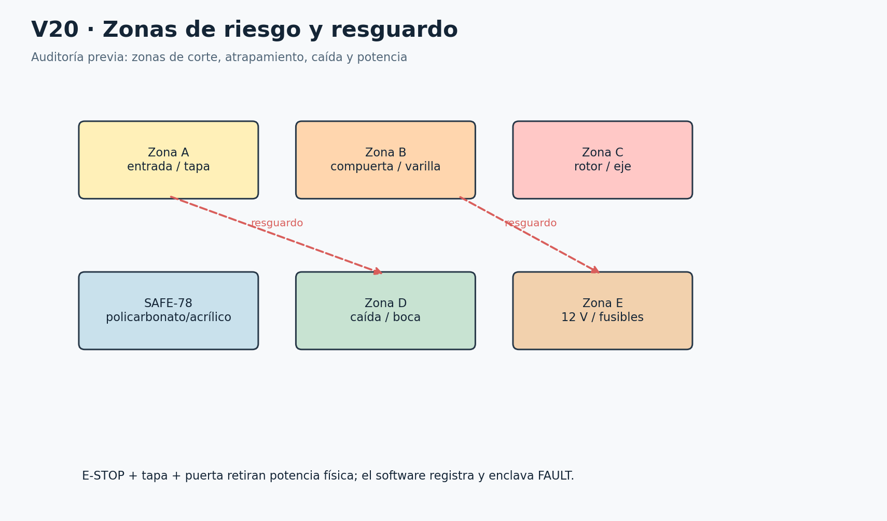

V20 Zonas móviles y de resguardo. El corte retira energía; no garantiza parada instantánea.

## 39 Dimensiones TBC y control de versiones

dimensions.json contiene 84 registros iniciales; ninguno está congelado. Las cifras REFERENCE hacen visible el concepto y las cifras TBC-MEDIR son envolventes para ubicar elementos todavía no medidos. Todas aparecen en el panel MEDICIONES. Una cifra editada se marca MEASURED y solo una acción distinta la pasa a FROZEN.

Al cambiar una cota, revisar dependencias: bins → bastidor/bocas/rotor/extracción; cámara → FOV/tapa/CSI; compuerta → barrido/torque/switches; eje/rodamientos → alojamientos/acople; fuentes/módulos → panel/ventilación/conectores. No se congela una pieza de forma aislada si su cambio invade otra.

Versionar CAD, dimensions.json, BOM, pinout, firmware, modelo y configuración por separado pero con un manifiesto de release común. Guardar SHA-256 del documento normativo original. El archivo traceability.json relaciona requisito, sección, ID, módulo y prueba. Cambiar una etiqueta de UI no cambia una pieza; sustituir un componente sí exige una nueva revisión de BOM.

Una dimensión física requiere herramienta, tolerancia de medición e incertidumbre acordes a la función. Los diámetros de ajuste de eje/rodamiento no se miden con la misma tolerancia que un panel decorativo. Las tolerancias indicadas a continuación son exigencias de medición iniciales, no tolerancias finales de mecanizado.

## 40 Qué medir antes de fabricar

Reunir las piezas reales, no solo anuncios. Registrar cada lectura con foto, referencia, unidad, instrumento y responsable. Las tolerancias de ajuste definitivas se acuerdan con el taller y las fichas de las piezas; donde se indica ±0.1 mm se trata de resolución/objetivo de medición, no autorización universal de mecanizado.

Además de las longitudes de esta tabla, comprobar tipos de contacto, tensiones de señal, Rsense, capacidad DC de relay/portafusibles, consumo de LED e indicadores, corriente y caída del buck, temperatura, torque, masa total, deflexión de celda y cobertura óptica. Esas verificaciones pueden bloquear fabricación aunque las dimensiones encajen.

Las mediciones mínimas siguientes cubren recipientes, bocas, asas y extracción; motor/eje/acople/rodamientos/collarines; servo/horn/varilla/compuerta/bisagra; switches; cámara/CSI; celda/HX711; ToF/barreras; fuentes/buck/relay/DRV; Pi/Pico; prensaestopas y borneras. Finalizar este registro y resolver los BLOCKER es la siguiente puerta de construcción física.
| Parámetro / referencia | Qué medir | Con qué / tolerancia | CAD dependiente |
| --- | --- | --- | --- |
| cabinet_width_mm = 500 mm [REFERENCE] | Ancho exterior; medir bins y espesores | Cinta y escuadra / ±2 mm | Bastidor X |
| cabinet_depth_mm = 500 mm [REFERENCE] | Fondo y espacio posterior de electrónica | Cinta / ±2 mm | Bastidor Z |
| cabinet_height_mm = 850 mm [REFERENCE] | Altura completa y acceso superior | Cinta / ±2 mm | Bastidor Y |
| tray_y_mm = 555 mm [REFERENCE] | Altura plano de pesaje | Cinta y nivel / ±1 mm | Travesaño celda |
| tray_width_mm = 200 mm [REFERENCE] | Bandeja útil y soportes | Calibrador / ±0.5 mm | Bandeja |
| gate_width_mm = 160 mm [REFERENCE] | Hoja y barrido | Calibrador / ±0.5 mm | Hoja |
| clear_aperture_mm = 140 mm [REFERENCE] | Paso mínimo libre real | Galga objeto límite / sin reducción sobre mínimo validado | Bandeja/guía |
| camera_height_above_tray_mm = 280 mm [REFERENCE] | Lente a bandeja y objeto alto | Regla + carta cuadriculada / ±1 mm inicial | Soporte cámara |
| rotor_radius_mm = 163 mm [REFERENCE] | Radio al centro salida | Regla y eje / ±1 mm inicial | Guía |
| rotor_halfwidth_mm = 72 mm [REFERENCE] | Ancho útil y pared | Calibrador / ±0.5 mm | Guía |
| rotor_inlet_y_mm = 462 mm [REFERENCE] | Altura de entrada | Regla / ±1 mm | Guía/celda |
| rotor_outlet_y_mm = 340 mm [REFERENCE] | Altura de salida | Regla / ±1 mm | Guía/bocas |
| rotor_shaft_diameter_mm = 8 mm [TBC-MEDIR] | Eje, acople 8 mm e interiores rodamientos | Micrómetro y alesómetro / Ajuste fabricante; no congelar H7 sin pieza | Eje y alojamientos |
| shaft_top_y_mm = 380 mm [REFERENCE] | Extremo bajo piso de guía, nunca dentro canal | Regla / ±1 mm | Hub |
| shaft_bottom_y_mm = 88 mm [REFERENCE] | Longitud eje y acople | Regla / ±0.5 mm | Eje |
| bearing_upper_y_mm = 305 mm [REFERENCE] | Apoyo superior bajo hub | Regla / ±0.5 mm | Travesaño |
| bearing_lower_y_mm = 140 mm [REFERENCE] | Separación apoyos | Regla / ±0.5 mm | Travesaño |
| bearing_inner_mm = 8 mm [TBC-MEDIR] | Diámetro interior real | Micrómetro / Según ajuste proveedor | Eje |
| bearing_outer_mm = 22 mm [TBC-MEDIR] | Diámetro exterior real | Calibrador/micrómetro / Según alojamiento y proveedor | Alojamiento |
| bearing_width_mm = 7 mm [TBC-MEDIR] | Ancho y sellos | Calibrador / ±0.05 mm de medición | Alojamiento |
| collar_diameter_mm = 8 mm [TBC-MEDIR] | Interior y exterior collarín | Calibrador / ±0.05 mm | Eje/holguras |
| motor_body_mm = 42 mm [TBC-MEDIR] | NEMA ancho y patrón | Calibrador / ±0.1 mm | MECH-10 |
| motor_length_mm = 48 mm [TBC-MEDIR] | Longitud modelo 17HS8401 recibido | Calibrador / ±0.1 mm | Altura acople |
| motor_shaft_mm = 5 mm [TBC-MEDIR] | Diámetro y plano eje | Micrómetro / ±0.02 mm medición | Acople |
| coupler_length_mm = 25 mm [TBC-MEDIR] | Longitud/inserciones | Calibrador / ±0.1 mm | Eje/motor |
| linkage_length_mm = 45 mm [TBC-MEDIR] | Centros articulaciones en ambos extremos | Calibrador y plantilla / ±0.5 mm inicial | Varilla |
| horn_radius_mm = 18 mm [TBC-MEDIR] | Centro servo a pasador | Calibrador / ±0.2 mm | Varillaje |
| gate_arm_mm = 18 mm [TBC-MEDIR] | Brazo efectivo bisagra | Calibrador / ±0.2 mm | Compuerta |
| servo_width_mm = 40.7 mm [TBC-MEDIR] | Ancho carcasa/orejas real | Calibrador / ±0.1 mm | Soporte |
| servo_depth_mm = 19.7 mm [TBC-MEDIR] | Profundidad real | Calibrador / ±0.1 mm | Soporte |
| servo_height_mm = 42.9 mm [TBC-MEDIR] | Altura eje y orejas | Calibrador / ±0.1 mm | Varillaje |
| gate_mass_g = 150 g [TBC-MEDIR] | Hoja con brazo/bisagra móvil | Báscula / ±1 g | Cálculo torque |
| moving_tare_g = 450 g [TBC-MEDIR] | Toda masa sostenida por celda | Báscula / ±1 g | Celda/topes |
| overload_stop_gap_mm = 0.4 mm [TBC-MEDIR] | Deflexión celda normal y tope | Galgas/reloj comparador / No fijar antes curva carga | Topes |
| camera_pcb_width_mm = 25 mm [TBC-MEDIR] | PCB, agujeros, lente | Calibrador / ±0.1 mm | Soporte cámara |
| csi_min_radius_mm = 10 mm [TBC-MEDIR] | Radio permitido por fabricante FPC | Ficha del cable + plantilla / Según fabricante | Canal CSI |
| csi_route_length_mm = 240 mm [TBC-MEDIR] | Ruta más bucles y holgura | Hilo de medición / ±5 mm | Posición Pi y cámara |
| cell_length_mm = 80 mm [TBC-MEDIR] | Extremos fijos, carga y flecha | Calibrador y ficha / ±0.1 mm | Soporte celda |
| hx711_width_mm = 34 mm [TBC-MEDIR] | PCB y agujeros | Calibrador / ±0.1 mm | Panel señal |
| tof_width_mm = 18 mm [TBC-MEDIR] | PCB y óptica | Calibrador / ±0.1 mm | Soporte ToF |
| beam_body_mm = 15 mm [TBC-MEDIR] | TX RX cono y agujeros | Calibrador + hoja fina / ±0.2 mm | Soportes barrera |
| switch_body_mm = 20 mm [TBC-MEDIR] | Cuerpo, palanca, pre/overtravel | Calibrador / ±0.2 mm | Levas |
| psu12_width_mm = 110 mm [TBC-MEDIR] | Fuente cerrada y cables | Calibrador / ±0.5 mm | Soporte externo |
| buck_width_mm = 45 mm [TBC-MEDIR] | PCB/disipador/potenciómetro | Calibrador / ±0.1 mm | Panel potencia |
| relay_width_mm = 50 mm [TBC-MEDIR] | Módulo y terminales reales | Calibrador / ±0.1 mm | Panel potencia |
| drv_width_mm = 20 mm [TBC-MEDIR] | Módulo/pines/disipador | Calibrador / ±0.1 mm | Panel potencia |
| pi_width_mm = 85 mm [TBC-MEDIR] | PCB, conectores y cooler | Calibrador / ±0.1 mm | Panel alto |
| pico_length_mm = 51 mm [TBC-MEDIR] | Headers y USB | Calibrador / ±0.1 mm | Panel señal |
| gland_hole_mm = 12.5 mm [TBC-MEDIR] | Rosca PG real y tuerca | Calibrador/ficha / Según fabricante | Panel entradas |
| terminal_pitch_mm = 5.08 mm [TBC-MEDIR] | KF301 real y taladros | Calibrador / ±0.1 mm | Soporte borneras |
| hinge_offset_mm = 5 mm [TBC-MEDIR] | Centro bisagra a hoja/marco | Calibrador / ±0.2 mm | Cortes panel |
| lid_sweep_deg = 85 deg [TBC-MEDIR] | Apertura sin tocar cámara | Transportador / ±1° inicial | Tapa |
| door_sweep_deg = 100 deg [TBC-MEDIR] | Apertura y área extracción | Transportador/cinta / ±1° inicial | Puerta |
| electronic_bay_depth_mm = 55 mm [REFERENCE] | Separación panel-residuo | Regla / ≥holgura validada | Panel trasero |
| rotor_index_tolerance_deg = 2 deg [TBC-MEDIR] | Error máximo sin perder boca | Transportador/plantilla / Medir repetibilidad y margen | Ranuras reed |
| cable_service_loop_mm = 40 mm [TBC-MEDIR] | Bucle sin tirar de celda | Regla y tara / Cambio de tara dentro incertidumbre | Arnés A |
| cabinet_mass_kg = 15 kg [TBC-MEDIR] | Masa completa y vacía | Báscula / ±0.1 kg | Estabilidad |
| cg_height_mm = 400 mm [TBC-MEDIR] | Centro de gravedad con bins llenos | Pesadas reacciones y geometría / Incertidumbre declarada | Base |
| beam_height_mm = 304 mm [REFERENCE] | Altura plano barreras | Regla / ±1 mm | Soportes |
| gate_clear_rotor_mm = 10 mm [TBC-MEDIR] | Distancia mínima hoja-guía durante giro | Galgas/maqueta / No interferencia con margen medido | Guía/hoja |
| bin0_width_mm = 175 mm [TBC-MEDIR] | BIN0 ancho exterior con reborde | Cinta/calibrador / ±1 mm inicial | BIN0, boca y puerta |
| bin0_depth_mm = 175 mm [TBC-MEDIR] | BIN0 profundidad con reborde | Cinta/calibrador / ±1 mm inicial | BIN0, boca y puerta |
| bin0_height_mm = 270 mm [TBC-MEDIR] | BIN0 altura total | Cinta/calibrador / ±1 mm inicial | BIN0, boca y puerta |
| bin0_mouth_mm = 158 mm [TBC-MEDIR] | BIN0 paso útil boca en ambos ejes | Cinta/calibrador / ±1 mm inicial | BIN0, boca y puerta |
| bin0_handle_mm = 15 mm [TBC-MEDIR] | BIN0 saliente de asas | Cinta/calibrador / ±1 mm inicial | BIN0, boca y puerta |
| bin0_extraction_mm = 330 mm [TBC-MEDIR] | BIN0 trayectoria de extracción libre | Cinta/calibrador / ±1 mm inicial | BIN0, boca y puerta |
| bin1_width_mm = 175 mm [TBC-MEDIR] | BIN1 ancho exterior con reborde | Cinta/calibrador / ±1 mm inicial | BIN1, boca y puerta |
| bin1_depth_mm = 175 mm [TBC-MEDIR] | BIN1 profundidad con reborde | Cinta/calibrador / ±1 mm inicial | BIN1, boca y puerta |
| bin1_height_mm = 270 mm [TBC-MEDIR] | BIN1 altura total | Cinta/calibrador / ±1 mm inicial | BIN1, boca y puerta |
| bin1_mouth_mm = 158 mm [TBC-MEDIR] | BIN1 paso útil boca en ambos ejes | Cinta/calibrador / ±1 mm inicial | BIN1, boca y puerta |
| bin1_handle_mm = 15 mm [TBC-MEDIR] | BIN1 saliente de asas | Cinta/calibrador / ±1 mm inicial | BIN1, boca y puerta |
| bin1_extraction_mm = 330 mm [TBC-MEDIR] | BIN1 trayectoria de extracción libre | Cinta/calibrador / ±1 mm inicial | BIN1, boca y puerta |
| bin2_width_mm = 175 mm [TBC-MEDIR] | BIN2 ancho exterior con reborde | Cinta/calibrador / ±1 mm inicial | BIN2, boca y puerta |
| bin2_depth_mm = 175 mm [TBC-MEDIR] | BIN2 profundidad con reborde | Cinta/calibrador / ±1 mm inicial | BIN2, boca y puerta |
| bin2_height_mm = 270 mm [TBC-MEDIR] | BIN2 altura total | Cinta/calibrador / ±1 mm inicial | BIN2, boca y puerta |
| bin2_mouth_mm = 158 mm [TBC-MEDIR] | BIN2 paso útil boca en ambos ejes | Cinta/calibrador / ±1 mm inicial | BIN2, boca y puerta |
| bin2_handle_mm = 15 mm [TBC-MEDIR] | BIN2 saliente de asas | Cinta/calibrador / ±1 mm inicial | BIN2, boca y puerta |
| bin2_extraction_mm = 330 mm [TBC-MEDIR] | BIN2 trayectoria de extracción libre | Cinta/calibrador / ±1 mm inicial | BIN2, boca y puerta |
| bin3_width_mm = 175 mm [TBC-MEDIR] | BIN3 ancho exterior con reborde | Cinta/calibrador / ±1 mm inicial | BIN3, boca y puerta |
| bin3_depth_mm = 175 mm [TBC-MEDIR] | BIN3 profundidad con reborde | Cinta/calibrador / ±1 mm inicial | BIN3, boca y puerta |
| bin3_height_mm = 270 mm [TBC-MEDIR] | BIN3 altura total | Cinta/calibrador / ±1 mm inicial | BIN3, boca y puerta |
| bin3_mouth_mm = 158 mm [TBC-MEDIR] | BIN3 paso útil boca en ambos ejes | Cinta/calibrador / ±1 mm inicial | BIN3, boca y puerta |
| bin3_handle_mm = 15 mm [TBC-MEDIR] | BIN3 saliente de asas | Cinta/calibrador / ±1 mm inicial | BIN3, boca y puerta |
| bin3_extraction_mm = 330 mm [TBC-MEDIR] | BIN3 trayectoria de extracción libre | Cinta/calibrador / ±1 mm inicial | BIN3, boca y puerta |

## Fuentes técnicas y reproducibilidad

[S0] Plan de construcción SorTV1 seis semanas. project_sources/01-Plan_Construccion_SorTV1_6_Semanas.docx SHA-256 1fa6c8d5ebac916e2fc25834eaa7dd1206dd7256a152fccedfc26d51d56226ed

[S1] Raspberry Pi camera documentation. https://www.raspberrypi.com/documentation/accessories/camera.html

[S2] TI DRV8825 datasheet. https://www.ti.com/lit/ds/symlink/drv8825.pdf

[S3] ST AN4846 multiple VL53L0X. https://www.st.com/resource/en/application_note/an4846-using-multiple-vl53l0x-in-a-single-design-stmicroelectronics.pdf

[S4] TowerPro MG996R manufacturer. https://towerpro.com.tw/product/mg996r/

[S5] Raspberry Pi Pico documentation. https://www.raspberrypi.com/documentation/microcontrollers/pico-series.html

[S6] Three.js official documentation. https://threejs.org/docs/

[S7] Torchvision MobileNetV3 Small. https://docs.pytorch.org/vision/stable/models/generated/torchvision.models.mobilenet_v3_small.html

Consultadas para verificar interfaces y límites de componentes. Las decisiones geométricas y de control específicas de SorTV1 son propuestas trazadas; la información de proveedor no prueba el estado de la pieza comprada.
