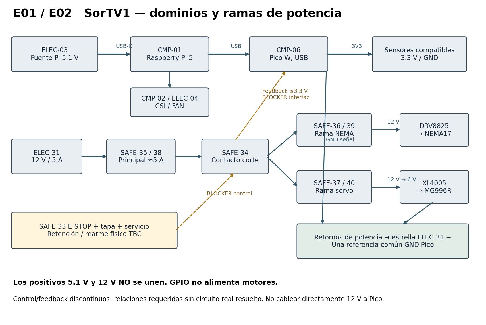
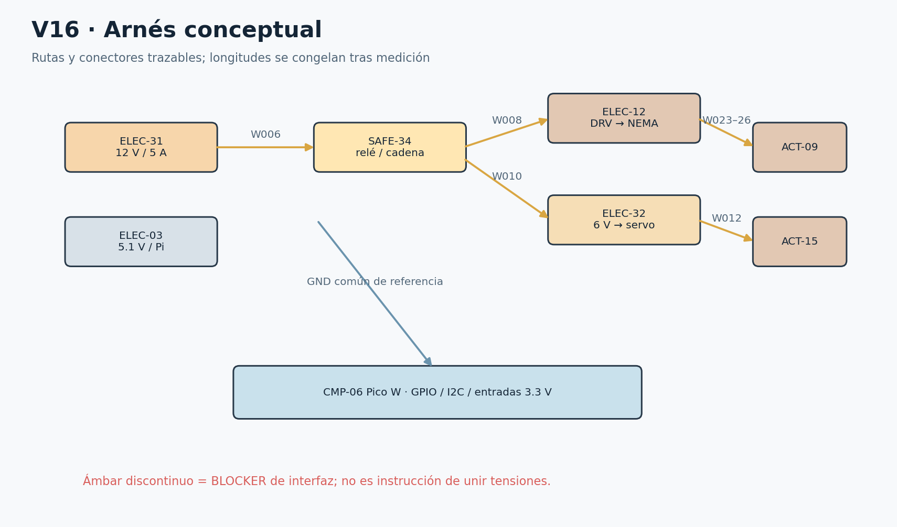

# Cableado SorTV1

## 19 Distribución de potencia

**Dominio lógico:** ELEC-03 5.1 V/5 A → USB-C CMP-01 → CSI CMP-02, FAN ELEC-04 y USB HAR-08 hacia CMP-06. Los sensores toman el dominio lógico de baja tensión según su consumo y módulo. No alimentar actuadores de Pi, Pico, GPIO ni 3V3.

**Dominio de actuadores:** ELEC-31 12 V/5 A → SAFE-35 con SAFE-38 → contacto de corte SAFE-34 → rama SAFE-36/39 a VMOT DRV8825 y rama SAFE-37/40 a XL4005 → aproximadamente 6 V MG996R. La rama auxiliar de señalización/luz, si su modelo corresponde a 12 V, debe permanecer antes del corte motriz para poder indicar el fallo; su driver y protección se cierran en la revisión eléctrica.

Los positivos 5.1 V y 12 V nunca se unen. El retorno de NEMA/DRV y servo/buck vuelve a una estrella de potencia próxima al negativo de ELEC-31. La referencia de señal se une una sola vez desde GND Pico a ese punto. No hacer circular corriente del servo por una pista GND del Pico. La carcasa metálica y la puesta a tierra de protección de las fuentes requieren revisar su clase; no confundir GND de señal con PE ni inventar un conductor de red dentro del equipo.

E01 unifilar y E02 potencia aparecen en la figura. El contacto de potencia está en serie con la energía motriz; la cadena de autorización gobierna su apertura. Los bordes de control discontinuos significan que el circuito real no está resuelto con las referencias genéricas recibidas.

**Corte físico y rearme:** abrir tapa/servicio o presionar paro durante maniobra debe retirar energía aunque Pi esté congelada. El firmware recibe el evento y enclava FAULT. Cerrar resguardos o liberar paro no mueve nada; se requiere inspección, retirada, rearme físico y homing vacío. En carga normal READY, abrir tapa es previsto y cierra la autorización temporalmente. Resolver cómo se permite el ciclo siguiente sin convertir el cierre después de un fallo en auto-rearme exige un circuito de autorización/retención definido.

La BOM no acredita contactos separados para leer resguardos a 3.3 V y cortar una cadena a 12 V, ni una salida libre del Pico para gobernar permiso, ni feedback aislado. Un único contacto SPDT no se conecta simultáneamente a 12 V y GPIO por cambiar de borne. No usar un jumper para borrar esa falta. HARDWARE-RISK-02 y 04 permanecen BLOCKER. El simulador implementa el contrato lógico deseado, claramente separado de su realizabilidad eléctrica.

**Relay HARDWARE-RISK-01:** registrar fabricante, referencia de cápsula y módulo, tensión de bobina, polaridad/umbral de IN, aislamiento, rating DC del contacto con tipo de carga, capacidad de terminales y pistas, corriente de arranque y margen térmico. Un impreso «10 A» para AC resistiva no prueba corte DC de motor/buck. Revisar arco, vida eléctrica, contacto soldado y tiempo de caída. Si falla, proponer por ECN un dispositivo con rating adecuado; no se considera comprado ni sustituido.

ELEC-41-0 puede suprimir bobina con cátodo al positivo y ánodo al lado bajo, según circuito real y diodo ya incorporado. Un diodo de rueda libre puede retrasar la liberación del relay; medirla. ELEC-41-1 queda reservado a aislamiento de una propuesta de retención por cerrar. No colocar 1N4007 indiscriminadamente sobre salidas de bobinas bipolares o sobre el servo para «proteger todo».

**Fusibles:** 5 A principal, 2–3 A motor y 3–5 A servo son asignaciones iniciales. Su curva, capacidad de interrupción DC, inrush y coordinación con la fuente limitada a 5 A deben verificarse. El fusible del buck está en 12 V y no protege automáticamente todo defecto a 6 V. Una fuente limitada puede no generar corriente suficiente para abrir rápido un fusible sobredimensionado. Medir demanda y escoger valores/curvas dentro de un cambio trazado; no realizar un cortocircuito improvisado para probarlos.

18 AWG para distribución y retorno de potencia; 22 AWG para sensores/señales y auxiliares de consumo comprobado. La caída se calcula con longitud de ida y vuelta y resistencia del conductor, y después se mide durante el pico. Los dos capacitores 100 µF/35 V se asignan a VMOT y entrada del buck. No se presupone que 100 µF garantice estabilidad del servo.

E01 y E02 Dos dominios y ramas de energía. Control/feedback pendientes marcados como BLOCKER.

| Protección | Ubicación | Valor inicial y validación |
| --- | --- | --- |
| SAFE-38 | Principal después de fuente12 | ≈5 A; 1 activo + 1 reserva; curva y DC TBC |
| SAFE-39 | Antes de VMOT | ≈2–3 A; no equivale a corriente de fase; 1+1 |
| SAFE-40 | Entrada12 V buck | ≈3–5 A; revisar selectividad y cable6 V; 1+1 |

## 20 Arnés y conexiones

E03 es el mapa de señales de la sección 21; E04/E07 corresponden a V16. E05 lista J01–J14; E08 contiene cada wire-from/wire-to, y E09 su asignación de conector. E10 está en la tabla de fusibles precedente. Cada extremo se identifica con Wxxx y la tensión, además del color.

HAR-P agrupa potencia; HAR-S señales. R-P recorre el borde posterior de potencia; R-M lleva bobinas hacia NEMA; R-S ocupa el borde contrario para lógica y sensores; R-I es la rama de I2C; R-HX mantiene corto el puente de celda; R-C es el CSI alto; R-A lleva iluminación e indicadores. No se calcula longitud final sumando líneas gráficas: seguir la ruta real con hilo, añadir holgura de servicio y registrar TBC-MEDIR.

En 18 AWG rojo se identifica +12 V o +6 V en ambos extremos; negro es retorno. En 22 AWG rojo se etiqueta explícitamente 3V3 o auxiliar12; negro retorno; amarillo/azul diferencian señales acompañadas de Wxxx. No confiar en color para reparar. Los cables existentes de motor, servo, fuente, CSI y USB conservan sus colores originales y se etiquetan sin reasignarlos.

KF301: seis de 2 polos =12 posiciones; cuatro de 3 =12; cuatro de 4 =16; total 40. Se asignan J01–J14 sin multiplicar bloques en la BOM. H01/H02 son las dos tiras de 40 posiciones macho; no implican conectores hembra incluidos. Donde no hay pareja comprada se especifica soldadura protegida, con el costo de desoldar para mantenimiento; adquirir conectores desmontables requiere cambio separado.

Faston se selecciona por ancho real de terminal y sección; anillo/horquilla cuando la fijación lo permite. Virolas compatibles con el tornillo evitan hilos sueltos. No estañar alambres flexibles bajo presión de bornera. Cada crimpado tiene prueba de tracción moderada y revisión de cobre expuesto. Termorretráctil no sustituye soporte mecánico. Los PG7/PG9 se ajustan a diámetro de cable y taladro real.

Las conexiones BLOCKER se conservan en la tabla para mostrar qué falta. Nunca son una instrucción de cableado provisional. En particular, W de GPIO28 representa la relación de feedback a través de una interfaz ausente; no un conductor directo desde NO12 V al Pico. Tampoco se atribuye nEN pull-up a un cable ni un driver de lámparas a la función gráfica.

E04 y E07 Arnés conceptual. Rutas reales y longitudes se congelan tras medición.

| Conector | Polos | Asignación |
| --- | --- | --- |
| J01 | 2 | Entrada fuente 12 V +/− |
| J02 | 2 | Principal protegido +12 V / retorno |
| J03 | 2 | Rama motor +12 V / retorno |
| J04 | 2 | Rama buck +12 V / retorno |
| J05 | 2 | Salida buck +6 V / retorno |
| J06 | 2 | Iluminación auxiliar TBC |
| J07 | 3 | Servo +6 V / GND / PWM |
| J08 | 3 | Relay alimentación / retorno / control TBC |
| J09 | 3 | Indicadores retorno G/Y/R; drivers ausentes |
| J10 | 3 | Referencia señal 3V3 / GND / reserva |
| J11 | 4 | Motor A1 A2 B1 B2 |
| J12 | 4 | HX711 E+ E− A+ A− |
| J13 | 4 | I2C 3V3 GND SDA SCL distribución |
| J14 | 4 | Cadena resguardos interfaz TBC |

| W / ruta | Origen → destino | Tensión / señal | AWG color / conector | Estado / fusible |
| --- | --- | --- | --- | --- |
| W001 R-L exterior/alivio | ELEC-03.USB-C → CMP-01.USB-C | 5.1 V / LOGIC | original negro / Cable fuente oficial | REFERENCE / fuente |
| W002 R-C alto; radio TBC | CMP-01.CSI22 → CMP-02.CSI15 | CSI / CSI | original FPC / HAR-07 | REFERENCE / — |
| W003 R-S posterior señal | CMP-01.FAN → ELEC-04.FAN | según Pi / FAN | original cable original / conector original | REFERENCE / — |
| W004 R-S posterior señal | CMP-01.USB-A → CMP-06.USB | USB 5 V + datos / USB CDC | original negro / HAR-08 | REFERENCE / — |
| W005 R-S posterior señal | CMP-01.SD → CMP-05.contactos | bus SD / STORAGE | original integrado / ranura SD | REFERENCE / — |
| W006 R-P potencia fija | ELEC-31.+ → SAFE-35.IN | 12 V / MAIN | 18 rojo / J01:1 | REFERENCE / SAFE-38-ACTIVE |
| W007 R-P potencia fija | SAFE-35.OUT → SAFE-34.COM | 12 V / PROTECTED | 18 rojo / J02:1 | REFERENCE / SAFE-38-ACTIVE |
| W008 R-P potencia fija | SAFE-34.NO → SAFE-36.IN | 12 V switched / MOTOR BRANCH | 18 rojo / J03:1 | REFERENCE / SAFE-39-ACTIVE |
| W009 R-P potencia fija | SAFE-36.OUT → ELEC-12.VMOT | 12 V switched / VMOT | 18 rojo / J03:1 | REFERENCE / SAFE-39-ACTIVE |
| W010 R-P potencia fija | SAFE-34.NO → SAFE-37.IN | 12 V switched / SERVO BRANCH | 18 rojo / J04:1 | REFERENCE / SAFE-40-ACTIVE |
| W011 R-P potencia fija | SAFE-37.OUT → ELEC-32.IN+ | 12 V switched / BUCK INPUT | 18 rojo / J04:1 | REFERENCE / SAFE-40-ACTIVE |
| W012 R-P potencia fija | ELEC-32.OUT+ → ACT-15.V+ | 6 V / SERVO POWER | 18 rojo / J05:1→J07:1 | REFERENCE / SAFE-40-ACTIVE |
| W013 R-P estrella potencia | ELEC-12.PGND → ELEC-31.− | 0 V / POWER RETURN | 18 negro / J03:2 | REFERENCE / — |
| W014 R-P estrella potencia | ELEC-32.IN− → ELEC-31.− | 0 V / POWER RETURN | 18 negro / J04:2 | REFERENCE / — |
| W015 R-P estrella potencia | ACT-15.GND → ELEC-31.− | 0 V / POWER RETURN | 18 negro / J07:2 | REFERENCE / — |
| W016 R-P estrella potencia | SAFE-34.COIL− → ELEC-31.− | 0 V / POWER RETURN | 18 negro / J08:2 | REFERENCE / — |
| W017 R-S posterior señal | ELEC-32.OUT− → ELEC-31.− | 0 V / BUCK COMMON | 18 negro / J05:2 | REFERENCE / — |
| W018 R-S unión única junto entrada potencia | CMP-06.GND pin38 → ELEC-31.− estrella | 0 V / SINGLE SIGNAL REFERENCE | 22 negro / J10:2 | REFERENCE / — |
| W019 R-S posterior señal | ELEC-12.VMOT → ELEC-14-0.+ | 12 V switched / DECOUPLING | 18 rojo / terminal corto | REFERENCE / — |
| W020 R-S posterior señal | ELEC-14-0.− → ELEC-31.− | 0 V / CAP RETURN | 18 negro / terminal corto | REFERENCE / — |
| W021 R-S posterior señal | ELEC-32.IN+ → ELEC-14-1.+ | 12 V switched / DECOUPLING | 18 rojo / terminal corto | REFERENCE / — |
| W022 R-S posterior señal | ELEC-14-1.− → ELEC-31.− | 0 V / CAP RETURN | 18 negro / terminal corto | REFERENCE / — |
| W023 R-M bobinas separadas señal | ELEC-12.A1 → ACT-09.coil A end1 | PWM bobina / COIL | 18 rojo / J11:1 | REFERENCE / SAFE-39-ACTIVE |
| W024 R-M bobinas separadas señal | ELEC-12.A2 → ACT-09.coil A end2 | PWM bobina / COIL | 18 negro / J11:2 | REFERENCE / SAFE-39-ACTIVE |
| W025 R-M bobinas separadas señal | ELEC-12.B1 → ACT-09.coil B end1 | PWM bobina / COIL | 18 rojo / J11:3 | REFERENCE / SAFE-39-ACTIVE |
| W026 R-M bobinas separadas señal | ELEC-12.B2 → ACT-09.coil B end2 | PWM bobina / COIL | 18 negro / J11:4 | REFERENCE / SAFE-39-ACTIVE |
| W027 R-S señal fija | CMP-06.GPIO0 / pin1 → ELEC-12.STEP | ≤3.3 V / STEP | 22 amarillo / H01:1 | REFERENCE / — |
| W028 R-S señal fija | CMP-06.GPIO1 / pin2 → ELEC-12.DIR | ≤3.3 V / DIR | 22 azul / H01:2 | REFERENCE / — |
| W029 R-S señal fija | CMP-06.GPIO2 / pin4 → ELEC-12.nEN | ≤3.3 V / nEN | 22 amarillo / H01:3 | BLOCKER / — |
| W030 R-S señal; bucle libre bandeja | CMP-06.GPIO3 / pin5 → ACT-15.SERVO PWM | ≤3.3 V / SERVO PWM | 22 azul / H01:4 | REFERENCE / — |
| W031 R-I bus corto separado bobinas | CMP-06.GPIO4 / pin6 → SENS-TOF0.SDA | 3.3 V / SDA | 22 amarillo / J13 / H02 | REFERENCE / — |
| W032 R-I bus corto separado bobinas | CMP-06.GPIO4 / pin6 → SENS-TOF1.SDA | 3.3 V / SDA | 22 amarillo / J13 / H02 | REFERENCE / — |
| W033 R-I bus corto separado bobinas | CMP-06.GPIO4 / pin6 → SENS-TOF2.SDA | 3.3 V / SDA | 22 amarillo / J13 / H02 | REFERENCE / — |
| W034 R-I bus corto separado bobinas | CMP-06.GPIO4 / pin6 → SENS-TOF3.SDA | 3.3 V / SDA | 22 amarillo / J13 / H02 | REFERENCE / — |
| W035 R-I bus corto separado bobinas | CMP-06.GPIO5 / pin7 → SENS-TOF0.SCL | 3.3 V / SCL | 22 azul / J13 / H02 | REFERENCE / — |
| W036 R-I bus corto separado bobinas | CMP-06.GPIO5 / pin7 → SENS-TOF1.SCL | 3.3 V / SCL | 22 azul / J13 / H02 | REFERENCE / — |
| W037 R-I bus corto separado bobinas | CMP-06.GPIO5 / pin7 → SENS-TOF2.SCL | 3.3 V / SCL | 22 azul / J13 / H02 | REFERENCE / — |
| W038 R-I bus corto separado bobinas | CMP-06.GPIO5 / pin7 → SENS-TOF3.SCL | 3.3 V / SCL | 22 azul / J13 / H02 | REFERENCE / — |
| W039 R-S señal fija | CMP-06.GPIO6 / pin9 → SENS-TOF0.XSHUT0 | ≤3.3 V / XSHUT0 | 22 amarillo / H01:7 | REFERENCE / — |
| W040 R-S señal fija | CMP-06.GPIO7 / pin10 → SENS-TOF1.XSHUT1 | ≤3.3 V / XSHUT1 | 22 azul / H01:8 | REFERENCE / — |
| W041 R-S señal fija | CMP-06.GPIO8 / pin11 → SENS-TOF2.XSHUT2 | ≤3.3 V / XSHUT2 | 22 amarillo / H01:9 | REFERENCE / — |
| W042 R-S señal fija | CMP-06.GPIO9 / pin12 → SENS-TOF3.XSHUT3 | ≤3.3 V / XSHUT3 | 22 azul / H01:10 | REFERENCE / — |
| W043 R-S señal; bucle libre bandeja | CMP-06.GPIO10 / pin14 → ELEC-HX711.HX711 DOUT | ≤3.3 V / HX711 DOUT | 22 amarillo / H01:11 | REFERENCE / — |
| W044 R-S señal; bucle libre bandeja | CMP-06.GPIO11 / pin15 → ELEC-HX711.HX711 SCK | ≤3.3 V / HX711 SCK | 22 azul / H01:12 | REFERENCE / — |
| W045 R-S señal fija | CMP-06.GPIO12 / pin16 → SENS-24.TOP LID | ≤3.3 V / TOP LID | 22 amarillo / H01:13 | BLOCKER / — |
| W046 R-S señal; bucle libre bandeja | CMP-06.GPIO13 / pin17 → SENS-22.GATE CLOSED | ≤3.3 V / GATE CLOSED | 22 azul / H01:14 | REFERENCE / — |
| W047 R-S señal; bucle libre bandeja | CMP-06.GPIO14 / pin19 → SENS-23.GATE OPEN | ≤3.3 V / GATE OPEN | 22 amarillo / H01:15 | REFERENCE / — |
| W048 R-S señal fija | CMP-06.GPIO15 / pin20 → SENS-26.RESET | ≤3.3 V / RESET | 22 azul / H01:16 | REFERENCE / — |
| W049 R-S señal fija | CMP-06.GPIO16 / pin21 → SENS-ROT0.ROT0 | ≤3.3 V / ROT0 | 22 amarillo / H01:17 | REFERENCE / — |
| W050 R-S señal fija | CMP-06.GPIO17 / pin22 → SENS-ROT1.ROT1 | ≤3.3 V / ROT1 | 22 azul / H01:18 | REFERENCE / — |
| W051 R-S señal fija | CMP-06.GPIO18 / pin24 → SENS-ROT2.ROT2 | ≤3.3 V / ROT2 | 22 amarillo / H01:19 | REFERENCE / — |
| W052 R-S señal fija | CMP-06.GPIO19 / pin25 → SENS-ROT3.ROT3 | ≤3.3 V / ROT3 | 22 azul / H01:20 | REFERENCE / — |
| W053 R-S señal fija | CMP-06.GPIO20 / pin26 → SENS-27.FALL0 | ≤3.3 V / FALL0 | 22 amarillo / H01:21 | REFERENCE / — |
| W054 R-S señal fija | CMP-06.GPIO21 / pin27 → SENS-28.FALL1 | ≤3.3 V / FALL1 | 22 azul / H01:22 | REFERENCE / — |
| W055 R-S señal fija | CMP-06.GPIO22 / pin29 → SENS-29.FALL2 | ≤3.3 V / FALL2 | 22 amarillo / H01:23 | REFERENCE / — |
| W056 R-S señal fija | CMP-06.GPIO26 / pin31 → SENS-30.FALL3 | ≤3.3 V / FALL3 | 22 amarillo / H01:27 | REFERENCE / — |
| W057 R-S señal fija | CMP-06.GPIO27 / pin32 → SENS-25.SERVICE DOOR | ≤3.3 V / SERVICE DOOR | 22 azul / H01:28 | BLOCKER / — |
| W058 R-S señal fija | CMP-06.GPIO28 / pin34 → SAFE-34.ACTUATOR POWER | ≤3.3 V / ACTUATOR POWER | 22 amarillo / H01:29 | BLOCKER / — |
| W059 R-S señal | CMP-06.3V3 pin36 → SENS-TOF0.VCC | 3.3 V validado módulo / SENSOR SUPPLY | 22 rojo / J10:1 / H02 | TBC-MEDIR / — |
| W060 R-S posterior señal | SENS-TOF0.GND → CMP-06.GND | 0 V / SENSOR RETURN | 22 negro / H02 | REFERENCE / — |
| W061 R-S señal | CMP-06.3V3 pin36 → SENS-TOF1.VCC | 3.3 V validado módulo / SENSOR SUPPLY | 22 rojo / J10:1 / H02 | TBC-MEDIR / — |
| W062 R-S posterior señal | SENS-TOF1.GND → CMP-06.GND | 0 V / SENSOR RETURN | 22 negro / H02 | REFERENCE / — |
| W063 R-S señal | CMP-06.3V3 pin36 → SENS-TOF2.VCC | 3.3 V validado módulo / SENSOR SUPPLY | 22 rojo / J10:1 / H02 | TBC-MEDIR / — |
| W064 R-S posterior señal | SENS-TOF2.GND → CMP-06.GND | 0 V / SENSOR RETURN | 22 negro / H02 | REFERENCE / — |
| W065 R-S señal | CMP-06.3V3 pin36 → SENS-TOF3.VCC | 3.3 V validado módulo / SENSOR SUPPLY | 22 rojo / J10:1 / H02 | TBC-MEDIR / — |
| W066 R-S posterior señal | SENS-TOF3.GND → CMP-06.GND | 0 V / SENSOR RETURN | 22 negro / H02 | REFERENCE / — |
| W067 R-S señal | CMP-06.3V3 pin36 → ELEC-HX711.VCC | 3.3 V validado módulo / SENSOR SUPPLY | 22 rojo / J10:1 / H02 | TBC-MEDIR / — |
| W068 R-S posterior señal | ELEC-HX711.GND → CMP-06.GND | 0 V / SENSOR RETURN | 22 negro / H02 | REFERENCE / — |
| W069 R-S señal | CMP-06.3V3 pin36 → SENS-27.VCC | 3.3 V validado módulo / SENSOR SUPPLY | 22 rojo / J10:1 / H02 | TBC-MEDIR / — |
| W070 R-S posterior señal | SENS-27.GND → CMP-06.GND | 0 V / SENSOR RETURN | 22 negro / H02 | REFERENCE / — |
| W071 R-S señal | CMP-06.3V3 pin36 → SENS-28.VCC | 3.3 V validado módulo / SENSOR SUPPLY | 22 rojo / J10:1 / H02 | TBC-MEDIR / — |
| W072 R-S posterior señal | SENS-28.GND → CMP-06.GND | 0 V / SENSOR RETURN | 22 negro / H02 | REFERENCE / — |
| W073 R-S señal | CMP-06.3V3 pin36 → SENS-29.VCC | 3.3 V validado módulo / SENSOR SUPPLY | 22 rojo / J10:1 / H02 | TBC-MEDIR / — |
| W074 R-S posterior señal | SENS-29.GND → CMP-06.GND | 0 V / SENSOR RETURN | 22 negro / H02 | REFERENCE / — |
| W075 R-S señal | CMP-06.3V3 pin36 → SENS-30.VCC | 3.3 V validado módulo / SENSOR SUPPLY | 22 rojo / J10:1 / H02 | TBC-MEDIR / — |
| W076 R-S posterior señal | SENS-30.GND → CMP-06.GND | 0 V / SENSOR RETURN | 22 negro / H02 | REFERENCE / — |
| W077 R-S posterior señal | SENS-24.COM seco → CMP-06.GND | 0 V / CONTACT RETURN | 22 negro / H02 | BLOCKER / — |
| W078 R-S posterior señal | SENS-22.COM seco → CMP-06.GND | 0 V / CONTACT RETURN | 22 negro / H02 | REFERENCE / — |
| W079 R-S posterior señal | SENS-23.COM seco → CMP-06.GND | 0 V / CONTACT RETURN | 22 negro / H02 | REFERENCE / — |
| W080 R-S posterior señal | SENS-26.COM seco → CMP-06.GND | 0 V / CONTACT RETURN | 22 negro / H02 | REFERENCE / — |
| W081 R-S posterior señal | SENS-ROT0.COM seco → CMP-06.GND | 0 V / CONTACT RETURN | 22 negro / H02 | REFERENCE / — |
| W082 R-S posterior señal | SENS-ROT1.COM seco → CMP-06.GND | 0 V / CONTACT RETURN | 22 negro / H02 | REFERENCE / — |
| W083 R-S posterior señal | SENS-ROT2.COM seco → CMP-06.GND | 0 V / CONTACT RETURN | 22 negro / H02 | REFERENCE / — |
| W084 R-S posterior señal | SENS-ROT3.COM seco → CMP-06.GND | 0 V / CONTACT RETURN | 22 negro / H02 | REFERENCE / — |
| W085 R-S posterior señal | SENS-25.COM seco → CMP-06.GND | 0 V / CONTACT RETURN | 22 negro / H02 | BLOCKER / — |
| W086 R-HX corto junto celda; bucle flexible | ELEC-HX711.E+ → SENS-19.E+ | puente / LOAD BRIDGE | 22 rojo / J12:1 | REFERENCE / — |
| W087 R-HX corto junto celda; bucle flexible | ELEC-HX711.E− → SENS-19.E− | puente / LOAD BRIDGE | 22 negro / J12:2 | REFERENCE / — |
| W088 R-HX corto junto celda; bucle flexible | ELEC-HX711.A+ → SENS-19.A+ | puente / LOAD BRIDGE | 22 amarillo / J12:3 | REFERENCE / — |
| W089 R-HX corto junto celda; bucle flexible | ELEC-HX711.A− → SENS-19.A− | puente / LOAD BRIDGE | 22 azul / J12:4 | REFERENCE / — |
| W090 R-P control físico | SAFE-35.OUT → SAFE-33.NC | 12 V control TBC / SAFETY CHAIN | 22 rojo / J14 / Faston | BLOCKER / SAFE-38-ACTIVE |
| W091 R-P control físico | SAFE-33.NC OUT → SENS-24.polo corte | 12 V control TBC / SAFETY CHAIN | 22 rojo / J14 / Faston | BLOCKER / SAFE-38-ACTIVE |
| W092 R-P control físico | SENS-24.polo corte OUT → SENS-25.polo corte | 12 V control TBC / SAFETY CHAIN | 22 rojo / J14 / Faston | BLOCKER / SAFE-38-ACTIVE |
| W093 R-P control físico | SENS-25.polo corte OUT → SAFE-34.autorización bobina | 12 V control TBC / SAFETY CHAIN | 22 rojo / J14 / Faston | BLOCKER / SAFE-38-ACTIVE |
| W094 R-P control físico | SENS-26.contacto rearme → SAFE-34.retención | 12 V control TBC / SAFETY CHAIN | 22 rojo / J14 / Faston | BLOCKER / SAFE-38-ACTIVE |
| W095 R-A iluminación/indicadores | SAFE-35.OUT → ELEC-42.+ | 12 V / AUXILIARY | 22 rojo / Faston | BLOCKER / SAFE-38-ACTIVE |
| W096 R-A | ELEC-42.− → ELEC-31.retorno controlado AUSENTE | 0 V / MISSING DRIVER | 22 negro / J09 | BLOCKER / — |
| W097 R-A iluminación/indicadores | SAFE-35.OUT → ELEC-43.+ | 12 V / AUXILIARY | 22 rojo / Faston | BLOCKER / SAFE-38-ACTIVE |
| W098 R-A | ELEC-43.− → ELEC-31.retorno controlado AUSENTE | 0 V / MISSING DRIVER | 22 negro / J09 | BLOCKER / — |
| W099 R-A iluminación/indicadores | SAFE-35.OUT → ELEC-44.+ | 12 V / AUXILIARY | 22 rojo / Faston | BLOCKER / SAFE-38-ACTIVE |
| W100 R-A | ELEC-44.− → ELEC-31.retorno controlado AUSENTE | 0 V / MISSING DRIVER | 22 negro / J09 | BLOCKER / — |
| W101 R-A iluminación/indicadores | SAFE-35.OUT → ELEC-45.+ | 12 V auxiliar TBC / AUXILIARY | 22 rojo / J06 | BLOCKER / SAFE-38-ACTIVE |
| W102 R-A | ELEC-45.− → ELEC-31.retorno controlado AUSENTE | 0 V / LED DRIVER TBC | 22 negro / J06 | BLOCKER / — |
| W103 R-P control | ELEC-41-0.A/K → SAFE-34.bobina/retención TBC | 12 V control / DIODE | 22 azul / soldado aislado | BLOCKER / — |
| W104 R-P control | ELEC-41-1.A/K → SAFE-34.bobina/retención TBC | 12 V control / DIODE | 22 azul / soldado aislado | BLOCKER / — |

## 21 Pinout del Pico W

Se usa numeración GPIO del RP2040, no BCM de Raspberry Pi. Los 26 GPIO expuestos del mapa quedan asignados: no hay tres salidas libres para indicadores ni una salida adicional de permiso del relay. Cualquier solución que use GPIO de Pi para señalización necesita sus drivers y un contrato explícito; no modifica la autoridad física del Pico. [S5]

Las entradas de contacto usan pull-up a 3.3 V y contacto seco a GND; el estado activo lógico suele ser LOW. El feedback de potencia será HIGH cuando exista autorización, pero solo después de definir su interfaz. GPIO2 nEN inicia HIGH y GPIO3 sin PWM. GPIO6–9 se manejan LOW/alta impedancia cuando XSHUT lo requiera.

Pines de alimentación de referencia: 3V3 OUT físico36, GND físico38 y otros GND del header. VSYS/VBUS no son salidas de potencia para motores. Confirmar orientación USB y pin1 sobre la placa recibida, especialmente si headers fueron soldados por el proveedor.

La tabla es el contrato inicial congelado de señales. El nivel seguro de entradas desconectadas debe ensayarse; un pull-up de software no sustituye el corte físico independiente.
| GPIO | Pin | Señal y destino | Dir / activo | Estado seguro |
| --- | --- | --- | --- | --- |
| 0 | 1 | STEP → ELEC-12 | OUT / HIGH | LOW |
| 1 | 2 | DIR → ELEC-12 | OUT / HIGH | LOW |
| 2 | 4 | nEN → ELEC-12 | OUT / LOW | HIGH / deshabilitado; pull-up externo AUSENTE BOM |
| 3 | 5 | SERVO PWM → ACT-15 | OUT / HIGH | HIGH-Z / sin PWM |
| 4 | 6 | SDA → SENS-TOF0..3 | BIDIR / HIGH | OPEN/UNKNOWN |
| 5 | 7 | SCL → SENS-TOF0..3 | BIDIR / HIGH | OPEN/UNKNOWN |
| 6 | 9 | XSHUT0 → SENS-TOF0 | OUT / HIGH | LOW |
| 7 | 10 | XSHUT1 → SENS-TOF1 | OUT / HIGH | LOW |
| 8 | 11 | XSHUT2 → SENS-TOF2 | OUT / HIGH | LOW |
| 9 | 12 | XSHUT3 → SENS-TOF3 | OUT / HIGH | LOW |
| 10 | 14 | HX711 DOUT → ELEC-HX711 | IN / HIGH | OPEN/UNKNOWN |
| 11 | 15 | HX711 SCK → ELEC-HX711 | OUT / HIGH | LOW |
| 12 | 16 | TOP LID → SENS-24 | IN / LOW | OPEN/UNKNOWN |
| 13 | 17 | GATE CLOSED → SENS-22 | IN / LOW | OPEN/UNKNOWN |
| 14 | 19 | GATE OPEN → SENS-23 | IN / LOW | OPEN/UNKNOWN |
| 15 | 20 | RESET → SENS-26 | IN / LOW | OPEN/UNKNOWN |
| 16 | 21 | ROT0 → SENS-ROT0 | IN / LOW | OPEN/UNKNOWN |
| 17 | 22 | ROT1 → SENS-ROT1 | IN / LOW | OPEN/UNKNOWN |
| 18 | 24 | ROT2 → SENS-ROT2 | IN / LOW | OPEN/UNKNOWN |
| 19 | 25 | ROT3 → SENS-ROT3 | IN / LOW | OPEN/UNKNOWN |
| 20 | 26 | FALL0 → SENS-27 | IN / LOW | OPEN/UNKNOWN |
| 21 | 27 | FALL1 → SENS-28 | IN / LOW | OPEN/UNKNOWN |
| 22 | 29 | FALL2 → SENS-29 | IN / LOW | OPEN/UNKNOWN |
| 26 | 31 | FALL3 → SENS-30 | IN / LOW | OPEN/UNKNOWN |
| 27 | 32 | SERVICE DOOR → SENS-25 | IN / LOW | OPEN/UNKNOWN |
| 28 | 34 | ACTUATOR POWER → SAFE-34 | IN / HIGH | OPEN/UNKNOWN |
