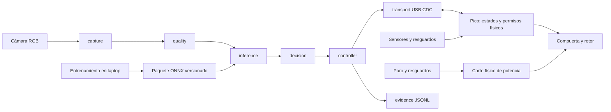

# Arquitectura de SorTV1

Fuente de requisitos: `Plan_Construccion_SorTV1_6_Semanas.docx`, v1.0, capítulos 02 y 10–18. Esta entrega es la base del repositorio y una demostración de contratos de software; la aceptación física sigue pendiente.

La Pi captura, verifica calidad, ejecuta inferencia, decide y registra. Envía un destino, nunca pasos ni ángulos. El Pico origina boot_id y cycle_id, valida guardas, mueve y confirma. ACK expresa aceptación; DONE expresa el resultado físico confirmado. La interfaz del operador consulta y exporta sin dirigir motores.

Adaptadores reales en capture/picamera2_capture.py, inference/onnx_runtime.py, quality/image_quality.py y transport/serial_transport.py; controller/physical.py integra eventos/evidencia/UI. Interfaces/simulador originales se conservan. Estado actual: docs/MVP_STATUS.md en raiz.

La política exige tres frames válidos y distintos y dos votos con top1 > 0.80 y margen > 0.15. Calidad inválida pide revisión. Incertidumbre puede ir al depósito 3 solo con dominio físico admitido y disponibilidad confirmada. OTRO conocido y RECHAZO conservan motivos distintos. Lleno o desconocido nunca provoca un desvío silencioso.

Los tiempos se calculan en su dominio monótono: edad del frame en Pi; vencimiento de INSPECT en Pico. Los límites iniciales se conservan en configuración y necesitan calibración física. Esta demostración no mide las latencias de aceptación.

El journal se persiste antes de entregar SORT y al consolidar DONE. El conteo se deduplica por boot y ciclo. Al recuperar una intención sin DONE, la aplicación bloquea nuevas operaciones para conciliación; esta base no implementa un flujo de rearme ni conciliación automática. La aplicación no garantiza una transacción física exactamente una vez ante pérdida simultánea de registros y reinicio del Pico.
