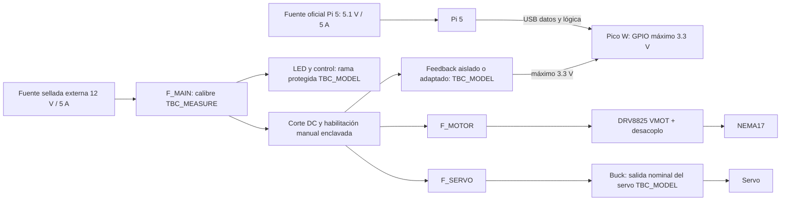

# Árbol de alimentación experimental

Estado: PENDING_PHYSICAL_VALIDATION. Arquitectura definida; modelos, corrientes y terminales reales pendientes. Consultar `../wiring/wire_from_to.csv`: las conexiones históricas REFERENCE no constituyen aprobación de montaje; W111–W119 proponen la cadena completa y sustituyen sus referencias al emitir el ECN de la selección real.

No unir positivos de fuentes. Pi no alimenta servo, motor ni VMOT; ni USB, GPIO o 3V3 pueden hacerlo. El dominio lógico del Pico se mantiene vivo durante el corte de actuadores. Los sensores se alimentarán exclusivamente con la tensión validada para cada breakout; comprobar niveles DOUT, barreras, SDA/SCL y XSHUT antes de conectar.

Referencia común de STEP/DIR/servo solo cuando la interfaz elegida lo requiera: unir GND lógico y retorno de señal en un punto definido, con retornos de motor/servo independientes hasta distribución. Si el feedback es aislado, mantener separadas sus caras según datasheet. No cerrar bucles de masa a través de USB. Ningún retorno de potencia pasa por Pico o Pi.

DRV8825: confirmar modelo/RSENSE, límites térmicos y corriente nominal del motor; ajustar VREF usando la ecuación del módulo real. Confirmar RESET/SLEEP, MODE y nEN en terminales reales; pull-up externo nEN a **3V3**. Capacitor VMOT cercano con tensión/rizado y polaridad verificados; 100 µF/35 V es referencia histórica, no una medición ni aprobación. No conectar/desconectar bobinas energizadas.

Servo: fabricante/modelo y torque ~8–10 kgf·cm son selección pendiente. ≈6 V del gemelo es referencia, no tensión aprobada para una unidad desconocida. Medir buck sin servo y con carga protegida; confirmar corriente de arranque/atasco y compatibilidad PWM 3V3. Cable, bornera, fusible y corte DC se dimensionan a corriente medida, capacidad del conductor y curva de protección. Los fusibles del plan son referencias separadas en `fuse_matrix.csv`.

Fuentes de red deben permanecer cerradas/certificadas; el proyecto cablea sus salidas DC. No usar protoboard como montaje de potencia permanente. Usar terminales crimpados, aislamiento, alivio de tensión y fijación mecánica. Detener si no se conocen terminales, polaridad, corriente admisible o aislamiento.
